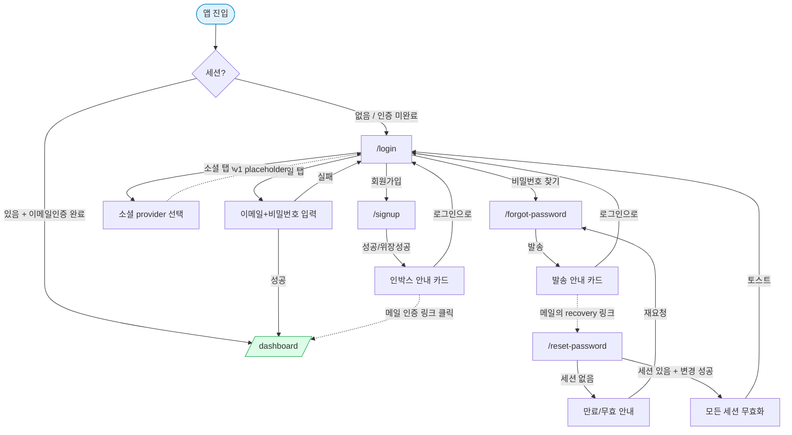

# s1 인증 — 화면 정의 / 기능 / 워크플로우

> 외부 디자이너에게 전달하기 위한 **s1 인증 도메인 화면 정의서**. 디자인 리뉴얼은 본 문서 범위 외이며, 본 문서는 "무엇이 어떻게 동작하는가"만 다룬다.
>
> **상위 참조**:
> - 도메인 종합 설계: `docs/architecture/v1/features/auth.md`
> - PRD: `docs/spec/PRD.md` §2.1
> - User Flow: `docs/spec/user_flow.md` §s1
> - 구현: `apps/web/src/features/auth/`
> - 라우팅: `apps/web/src/app/router.tsx` (`AuthLayout` 그룹)
> - 공용 셸: `apps/web/src/app/layouts/AuthLayout.tsx`

---

## 1. 도메인 개요

### 1.1 목적

셀러가 SaaS 에 진입하기 위한 인증 동선을 제공한다. Supabase Auth JWT 를 단일 ground truth 로 두고, 이메일/비밀번호 가입·로그인 + (v2) 소셜 로그인 + 비밀번호 재설정을 묶는다.

### 1.2 진입 경로

| From | To | 조건 |
|---|---|---|
| 앱 루트 `/` | `/login` | 세션 없음 |
| 앱 루트 `/` | `/dashboard` | 세션 존재 + 이메일 인증 완료 |
| `RequireAuth` 가드 | `/login` (`location.state.from = 원래 URL`) | anonymous 가 보호 라우트 접근 |
| `/login` | `/signup` / `/forgot-password` | 사용자 클릭 |
| 메일 본문 (recovery 링크) | `/reset-password` | Supabase recovery 토큰 URL fragment 포함 |
| 메일 본문 (signup confirm) | `/dashboard` 또는 `/login` | Supabase 가 자동 처리 (별도 화면 없음 — v1) |

### 1.3 User Flow 매핑 (`docs/spec/user_flow.md` §s1)

| 노드 | 라벨 | 화면 |
|---|---|---|
| n1 | 시작 | (라우터 부트스트랩 / 본 도메인 외) |
| n2 | 로그인/회원가입 진입점 | `/login` |
| n3 | 이메일 로그인 | `/login` (Tabs: email) |
| n4 | 소셜 로그인 | `/login` (Tabs: social — v1 placeholder) |
| n5 | 회원가입 | `/signup` |
| n6 | 비밀번호 찾기 | `/forgot-password` (+ `/reset-password` 콜백) |
| n7 | 로그인 실행 | (`/login` 내부 액션) |
| n8 | 회원가입 완료 | (`/signup` 성공 후 인박스 안내 상태) |

### 1.4 PRD 매핑 (§2.1)

| PRD 절 | 요구사항 | 본 문서 화면 |
|---|---|---|
| §2.1.1 | 회원가입 폼 유효성 검사 | `/signup` |
| §2.1.2 | 비밀번호 강도 검사 + 가이드 | `/signup`, `/reset-password` |
| §2.1.3 | 2FA | **v2 보류** (v1 화면 없음) |
| §2.1.4 | 세션 관리 + 자동 로그아웃 | (횡단 — `AuthContext` / `RequireAuth`) |
| §2.1.5 | 비밀번호 재설정 + 이메일 인증 | `/forgot-password`, `/reset-password`, 가입 시 메일 인증 |

---

## 2. 화면 목록

| 라우트 | 파일 | 화면명 | 인증 필요 |
|---|---|---|---|
| `/login` | `apps/web/src/features/auth/pages/LoginPage.tsx` | 로그인 | 아니오 |
| `/signup` | `apps/web/src/features/auth/pages/SignupPage.tsx` | 회원가입 | 아니오 |
| `/forgot-password` | `apps/web/src/features/auth/pages/ForgotPasswordPage.tsx` | 비밀번호 찾기 | 아니오 |
| `/reset-password` | `apps/web/src/features/auth/pages/ResetPasswordPage.tsx` | 비밀번호 재설정 | recovery 세션 필요 |

4개 화면 모두 **`AuthLayout`** 하위에 배치 — 사이드바 없음, 상단 워드마크, 중앙 카드(`max-width: 420px`), 하단 Footer(약관/개인정보처리방침/매뉴얼 링크).

---

## 3. 화면별 상세

### 3.1 `/login` — 로그인

- **라우트**: `/login`
- **파일**: `apps/web/src/features/auth/pages/LoginPage.tsx`
- **목적**: 이메일/비밀번호로 셀러 인증 후 대시보드(또는 직전 차단 URL)로 이동.
- **진입 경로**:
  - 앱 루트에서 세션 없음 → 자동 리다이렉트
  - `RequireAuth` 가드에서 anonymous → `location.state.from = 원래 URL` 동반 리다이렉트
  - `/signup`, `/forgot-password`, `/reset-password` 화면의 "로그인으로" 링크
- **기능**:
  - 이메일/비밀번호 입력 + 비밀번호 표시·숨김 토글 (`aria-pressed`, `aria-label` 전환)
  - 탭 전환: "이메일 로그인" / "소셜 로그인"
  - 소셜 로그인 탭은 **v1 placeholder** (provider 설정 후 활성, 현재 "준비중" 안내)
  - 제출 후 에러: `auth-error-map.ts` 의 `MappedAuthError` 한국어 매핑 + `ErrorMessage` 노출
  - 제출 직후 비밀번호 폼 state 초기화 (`reset()`) — auth.md §4.1
  - 성공 시 `location.state.from` 우선, 없으면 `/dashboard` 로 `navigate(replace: true)`
  - 보조 링크: "비밀번호를 잊으셨나요?" → `/forgot-password`, "회원가입" → `/signup`
- **워크플로우**:
  1. 사용자가 이메일 + 비밀번호 입력 → "로그인" 버튼 클릭
  2. RHF + `SignInFormSchema` (zod) 검증 → 실패 시 필드별 에러 텍스트
  3. 성공 시 `useAuth().signInWithPassword(email, password)` 호출
  4. 결과 분기:
     - **200 ok** → `auth.login_success` 이벤트 적재 → 리다이렉트
     - **invalid_credentials / email_not_confirmed / rate_limited / network / unknown** → `mapAuthError` → `ErrorMessage`, 비밀번호 폼 비움
- **주요 컴포넌트**:
  - shadcn: `Card`, `Tabs`, `TabsList`, `TabsTrigger`, `TabsContent`, `Input`, `Label`, `Button`, `ErrorMessage`
  - 도메인: `useAuth()` (`features/auth/context/AuthContext.tsx`), `mapAuthError`, `trackAuthEvent`
  - 텍스트: `ko.auth.login.*` (`apps/web/src/locales/ko.ts`)
- **데이터 의존**:
  - Supabase Auth: `signInWithPassword` (AuthContext 내부)
  - Edge Function: `auth-event-log` (로그인 성공/실패 이벤트 적재)
  - TanStack Query: **사용 안 함** (Auth 는 AuthContext 직접 호출)
- **상태 처리**:
  - `loading`: 버튼 `aria-busy` + 라벨 "로그인 중…" + `disabled`
  - `data` (성공): 즉시 리다이렉트 (화면 자체에 success state 없음)
  - `error`: `ErrorMessage` (긴 메시지는 접힘) + 필드별 zod 에러
  - `empty`: 초기 폼 상태 (placeholder 노출)
- **폼 검증**:
  - 스키마: `apps/web/src/lib/schemas/auth.ts` → `SignInFormSchema`
  - 규칙: email 형식 + 비어있지 않은 비밀번호 (로그인 시점에는 비밀번호 정책 강제 안 함 — 정책 강화 전 가입자 보호)
- **PRD 근거**: §2.1.4 (세션 관리)
- **user_flow**: n2, n3, n4, n7

---

### 3.2 `/signup` — 회원가입

- **라우트**: `/signup`
- **파일**: `apps/web/src/features/auth/pages/SignupPage.tsx`
- **목적**: 신규 셀러 계정 생성 후 이메일 인증 안내 화면으로 전환.
- **진입 경로**: `/login` 의 "회원가입" 링크
- **기능**:
  - 표시 이름 / 이메일 / 비밀번호 / 비밀번호 확인 입력
  - 비밀번호 **실시간 강도 미터** (5단계: 매우 약함 / 약함 / 보통 / 강함 / 매우 강함) + 정책 미달 사유 bullet
    - 계산 함수: `features/auth/lib/password-strength.ts` (`evaluatePasswordStrength`)
    - `aria-live="polite"` 로 스크린리더에 강도 변경 안내
  - 약관 동의 (필수, 단일 체크) + 마케팅 수신 동의 (선택)
  - 가입 성공 → **인박스 안내 카드**(`SignupSuccess`) 로 전환
  - **enumeration 방지**: `user_already_exists` 응답도 동일한 성공 화면을 노출하며 내부적으로 `auth.signup_attempted_existing_email` 이벤트만 적재 (auth.md §4.4)
- **워크플로우**:
  1. 폼 입력 → "가입하기" 클릭
  2. RHF + `SignUpFormSchema` 검증 (비밀번호 정책 + 확인 일치 + 약관 동의 `z.literal(true)`)
  3. `useAuth().signUp({ email, password, displayName, marketingConsent })` 호출
  4. 결과 분기:
     - **성공** → `submittedEmail` state 세팅 → 인박스 안내 화면
     - **user_already_exists** → 동일 인박스 안내 화면 (사용자에게 노출되는 응답은 성공과 구분 불가)
     - **기타 실패** → `ErrorMessage` + 비밀번호 폼 비움
  5. (사용자가 메일에서 인증 링크 클릭) → Supabase 가 토큰 검증 → `/dashboard` 또는 `/login`
- **주요 컴포넌트**:
  - shadcn: `Card`, `Input`, `Label`, `Button`, `ErrorMessage`
  - 내부: `FieldRow` (label + input + hint + error 묶음), `StrengthMeter`, `SignupSuccess`
  - 도메인: `useAuth().signUp`, `evaluatePasswordStrength`, `mapAuthError`, `trackAuthEvent`
- **데이터 의존**:
  - Supabase Auth: `signUp` (`raw_user_meta_data` 로 `display_name`, `marketing_consent` 전달)
  - DB 트리거: `handle_new_seller` 가 `public.sellers` row 자동 생성 (auth.md §2.3)
  - Edge Function: `auth-event-log`
- **상태 처리**:
  - `loading`: 버튼 `aria-busy` + 라벨 "가입 중…"
  - `data` (성공): `SignupSuccess` 카드 (이메일 표시 + "로그인으로" 링크)
  - `error`: `ErrorMessage` + 필드별 zod 에러
  - `empty`: 초기 폼
- **폼 검증**:
  - 스키마: `SignUpFormSchema`
  - 규칙:
    - email 형식 / 최대 255
    - 비밀번호: 10~72자 + 영문 대/소·숫자·특수문자 3종 이상
    - 비밀번호 확인: 일치
    - 표시 이름: 1~60자 trim
    - 약관 동의: `z.literal(true)` (체크 강제)
- **PRD 근거**: §2.1.1, §2.1.2, §2.1.5
- **user_flow**: n5, n8

---

### 3.3 `/forgot-password` — 비밀번호 찾기

- **라우트**: `/forgot-password`
- **파일**: `apps/web/src/features/auth/pages/ForgotPasswordPage.tsx`
- **목적**: 가입된 이메일로 비밀번호 재설정 메일을 발송.
- **진입 경로**: `/login` 의 "비밀번호를 잊으셨나요?" 링크
- **기능**:
  - 이메일 1개 필드 입력
  - **결과와 무관하게 동일 안내 화면** 노출 (enumeration 방지)
  - 예외: `network` / `server (5xx)` / `over_rate_limit` / `unknown` 같은 **시스템성 에러만** `ErrorMessage` 로 별도 노출 (사용자에게 재시도 신호 필요)
- **워크플로우**:
  1. 이메일 입력 → "재설정 메일 발송" 클릭
  2. RHF + `ForgotPasswordFormSchema` 검증
  3. `useAuth().sendPasswordResetEmail(email)` 호출 (Supabase `resetPasswordForEmail` + `redirectTo: /reset-password`)
  4. 결과:
     - **ok** 또는 비-시스템성 실패 → `auth.password_reset_requested` 적재 → "메일을 발송했습니다" 안내 화면
     - **시스템성 실패** → `ErrorMessage` (재시도 유도)
- **주요 컴포넌트**: `Card`, `Input`, `Label`, `Button`, `ErrorMessage`
- **데이터 의존**:
  - Supabase Auth: `resetPasswordForEmail`
  - Edge Function: `auth-event-log`
- **상태 처리**:
  - `loading`: 버튼 `aria-busy` + "발송 중…"
  - `data` (성공/위장 성공): 안내 카드 ("재설정 메일을 발송했습니다. 메일함을 확인하세요.") + "로그인으로" 링크
  - `error`: 시스템성 에러만 `ErrorMessage` 로
  - `empty`: 초기 폼
- **폼 검증**: `ForgotPasswordFormSchema` — email 형식만
- **PRD 근거**: §2.1.5
- **user_flow**: n6

---

### 3.4 `/reset-password` — 비밀번호 재설정 (메일 콜백)

- **라우트**: `/reset-password`
- **파일**: `apps/web/src/features/auth/pages/ResetPasswordPage.tsx`
- **목적**: 메일에서 받은 recovery 링크로 새 비밀번호를 설정.
- **진입 경로**:
  - 사용자가 메일 본문의 recovery 링크 클릭 → `/reset-password#access_token=…&type=recovery&…`
  - Supabase JS `detectSessionInUrl: true` 가 URL fragment 자동 처리 → recovery 세션 수립
- **기능**:
  - 새 비밀번호 / 비밀번호 확인 입력 + 강도 미터
  - 진입 시 세션 유무 분기:
    - **세션 없음**: "재설정 링크가 만료되었거나 유효하지 않습니다" + `/forgot-password` 재요청 링크
    - **세션 있음**: 폼 노출
  - 성공 시 **모든 기존 세션 강제 무효화** (`signOut({ scope: 'global' })`) 후 `/login` 으로 이동 + 성공 토스트 (auth.md §3.4)
  - recovery 세션은 password 변경 외 작업 금지 — 본 화면은 폼만 노출하며 사이드바·다른 mutation 차단
- **워크플로우**:
  1. URL 진입 → AuthContext `status` 가 `loading` 동안 "세션을 확인하는 중…" (`role="status"`, `aria-live="polite"`)
  2. `status` 확정:
     - `session === null` → invalidSession 카드
     - `session !== null` → 폼 노출
  3. 새 비밀번호 입력 → "변경" 클릭
  4. RHF + `ResetPasswordFormSchema` 검증
  5. `useAuth().updatePassword(newPassword)` 호출
  6. 결과:
     - **ok** → `auth.password_reset_completed` + `auth.session_revoked_global` 적재 → `signOut()` → `/login` + Sonner 성공 토스트
     - **실패** → `ErrorMessage` + 폼 비움
- **주요 컴포넌트**: `Card`, `Input`, `Label`, `Button`, `ErrorMessage`, `toast` (sonner)
- **데이터 의존**:
  - Supabase Auth: `updateUser({ password })`, `signOut({ scope: 'global' })`
  - Edge Function: `auth-event-log`
- **상태 처리**:
  - `loading`: "세션을 확인하는 중…" 카드 (AuthContext status === 'loading')
  - `data` (세션 있음): 폼 노출
  - `error` (시스템성): `ErrorMessage`
  - `empty` (세션 없음 = 만료/무효 링크): invalidSession 카드 (`ko.auth.reset.invalidSession`) + 재요청 링크
- **폼 검증**: `ResetPasswordFormSchema` — 비밀번호 정책 + 확인 일치 (회원가입과 동일 규칙)
- **PRD 근거**: §2.1.5
- **user_flow**: (n6 의 콜백 — flow 표에는 별도 노드 없음. 본 문서가 명시.)

---

## 4. 도메인 워크플로우 (전체)

핵심 보안 통제 (재서술):
- 모든 redirect URL 은 화이트리스트 origin (`features/auth/lib/redirect-allowlist.ts`)
- 비밀번호 변경 직후 **모든 기기 세션 강제 종료**
- enumeration 방지: 가입 / 재설정 요청 응답은 가입 여부를 노출하지 않음
- `email_not_confirmed` 사용자는 로그인 실패 + "인증 메일 재전송" 동선 (UI 메시지로 안내)

---

## 5. 디자인 리뉴얼 시 고려사항 (외부 디자이너 인계)

### 5.1 공통

- **단일 카드 셸**: 4개 화면 모두 `AuthLayout` (사이드바 없음, 상단 워드마크, 중앙 max-width 420 카드, 하단 Footer). 카드 폭·여백·헤더 정렬은 4개 일관 유지.
- **카드 헤더 = `CardTitle` + `CardDescription` 2단**. 카피는 `apps/web/src/locales/ko.ts` 의 `ko.auth.*` path 가 단일 소스 — 디자이너는 텍스트 길이 변동(특히 `subtitle`, `successBody`) 을 의식해 wrap 1~2 줄 케이스 모두 검토 필요.
- **버튼은 항상 `variant="primary"` 전폭(`w-full`)** (실행류). 검색/필터류 패턴 없음. Loading 상태에 `aria-busy` + 라벨 치환만 사용 — spinner 별도 노출 안 함 (현재). 디자이너가 spinner 추가 제안 시 PR 사유 필요.
- **에러 표시 2계층**:
  1. 필드별 zod 에러 — `
` (Input 바로 아래, 12px)
  2. 폼 전체 / 서버 에러 — `<ErrorMessage>` (긴 raw response 는 details 접힘 기본)
- **링크 색상은 `text-accent` 토큰만** — raw HEX 금지. 토큰 변경은 `docs/architecture/v1/ui-system.md` 먼저 갱신.
- **다크 모드 1차 대응 필수.** 4개 화면 모두 라이트/다크 토큰만으로 표현. 카드 배경 / 보더 / placeholder 대비 4.5:1 검증.

### 5.2 반응형 케이스

| 브레이크포인트 | 동작 |
|---|---|
| **~767px (모바일)** | 좌우 16px 패딩, 카드 폭 100%, 입력 폭 100%, 터치 타겟 ≥ 44×44px (Input 높이 + 버튼 높이). 비밀번호 표시 토글 버튼 영역도 ≥ 44×44px 보장. |
| **768~1199px (태블릿)** | 카드 max-width 420px 유지, 상하 여백 확대. Footer 가 화면 하단에 붙도록 `flex-1` 처리. |
| **1200px+ (데스크탑)** | 동일 카드 폭, 워드마크 위 상단 패딩 확장. 한 화면에 카드가 시각적으로 떠 보이게. |

- 키보드 폰트 ≥ 16px (iOS 자동 줌 방지) — `Input` 컴포넌트 기본 사이즈 유지.

### 5.3 에러 / 예외 상태 (디자이너가 별도 시안 필요한 케이스)

- **`/login`**:
  - "이메일 또는 비밀번호가 올바르지 않습니다" (가장 흔함)
  - "이메일 인증이 필요합니다" + "인증 메일 재전송" 버튼 (v1 재전송 UI는 아직 단순 카피 — 디자이너 의견 환영)
  - "요청이 너무 많습니다. 잠시 후 다시 시도해주세요" (rate limit)
  - 소셜 로그인 탭 placeholder 박스 (현재 단순 안내 박스 — 디자이너가 "준비중" 시각 강화 가능)
- **`/signup`**:
  - 인박스 안내 카드 (`SignupSuccess`) — 이메일 강조 / "메일이 안 왔나요? 스팸함을 확인하세요" 보조 카피가 v1 에는 없음. 디자이너 제안 필요.
  - 비밀번호 강도 미터 5단계 색상 — 현재 토큰 `toneClass` 사용. 다크 모드에서 대비 검증 필요.
  - 약관 동의 체크박스 — 약관 본문 링크(Footer 또는 인라인)와의 연결 방식 디자인 검토.
- **`/forgot-password`**:
  - 안내 화면 카드 카피가 의도적으로 모호 ("입력하신 이메일로 안내 메일을 발송했습니다") — enumeration 방지. 디자이너가 카피 강도 조절 시 보안 룰 확인 필요.
- **`/reset-password`**:
  - **3-way 상태**: `loading` ("세션 확인 중") / `invalidSession` (만료 안내 + 재요청) / 폼. 각 상태에 시각 차이가 필요 (현재 모두 동일 Card 외형).
  - 성공 후 토스트(`sonner`) — 토스트 표시 시간·위치·다크모드 시안 검토.

### 5.4 도메인 특이점

- **비밀번호 입력의 표시/숨김 토글**: `LoginPage` 만 토글 노출. `SignupPage` / `ResetPasswordPage` 는 미노출 (디자이너 의견 환영 — 정책상 통일 권장).
- **`AuthLayout` Footer 는 인증 동선에서도 항상 노출**: 약관/개인정보처리방침/매뉴얼 접근 보장 (회원가입 동의 의미 성립 위해). Footer 디자인 변경 시 본 도메인 모든 화면 동시 영향.
- **소셜 로그인 v2 진입 대비**: `/login` 의 소셜 탭은 추후 Google / Kakao / Naver 3 버튼이 들어올 자리. 4번째 탭 추가 가능성은 낮음 (provider 화이트리스트 고정).
- **2FA (PRD §2.1.3) 는 v2 보류**: 디자이너가 미리 코드 입력 화면 시안만 비축해 두는 정도는 환영하나 v1 라우팅 진입 안 함.
- **알림 토스트 위치 통일**: `ResetPasswordPage` 의 sonner 토스트 외에 본 도메인은 토스트 사용처가 거의 없음. 전역 토스트 위치(우상단 / 하단 중앙 등)는 횡단 결정 — `ui-system.md` 참조.
- **i18n**: 한국어 단일이지만 모든 카피가 `ko.ts` 경유. 디자이너 카피 변경 시 코드 직접 수정 금지 → `locales/ko.ts` PR 로 전달.
