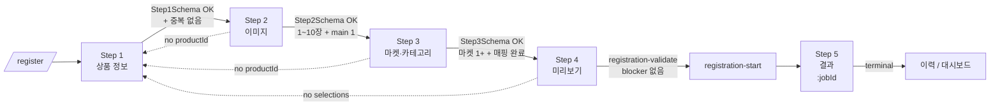
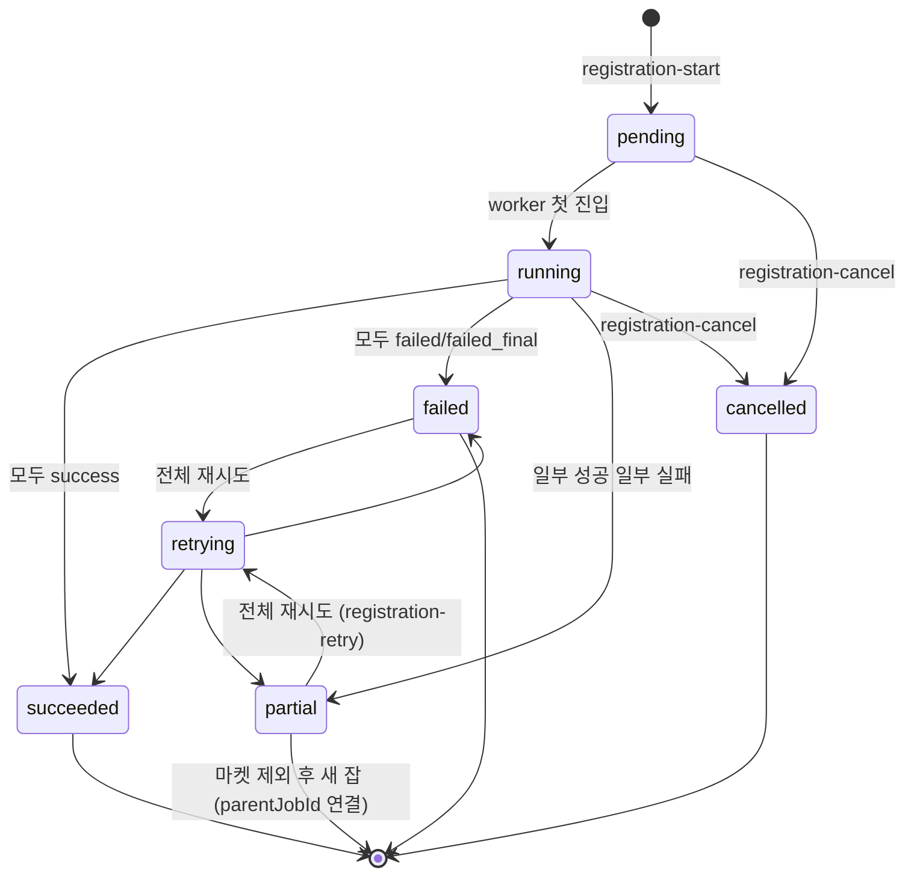
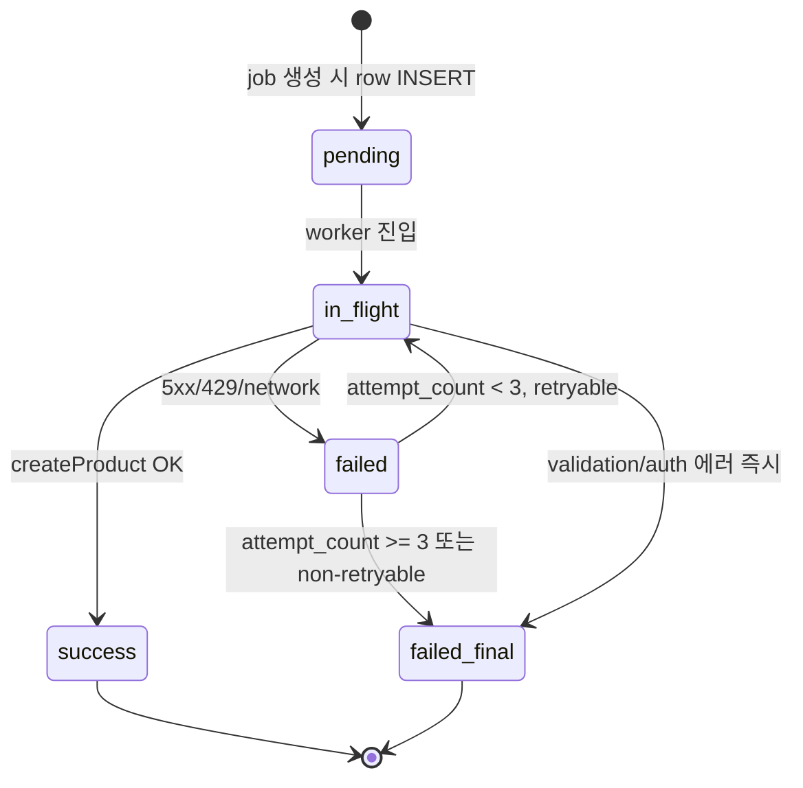

# s3 상품 등록 — 디자인 리뉴얼 인계 정의서 (v1)

> **목적**: 외부 디자이너에게 s3 상품 등록 도메인의 **화면 / 기능 / 워크플로우** 를 넘기기 위한 정리 문서.
> 이 문서 자체는 디자인 리뉴얼을 하지 않는다. 현재 구현된 5단계 위저드 + 결과 화면의 **구조·데이터 의존·상태 분기·블로킹 규칙·도메인 워크플로우** 를 단일 문서로 압축한다.
>
> **상위 마스터** (변경 시 본 문서도 동기화):
> - PRD: `docs/spec/PRD.md` §1.1 ~ §1.4 + §3.6
> - User Flow: `docs/spec/user_flow.md` §s3 (n15 ~ n25)
> - 아키텍처: `docs/architecture/v1/features/registration.md`
> - 횡단: `docs/architecture/v1/cross-cutting/registration-job-state.md` (상태 전이) / `image-pipeline.md` / `market-adapter.md`

---

## 1. 도메인 개요

### 1.1 도메인 정의

다중 마켓 상품 자동 등록 SaaS 의 **핵심 가치 단위**. 사용자가 상품 정보를 한 번 입력하면 v1 활성 4개 마켓 (네이버 스마트스토어 / 쿠팡 / G마켓 / 옥션) 에 병렬로 동시 등록되는 5단계 위저드 + 결과 화면.

### 1.2 5단계 흐름 (한 줄)

```
정보 (n16)  →  이미지 (n18)  →  마켓·카테고리 (n17 + n19)  →  미리보기 (n20)  →  결과 (n21 + n24/n25)
   Step 1         Step 2              Step 3                     Step 4              Step 5
```

> 주의: PRD/user_flow 의 **6노드** (정보 → 마켓 → 이미지 → 카테고리 → 미리보기 → 결과) 와 실제 구현 **5단계** 는 의식적으로 다르다. 구현은 이미지를 마켓 선택보다 앞에 두고 (이미지 없으면 마켓 선택 의미 없음), 마켓 선택과 카테고리 매핑을 **동일 페이지** 에서 처리한다. PRD 노드 매핑은 §1.4 표 참조.

### 1.3 PRD 매핑

| PRD §  | 기능 | 구현 단계 |
|---|---|---|
| 1.1.1 | 상품명 자동 검증 + 실시간 중복 확인 | Step 1 (`useDuplicateProductCheck` 500ms 디바운스) |
| 1.1.2 | 이미지 다중 업로드 + 미리보기 + 순서 조정 | Step 2 (`ImageDropzone` / `ImageThumbnailGrid`) |
| 1.1.3 | 동적 카테고리 선택 + 필터링 | Step 3 (`MarketOptionsCard` — 카테고리 + 마켓별 동적 등록필드) |
| 1.1.4 | 기본 배송 정보 입력 | Step 1 의 `shippingPolicyId` 선택 (정책 마스터는 별도 화면) |
| 1.2.1 | 마켓별 상품 속성 자동 변환 | Step 4 미리보기 (`transformProduct` 클라이언트 + 서버 결정성) |
| 1.2.2 | 마켓별 이미지 규격·포맷 자동 최적화 | Step 2 업로드 시 이미지 파이프라인 (`image-pipeline.md`) |
| 1.2.3 | 마켓별 필수 항목 자동 체크 + 알림 | Step 4 `registration-validate` Edge Function |
| 1.3.1 | 등록 요청 병렬 처리 + 상태 관리 | Step 5 (`registration-market-worker` 마켓당 1회 호출, 격리) |
| 1.3.2 | 실패 자동 재시도 + 예외 처리 | Step 5 (워커 내부 `attempt_count < 3` 자동 재시도 + `failed_final` 종결) |
| 1.3.3 | 마켓별 API 인증 + 보안 통신 | Step 5 진입 전 token 검증 (credential-vault) |
| 1.4.1 | 등록 결과 상세 내역 | Step 5 (`JobMarketResultRow` 마켓별 카드) |
| 1.4.2 | 등록 결과 CSV/Excel 내보내기 | Step 5 (s6 이력 화면과 공유 — 본 도메인은 진입 링크만) |
| 1.4.3 | 등록 성공/실패 알림 설정 | 횡단 알림 도메인 (본 화면은 발생 트리거만) |
| 3.6.1 | HTML 상세 WYSIWYG 에디터 | Step 1 의 `descriptionHtml` — **v0.6 부터 Tiptap WYSIWYG** (StarterKit + Link + Image + Placeholder), `RichTextEditor` 공통 컴포넌트 |
| 3.6.2 | HTML 상세 코드 유효성·XSS 검사 | **클라이언트 DOMPurify sanitize** (`sanitizeHtml()` — `apps/web/src/lib/sanitize-html.ts`) + 서버 추가 검증 |
| 3.6.3 | HTML 상세 미리보기 | Step 4 미리보기 카드에 포함 (sanitize 결과 그대로 렌더) |

### 1.4 user_flow s3 노드 매핑

| 노드 | 라벨 | 구현 | 비고 |
|---|---|---|---|
| n15 | main_page 상품 등록 | `RegisterIndexPage` | `/register` 진입 시 `/register/info` replace navigate |
| n16 | 상품 정보 입력 | Step 1 (`StepInfoPage`) | |
| n17 | 마켓 선택 | Step 3 전반부 (`MarketSelectGrid`) | n17/n19 통합 페이지 |
| n18 | 이미지 업로드 | Step 2 (`StepImagesPage`) | 구현은 이미지를 마켓보다 앞에 둠 |
| n19 | 카테고리 매핑 + 마켓별 등록옵션 | Step 3 후반부 (`MarketOptionsCard`) | n17 과 동일 페이지. ESM(gmarket/auction)은 배송 프로필 select + 상품정보고시 입력(`OfficialNoticeField`, PR-5) 추가 |
| n20 | 등록 미리보기 | Step 4 (`StepPreviewPage`) | |
| n21 | 등록 결과 | Step 5 (`StepResultPage`) | |
| n22 | action 템플릿 불러오기 | (v2) | s4 템플릿 도메인 v2 보류 |
| n23 | action 일괄 등록 실행 | Step 4 의 "일괄 등록 실행" 버튼 → `registration-start` | |
| n24 | action 오류 재시도 | Step 5 `PartialJobBanner` / 마켓 행 재시도 버튼 → `registration-retry` | |
| n25 | action 마켓 제외 등록 | Step 5 "마켓 제외 후 재등록" → 새 `registration-start` (parentJobId 연결) | |

---

## 2. 위저드 진행 표

| 단계 | 라우트 | 파일 | 화면명 | 진입 조건 | 다음 단계 |
|---|---|---|---|---|---|
| - | `/register` | `RegisterIndexPage.tsx` | (리다이렉트) | 로그인 | `/register/info` replace |
| 1 | `/register/info` | `StepInfoPage.tsx` | 1단계 — 상품 정보 | 없음 (entry) | Step1Schema 통과 + 중복 없음 → `/register/images` |
| 2 | `/register/images` | `StepImagesPage.tsx` | 2단계 — 이미지 | `productId` 존재 (없으면 Step 1 으로 회귀) | Step2Schema 통과 (1~10장 + main 1장) → `/register/markets` |
| 3 | `/register/markets` | `StepMarketsCategoriesPage.tsx` | 3단계 — 마켓·카테고리 | `productId` 존재 | Step3Schema 통과 (마켓 1+ 선택 + 마켓별 카테고리 모두 선택) → `/register/preview` |
| 4 | `/register/preview` | `StepPreviewPage.tsx` | 4단계 — 미리보기 | `productId` + `selections.length > 0` | `registration-validate` blocker 없음 → `registration-start` → `/register/result/<jobId>` replace |
| 5 | `/register/result/:jobId` | `StepResultPage.tsx` | 등록 결과 | URL param `jobId` 유효 | terminal 상태 (succeeded/failed/partial/cancelled) 도달 후 이력/대시보드로 이동 |

> **레이아웃 차이**: Step 1~4 는 `RegisterLayout` (Stepper UI 포함, `/register/*` 의 children) 안에 있고, **Step 5 (결과) 는 위저드 바깥**. 결과는 후처리 (재시도 / 제외 후 재등록 / 이력 진입) 가 본질이라 Stepper 표시를 의도적으로 빼는 결정 (router.tsx L180).

---

## 3. 화면별 상세

### 3.1 Step 1 — 상품 정보 입력 (n16)

- **라우트**: `/register/info`
- **파일**: `apps/web/src/features/registration/pages/StepInfoPage.tsx`
- **목적**: 마스터 상품 정보 (이름·가격·정상가·브랜드·제조사·내부 카테고리·배송 정책·설명) 입력 및 `products` 테이블에 draft 로 upsert.

**입력 항목** (zod: `lib/schemas/registration.ts` `Step1Schema`):

| 필드 | 타입 | 검증 | 비고 |
|---|---|---|---|
| `name` | string | 2~100자 | 디바운스 500ms 후 중복 확인 (`useDuplicateProductCheck`) |
| `price` | number int | ≥ 100원 | 마켓별 추가 한도는 Step 4 에서 검증 (쿠팡 ≥ 1000원 등) |
| `originalPrice` | number int \| null | ≥ 0, **≥ price** (`refine`) | 할인율 표시용. 선택 |
| `brand` | string \| null | ≤ 50자 | 일부 카테고리 (의류/뷰티) 에서 마켓이 필수로 요구 → Step 4 경고 |
| `manufacturer` | string \| null | ≤ 50자 | 동상 |
| `descriptionHtml` | string \| null | ≤ 50000자 | **v0.6 부터 Tiptap WYSIWYG** (StarterKit + Link + Image + Placeholder) + DOMPurify sanitize |
| `baseCategoryId` | string | required | 내부 분류 키 (마켓 카테고리는 Step 3 에서 별도 매핑) |
| `shippingPolicyId` | string uuid | required | `useShippingPolicies` select. 0개면 빠른 생성 안내 (별도 페이지) |

**워크플로우**:

| 액션 | 반응 |
|---|---|
| 페이지 진입 | `form.trigger()` 1회 호출 → `blockingReasons` 즉시 채움 (UX: 처음부터 무엇이 부족한지 노출) |
| `name` 입력 (2자 이상) | 500ms 디바운스 → `useDuplicateProductCheck` 쿼리 → `duplicate=true` 면 경고 라벨 |
| `price` 입력 | onChange 즉시 zod 검증 (RHF mode='onChange') |
| `originalPrice < price` | RHF refine 오류 → `정가는 판매가 이상이어야 합니다` |
| 배송 정책 select 변경 | 즉시 store 반영 |
| "다음: 이미지" 클릭 | `setStep1` → `useUpsertProductDraft` mutate → 성공 시 `setProductId` + `/register/images` navigate. 실패 시 sonner toast (자세한 메시지는 `registration-error-messages.ts`) |

**주요 컴포넌트**:
- shadcn: `Card` / `Input` / `Label` / `Tooltip` / `ErrorMessage` / `Skeleton` / `Button`
- 자체: `Field` (label + children + error 슬롯) — 파일 내 private 컴포넌트

**데이터 의존**:
- `useShippingPolicies()` — TanStack Query, 셀러의 배송 정책 목록.
- `useDuplicateProductCheck(name, productId)` — TanStack Query, 동명 미완료 상품 확인 (현재 편집 중인 productId 는 제외).
- `useUpsertProductDraft()` — mutation, `products` 테이블 draft upsert.

**상태 분기** (loading / data / error / empty + partial 해당 없음):

- **loading**: 배송 정책 fetch 중 → `Skeleton`.
- **data**: 정책 select 옵션 렌더.
- **error**: 배송 정책 fetch 실패 → `ErrorMessage` ("새로고침해 주세요").
- **empty**: 배송 정책 0개 → 경고 라벨 ("등록된 배송 정책이 없습니다. 별도 화면에서 1건 이상 생성해 주세요").
- 업서트 mutation 진행 중 → `blockingReasons` 에 "처리 중…" 추가, 버튼 disabled + tooltip.

**다음 단계 진입 가드** (`blockingReasons`):
- 폼 zod 에러 1개라도 있음 → "필수 항목을 모두 입력하세요"
- 중복 상품명 → "동일 상품명의 미완료 상품이 있습니다"
- `upsert.isPending` 또는 `form.formState.isSubmitting` → "처리 중…"

**PRD 근거**: §1.1.1, §1.1.4, §3.6.1 (descriptionHtml plain text v1) — **user_flow**: n15 → n16

---

### 3.2 Step 2 — 이미지 (n18)

- **라우트**: `/register/images`
- **파일**: `apps/web/src/features/registration/pages/StepImagesPage.tsx`
- **목적**: 상품 이미지 1~10장 업로드 + 미리보기 + 대표 지정 + 순서 조정 + 삭제.

**입력 항목** (zod: `Step2Schema`):

| 필드 | 검증 |
|---|---|
| `images[]` | 1~10장, 각 항목 `ImageMetaSchema` 통과, **대표(main) 정확히 1장** (`refine`) |
| 개별 이미지 | uuid / storagePath / role (main\|sub) / sortOrder 0~9 / width≥100 / height≥100 / bytes 1~10MB / mimeType image/(jpeg\|png\|webp) / hashSha256 64자 |

**워크플로우** (signed URL 패턴):

| 액션 | 반응 |
|---|---|
| 페이지 진입 | `productId` 없으면 `/register/info` replace (가드) |
| 드래그앤드롭 또는 파일 선택 | `uploadOneImage` 병렬 실행: (1) Edge Function 으로 signed URL 발급 (2) S3/Storage 로 PUT (3) 등록 메타 콜백 |
| 업로드 진행 중 | 카드별 진행률 % + 전체 프로그레스 바 + 파일명. 1.5s 후 자동 fade out (성공 시) |
| 업로드 첫 장 | 자동으로 `role='main'` 지정 |
| 업로드 실패 | 카드 안에 `❌ <message>` + sonner toast (`ImageApiError.message` 또는 fallback) |
| 대표 토글 (썸네일 액션) | `handleSetMain(imageId)` → 해당 id 만 main, 나머지 sub |
| 삭제 | `handleRemove` → 배열에서 제거 + 대표가 사라지면 첫 항목을 자동 main 승격 + sortOrder 재정렬 |
| 위/아래 이동 | `handleMove(id, 'up'\|'down')` → 인접 항목과 swap + sortOrder 재정렬 |
| "다음: 마켓 선택" | `Step2Schema.safeParse` 통과 시 `/register/markets` navigate |

**주요 컴포넌트**:
- 자체: `ImageDropzone` (드롭존 + 파일 선택 input), `ImageThumbnailGrid` (썸네일 카드 + 대표/삭제/이동 액션)
- shadcn: `Card` / `Button` / `Tooltip` / `ErrorMessage`

**데이터 의존**:
- `uploadOneImage` — signed URL 발급 + PUT + 메타 등록 (`hooks/useImageUpload.ts`)
- 업로드 결과 (`ImageMeta`) 는 zustand store `images` 배열에 push.

**상태 분기**:
- **loading**: 개별 카드 진행률 표시 (전체 페이지 스피너 없음 — 부분 로딩).
- **data**: `ImageThumbnailGrid` 렌더.
- **error**: 업로드 실패 카드 + 페이지 레벨 `ErrorMessage` (Step2Schema 검증 실패 시).
- **empty**: 아직 0장 → 드롭존 + "1장 이상 업로드 필요" blockingReason.
- **partial**: 일부 업로드 성공 + 일부 진행 중 (병렬 업로드의 자연 상태) — 진행 중 표시.

**다음 단계 진입 가드**:
- `images.length === 0` → "1장 이상 업로드 필요"
- `images.length > 0 && !some(role='main')` → "대표 이미지 1장 지정 필요"
- `uploading.length > 0` → "업로드 진행 중"

**PRD 근거**: §1.1.2, §1.2.2 (이미지 규격 자동 최적화는 storage 측 파이프라인) — **user_flow**: n16 → n18

---

### 3.3 Step 3 — 마켓 선택 + 카테고리 매핑 (n17 + n19)

- **라우트**: `/register/markets`
- **파일**: `apps/web/src/features/registration/pages/StepMarketsCategoriesPage.tsx`
- **목적**: 등록 대상 마켓 선택 + 마켓별 카테고리 매핑 + (선택) 마켓별 override (이름·가격·옵션).

**입력 항목** (zod: `Step3Schema`):

| 필드 | 검증 |
|---|---|
| `selections[]` | 1~5개 마켓. 각 `{ marketId, marketAccountId(uuid) }` |
| `mappings[]` | ≥ 1, 각 `{ marketId, marketCategoryCode(required), marketNameOverride(nullable), marketPriceOverride(nullable), marketOptions(record) }` |
| 일관성 (`refine`) | `selections.length === mappings.length` |

**워크플로우**:

| 액션 | 반응 |
|---|---|
| 페이지 진입 | `productId` 없으면 Step 1 회귀. `useMarketAccounts()` 호출 |
| 마켓 카드 체크 | `setSelections` + 동시에 해제된 마켓의 매핑은 제거 (orphan 매핑 방지) |
| 카테고리 검색·트리 탐색 | 마켓별 카테고리 트리는 `useMarketCategoryTree(marketId)` (마켓 어댑터 `fetchCategoryTree`) |
| 카테고리 선택 (leaf) | `upsertMapping(next)` — 같은 marketId 의 이전 매핑 교체 |
| 마켓별 override (이름·가격·옵션) | 같은 카드에서 입력 → mapping 업데이트 |
| "다음: 미리보기" | `Step3Schema.safeParse` 통과 시 `/register/preview` navigate |

**주요 컴포넌트**:
- 자체: `MarketSelectGrid` (v1 5마켓 카드 그리드, 비활성 계정 마켓은 disabled + 사유 라벨), `MarketOptionsCard` (마켓별 카테고리 트리 + 어댑터 메타 기반 동적 등록필드. ESM=배송 프로필 select + 상품정보고시), `OfficialNoticeField` (상품정보고시 상품군 select + 군별 항목 동적 폼, PR-5)
- shadcn: `Card` / `Button` / `Input` / `Skeleton` / `ErrorMessage` / `Tooltip`
- **동적 등록필드 (PR-3.5)**: `MarketOptionsCard` 는 `getRegistrationFieldsForMarket(marketId)` 가 돌려준 `RegistrationFieldMeta[]` 를 `kind` 별로 렌더(마켓 하드코딩 분기 없음). ESM(gmarket/auction)은 `shippingProfile` 필드(배송 프로필 select, 옵션 출처 `esm_shipping_profiles`, 없으면 `/settings/shipping/esm-profiles` deep link) + `officialNotice` 필드. 그 외 마켓은 필드 0개 → 카테고리만. required 필드 미입력 시 `makeStep3Schema` fail + 다음 버튼 비활성 tooltip.
- **상품정보고시 (PR-5)**: `kind='officialNotice'` 필드는 `OfficialNoticeField` 로 렌더. 상품군 select(41개 법정 표준 상품군, `ESM_OFFICIAL_NOTICE_GROUPS`) → 선택 군의 필수 고시 항목 동적 폼(군의 정적 `requiredItemCodes` 는 코드 잠금 행으로 seed, 그 외 군은 셀러가 `{code,value}` 행 추가). 입력값은 `EsmOfficialNotice`({officialNoticeNo, details[{code,value}]}) 형태로 `marketOptions.officialNotice` 에 적재 → 오케스트레이터가 `mapping.extra.officialNotice` 로 흘려 PR-4 `transformProduct` 가 페이로드(`itemAddtionalInfo.officialNotice`)에 매핑. 군 미선택/항목 value 누락은 `makeStep3Schema`(객체 형태 완성도 판정 `isMarketOptionValuePresent`) fail → blockingReason "상품정보고시 입력 필요" tooltip + 다음 버튼 비활성.

**데이터 의존**:
- `useMarketAccounts()` — 셀러가 연결한 마켓 계정 목록 (`status='active'` 만 선택 가능).
- `useMarketCategoryTree(marketId)` — 마켓별 카테고리 트리 (캐시).

**상태 분기**:
- **loading**: `useMarketAccounts` 페치 중 → `Skeleton`.
- **data**: 그리드 + 선택된 마켓별 매핑 카드.
- **error**: 마켓 정보 페치 실패 → `ErrorMessage` ("연결된 마켓 정보를 불러오지 못했습니다").
- **empty**: 연결된 마켓 계정 0개 → "마켓 계정 연결 먼저" 안내 (s5 진입 링크).

**다음 단계 진입 가드**:
- `selections.length === 0` → "마켓을 1개 이상 선택하세요"
- 선택된 마켓 중 카테고리 미선택 → "선택한 마켓의 카테고리를 모두 선택하세요"

**PRD 근거**: §1.1.3, §1.2.1, §1.3.3 (마켓 인증 상태 기반 선택 게이트) — **user_flow**: n18 → n17 → n19

---

### 3.4 Step 4 — 미리보기 (n20)

- **라우트**: `/register/preview`
- **파일**: `apps/web/src/features/registration/pages/StepPreviewPage.tsx`
- **목적**: 마켓별로 어떻게 등록될지 사전 검증 (`registration-validate` Edge Function) 후 사용자 동의 하에 `registration-start` 호출.

**입력 항목**: store 의 `productId` + `selections` 만 사용. 폼 입력 없음.

**워크플로우**:

| 액션 | 반응 |
|---|---|
| 페이지 진입 | `productId` 또는 `selections.length===0` 이면 Step 1 회귀. `useRegistrationValidate` mutate 1회 자동 호출 (startedRef gate) |
| 검증 응답 도착 | 마켓별 `MarketPreviewCard` 렌더 — payload 요약 + 예상 수수료 + issue (error/warning) 목록 |
| issue.code 가 blocker 목록에 포함 | 등록 실행 disabled + blockingReasons |
| warning 만 있음 | 사용자 인지 후 등록 가능 (오버레이 confirm 없이 그냥 통과) |
| "일괄 등록 실행 (N개 마켓)" | `useRegistrationStart` mutate → 성공 시 `/register/result/<jobId>` replace |

**검증 issue 코드 (blocker)**:
```
product_name_invalid / product_price_invalid / category_missing / category_not_leaf /
brand_required / manufacturer_required / shipping_method_unsupported /
image_main_missing / description_required / market_options_missing /
token_expired / token_revoked / mapping_not_found
```
(warning 코드 = `image_size_too_small` 등)

**주요 컴포넌트**:
- 자체: `MarketPreviewCard` (`marketId` / `estimatedFee` / `issues[]` / `hasPayload`)
- shadcn: `Card` / `Skeleton` / `ErrorMessage` / `Tooltip` / `Button`

**데이터 의존**:
- `useRegistrationValidate` — mutation (`registration-validate` Edge Function 호출). 응답: `{ ok, issues[], previews[] }`.
- `useRegistrationStart` — mutation (`registration-start` Edge Function). 응답: `{ jobId }`.

**상태 분기**:
- **loading**: `validate.isPending` → `Skeleton`.
- **data**: 마켓별 카드 그리드.
- **error**: validate 실패 → `ErrorMessage` (`formatRegistrationError` 매핑된 메시지 + correlationId).
- **empty**: 해당 없음 (selections 보장).
- **partial**: 일부 마켓에 issue, 일부는 OK — 카드별로 상태 다름 (이게 본 단계의 본질).

**다음 단계 진입 가드**:
- `validate.isPending` → "마켓별 검증 중"
- error 코드 1개 이상 → "일부 마켓에 등록 불가 항목이 있습니다. 이전 단계에서 수정하세요"
- `start.isPending` → "등록 시작 중"

**PRD 근거**: §1.2.1 (자동 변환 결과 사전 노출), §1.2.3 (마켓별 필수 항목 자동 체크), §1.3.3 (인증 만료 사전 차단) — **user_flow**: n19 → n20 → n23 → n21

---

### 3.5 Step 5 — 결과 (n21 / n24 / n25)

- **라우트**: `/register/result/:jobId`
- **파일**: `apps/web/src/features/registration/pages/StepResultPage.tsx`
- **목적**: `RegistrationJob` 실시간 진행률 + 마켓별 결과 + 재시도 / 마켓 제외 후 재등록 / 이력 진입.
- **레이아웃**: `RegisterLayout` 바깥 (Stepper 없음). 자체 `PageHeader`.

**워크플로우**:

| 액션 | 반응 |
|---|---|
| 페이지 진입 | `useRegistrationJob(jobId)` 시작 — useQuery + Supabase Realtime 2채널 (`registration_jobs` row update + `registration_job_market_results` 행 update) |
| 진행 중 | `JobProgressBar` 가 상위 status + 마켓별 진행률 합산하여 표시. terminal 진입 시 refetchInterval 자동 정지 |
| `status === 'partial'` | `PartialJobBanner` 노출 — 성공 N / 실패 M 요약 + "전체 재시도" + "마켓 제외 후 재등록" |
| 마켓 행 "재시도" | `useRegistrationRetry.mutate({ jobId, marketResultIds: [resultId] })` |
| 배너 "전체 재시도" | `useRegistrationRetry.mutate({ jobId })` — 모든 비성공 마켓 재시도 |
| 배너 "마켓 제외 후 재등록" | 비성공 (단 `failed_final` 제외) 마켓만 모아 새 `registration-start` 호출 + `parentJobId` 연결. 성공한 마켓은 유지. 새 jobId 로 replace navigate |
| terminal 상태 도달 | 사용자가 "등록 이력으로" / "대시보드로" 진입 |

**주요 컴포넌트**:
- 자체: `JobProgressBar` (status + results 기반 진행률), `JobMarketResultRow` (마켓당 1행 — 외부 product URL / 오류 메시지 / 재시도 버튼 / attempt 횟수), `PartialJobBanner`
- shadcn: `Card` / `PageHeader` / `Button` / `Skeleton` / `ErrorMessage`

**데이터 의존**:
- `useRegistrationJob(jobId)` — query + realtime. 응답: `{ job: RegistrationJob, results: MarketResult[] }`
- `useRegistrationRetry` — `registration-retry` Edge Function (잡 단위 또는 특정 result id 들 단위)
- `useRegistrationStart` — 마켓 제외 후 새 잡 시작 시 재사용 (parentJobId 연결)

**상태 분기** (**partial 추가** — 이 화면의 핵심):

- **loading**: 초기 페치 → `Skeleton`.
- **data**: `succeeded` / `failed` / `cancelled` (terminal) — 완료 결과.
- **error**: 잡 정보 페치 실패 → `ErrorMessage`. 무효한 jobId 면 즉시 이력 진입 링크.
- **empty**: 해당 없음 (jobId 항상 있음).
- **partial**: `status === 'partial'` — 배너 + 재시도 / 제외 후 재등록 액션 (본 단계의 가장 중요한 상태).
- **running / retrying**: 진행 중 — progress bar 실시간 갱신.

**다음 단계 진입 가드**: 없음 (terminal 결과 화면).

**PRD 근거**: §1.4.1 (마켓별 상세 내역), §1.4.2 (CSV/Excel 내보내기는 s6 진입 후), §1.4.3 (성공/실패 알림 트리거), §4.3.1 (재시도), §4.3.2 (마켓 제외 후 재등록) — **user_flow**: n21 → n24 / n25

---

## 4. 위저드 상태 관리

### 4.1 store 구조 (`apps/web/src/features/registration/store/useRegisterFormStore.ts`)

**zustand 단일 store**. 새로고침 후 복구 (draft persistence) 는 **v2 보류**.

```ts
interface RegisterFormState {
  productId: string | null         // Step 1 upsert 응답으로 채워짐 (이후 모든 단계의 입구 키)
  step1: Step1Draft | null         // Step 1 폼 값 (back/forth 복원용)
  images: ImageMeta[]              // Step 2 누적 이미지 메타
  selections: MarketSelection[]    // Step 3 선택 마켓
  mappings: CategoryMapping[]      // Step 3 카테고리 매핑
  // ...setters + clear()
}
```

### 4.2 단계간 데이터 보존 방식

| 데이터 | 보존 위치 | 이유 |
|---|---|---|
| `productId` | zustand + DB upsert | 모든 후속 단계의 입구 키. Edge Function 호출의 핵심 인자 |
| Step 1 폼 값 | zustand `step1` | back navigation 시 RHF defaultValues 복원 |
| 업로드 이미지 메타 | zustand `images` | 업로드 자체는 서버 (`product_images`) 에 즉시 적재되지만 store 에도 미러로 보유해 즉각적 UI 갱신 |
| 마켓 선택 / 매핑 | zustand `selections` / `mappings` | Step 4 검증 + Step 5 시작 시 함께 전송 |
| 검증 결과 (Step 4) | TanStack Query mutation `data` | mutation 단위 캐시 — 페이지 재진입 시 자동 재요청 (`startedRef` gate 로 중복 방지) |
| 잡 상태 (Step 5) | TanStack Query + Realtime | 서버가 ground truth |

### 4.3 라우팅 가드

- Step 2/3/4 진입 시 `productId === null` 이면 `/register/info` replace.
- Step 4 진입 시 `selections.length === 0` 이면 동일하게 회귀.
- Step 5 진입 시 URL param `jobId` 없으면 invalid 카드 + 이력 링크.
- 모두 컴포넌트 useEffect 단에서 처리 (router loader 미사용).

### 4.4 폼 새로고침 시 동작 (v1)

- store 는 in-memory only → 새로고침 시 전부 초기화.
- 단 `products` 테이블에 draft 가 남으므로 사용자는 s6 이력 또는 (v2) draft 복구 페이지에서 재진입 가능.
- v2 도입 예정: zustand persist + IndexedDB.

---

## 5. 일괄 등록 잡 흐름

### 5.1 RegistrationJob 상태 ENUM

마스터: `cross-cutting/registration-job-state.md` §3.1. 본 도메인은 정의를 **인용**할 뿐 새 상태 추가 금지.

**상위 잡 상태 (`registration_job_status`)**:

| 상태 | 발생 시점 |
|---|---|
| `pending` | `registration-start` 가 잡 INSERT 직후, worker 진입 전 |
| `running` | 마켓 worker 최초 진입 시 RPC `mark_job_running(job_id)` |
| `partial` | 모든 결과 종료 + 일부 성공/일부 실패 (RPC `recompute_job_status`) |
| `succeeded` | 모든 마켓 결과 = success |
| `failed` | 모든 마켓 결과 = failed/failed_final |
| `retrying` | `registration-retry` 가 `retry_count++` 와 함께 set (잡 단위 재시도) |
| `cancelled` | `registration-cancel` 호출 |

**마켓 결과 상태 (`market_result_status`)**:

| 상태 | 의미 |
|---|---|
| `pending` | row INSERT 직후 |
| `in_flight` | worker 진입 |
| `success` | `adapter.createProduct` 성공 |
| `failed` | 5xx / 429 / network 오류 — worker 가 `attempt_count < 3` 까지 자동 재시도 큐에 |
| `failed_final` | validation / auth / 한도 초과 — 더 시도 안 함 (사용자가 수동 액션해야 진입 가능) |

### 5.2 Step 4 → Step 5 까지의 전이

```
Step 4 (Preview)
   │
   ▼ "일괄 등록 실행" 클릭
registration-start (Edge Function)
   │ INSERT registration_jobs (status='pending')
   │ INSERT registration_job_market_results × N (status='pending')
   │ enqueue 마켓별 worker × N
   ▼
   { jobId } 응답  →  navigate /register/result/<jobId> (replace)
   ▼
Step 5 (Result)  ←  useRegistrationJob 마운트
   │
   │ Realtime 채널 2개:
   │   - registration_jobs row update (상위 status 전이)
   │   - registration_job_market_results row update (마켓별 진행)
   │
   ▼
registration-market-worker × N (병렬, 격리)
   │ status='in_flight' set
   │ adapter.transformProduct → adapter.createProduct
   │ 성공 → status='success' + externalProductId / productUrl
   │ 실패 → status='failed' + errorCode/Message + attempt_count++
   │   ├─ attempt_count < 3 + retryable → 큐 재진입
   │   └─ attempt_count >= 3 또는 non-retryable → status='failed_final'
   ▼
RPC recompute_job_status(jobId)
   │ 모두 success → 'succeeded'
   │ 모두 fail/fail_final → 'failed'
   │ 일부 성공/일부 실패 → 'partial'
   ▼
Step 5 UI 갱신 (Realtime push) → terminal 도달 시 refetchInterval 자동 stop
```

### 5.3 마켓별 1:N 결과 표시

- 한 잡 row 에 N개 (N = 선택된 마켓 수) `registration_job_market_results` row.
- UI 는 `JobMarketResultRow` 1행 = 1 마켓 결과. 외부 product ID / URL / 오류 메시지 / 시도 횟수 / 마지막 시도 시각 / 재시도 버튼.
- **격리**: 한 마켓 worker 실패가 다른 마켓 worker 의 진행을 절대 차단하지 않음 (Edge Function 호출 분리 + DB row 분리 + UI row 분리).

---

## 6. 에러 / 부분 실패 처리

### 6.1 부분 실패 (partial) UX 원칙

- 한 마켓 실패가 다른 마켓 차단 금지 (도메인 핵심 약속).
- partial 상태 진입 시 **명시적 배너** (`PartialJobBanner`) 로 사용자 액션 유도:
  1. **전체 재시도** — `registration-retry` 호출 (잡 단위, 모든 비성공 마켓 재시도). 잡 상태 `retrying` 으로 전이.
  2. **마켓 제외 후 재등록** — 성공 마켓은 유지하고, 비성공 (단 `failed_final` 제외) 만 추려 새 `registration-start` 호출. 새 잡은 `parentJobId` 로 원 잡과 연결되어 이력에서 추적 가능. **사용자가 가장 자주 쓰는 동선** (user_flow n25).
  3. 이력으로 / 대시보드로 이동.

### 6.2 마켓 행 단위 재시도

- `JobMarketResultRow` 의 "재시도" 버튼 → `registration-retry({ jobId, marketResultIds: [resultId] })` — 특정 결과 row 만 재시도.
- `failed_final` 상태 (token_revoked / category_not_leaf 등 사용자 수정 필요) 인 row 는 재시도 disabled + blockingReason 표시 ("자격증명 갱신 후 가능").

### 6.3 에러 메시지 표준화

- 마켓 API raw response 는 길어서 `ErrorMessage` 컴포넌트 (접힘 기본) 로 노출.
- 모든 Edge Function 응답 에러는 `RegistrationApiError` 로 wrap → `formatRegistrationError(err)` 가 사용자 친화 메시지 + correlationId 매핑.
- toast (sonner) 는 짧은 메시지 + description 에 correlationId.

### 6.4 인증 만료 분기

- Step 4 검증 시 `token_expired` / `token_revoked` issue → 등록 차단 + "마켓 계정 화면에서 재인증 필요" 안내 (s5 진입 링크).

---

## 7. 도메인 워크플로우 다이어그램

### 7.1 위저드 진행 (Step 1 → Step 5)



### 7.2 RegistrationJob 상태 전이



### 7.3 마켓 결과 상태 전이



---

## 8. 디자인 리뉴얼 시 고려사항 (디자이너 인계)

### 8.1 위저드 progress UI (`RegisterLayout` + `Stepper`)

- 현재: 단일 가로 stepper, 활성/완료/미진행 3상태. `REGISTER_STEPS` 5단계 정의 (`Stepper.tsx`).
- **리뉴얼 시 결정 필요**:
  - 5단계 가로 stepper 유지 vs 진행률 바 (% 형) vs 사이드바형 vs 모바일 전용 단계 카드 슬라이드.
  - 단계 클릭 가능 여부 (현재는 비활성 — 강제 순서). back 버튼만 허용 중.
  - 각 단계의 "완료 마크" / "건너뛸 수 없음" 표기 방식.
- **제약**: Step 5 는 위저드 바깥 (Stepper 미표시). 결과 화면은 별도 헤더 디자인 필요.

### 8.2 이미지 업로드 · 순서 조정 UX (Step 2)

- 현재: 드롭존 + 카드 그리드 + 진행률 바 + 위/아래 버튼.
- **리뉴얼 핵심**:
  - 드래그앤드롭 순서 조정 (현재는 화살표 버튼만) — 모바일 호환 어떻게 할지 (touch sortable).
  - 대표 이미지 시각화 (배지 / 보더 강조 / 위치 고정 옵션).
  - 업로드 실패 카드의 재시도 동작 (현재는 카드 fade out 후 사용자가 다시 드롭).
  - 진행률 표시 (개별 카드 % vs 전체 일괄).
  - 마켓별 변환본 미리보기 (PRD §1.2.2) — v1 에는 표시 없음. 리뉴얼 시 "이 마켓에서는 이렇게 잘림" 마이크로 프리뷰 검토.

### 8.3 HTML 상세 에디터 (Step 1 `descriptionHtml`)

- **v0.6 (현재)**: Tiptap WYSIWYG (StarterKit + Link + Image + Placeholder). 50000자 한도. `RichTextEditor` 공통 컴포넌트 (`apps/web/src/components/ui/rich-text-editor.tsx`). DOMPurify sanitize (`sanitizeHtml()`) 로 XSS 차단.
- **리뉴얼 시 가능 보강**: 툴바 커스터마이즈, 이미지 인서트 UX 개선 (현재 url 입력만 → drag&drop / Storage 업로드 연동), 마켓별 변환 미리보기 (이미지·HTML 깨짐 표시).
- 에디터 라이브러리 결정 마무리됨 (Tiptap) — 리뉴얼은 UX 보강만.

### 8.4 카테고리 트리 검색 (Step 3 `MarketOptionsCard`)

- 현재: 마켓별 트리 + leaf 선택 (구현 상세는 컴포넌트 내부).
- **리뉴얼 핵심**:
  - 트리 형 vs 검색·자동완성 형 vs 브레드크럼 드릴다운 형.
  - PRD §1.1.3 "키워드 입력 시 하위 카테고리 자동 필터링" 시각화.
  - 마켓별 트리가 크다 (네이버 수만 개 leaf). 가상화 / 지연 로딩 필요할 수 있음.
  - 마지막 사용 카테고리 / 추천 카테고리 표시 검토.

### 8.5 부분실패 결과 카드 (Step 5 `PartialJobBanner` + `JobMarketResultRow`)

- 현재: 배너 + 마켓별 행 (외부 URL / 오류 / 재시도 버튼).
- **리뉴얼 핵심**:
  - partial 상태 시각적 위계 — "성공 N / 실패 M" 의 강조 방식 (도넛 차트 / 진행률 바 분할 / 카드 그리드).
  - "마켓 제외 후 재등록" 액션의 친화성 — 가장 중요한 동선 (user_flow n25). 버튼 색·위치·문구 검토 필요.
  - `failed_final` (자동 재시도 불가) row 의 시각적 구분 — disabled 회색 vs warning 색.
  - 마켓별 색상 표준 (네이버 `#03C75A` / 11번가 `#FF0038` / G마켓 `#00B147` / 옥션 `#E73936` / 쿠팡 `#F11F44`) 반영.

### 8.6 모바일 단계 전환 (PRD §5)

- 현재: 가로 stepper 가 좁은 화면에서 어떻게 동작하는지 미검증 (mock 단계).
- **리뉴얼 핵심**:
  - 모바일 (~767px) 에서 Stepper 어떻게? (점만 / 현재 step 라벨만 / 슬라이드 단계 카드)
  - 모바일 터치 타겟 ≥ 44×44px (이미지 카드 액션 버튼 / 카테고리 leaf 클릭).
  - 모바일 키보드 노출 시 단계 전환 버튼 가려짐 — sticky bottom 액션 영역 검토.
  - 단계 전환 시 키보드 포커스 첫 입력으로 자동 이동 (a11y).

### 8.7 마켓 미리보기 카드 (Step 4 `MarketPreviewCard`)

- 현재: 마켓 로고 + 예상 수수료 + issue 리스트.
- **리뉴얼 핵심**:
  - 실제 마켓 상품 페이지의 mock 렌더 (가장 직관적). 마켓별 레이아웃 차이 어디까지 모방?
  - issue.code 와 hint 의 표현 — error / warning 위계, 클릭 시 해당 단계로 점프 (현재 미구현).
  - 예상 수수료 / 총 등록 시간 estimate 표시 검토.

### 8.8 접근성 (WCAG 2.1 AA)

- 모든 액션 버튼 키보드 동선 + aria 라벨.
- `blockingReasons` tooltip 은 hover/focus 양쪽에서 trigger.
- 색상 대비 4.5:1 (특히 마켓 브랜드 색을 텍스트 컬러로 쓰지 말 것 — 배지/배경으로만).
- `role="alert"` 가 필요한 곳: 중복 상품명 경고, 가격 검증 에러, 이미지 업로드 실패.

---

## 9. 부록 — 핵심 코드 포인터

| 항목 | 경로 |
|---|---|
| 5단계 페이지 | `apps/web/src/features/registration/pages/Step*.tsx` |
| 위저드 레이아웃 | `apps/web/src/app/layouts/RegisterLayout.tsx` |
| Stepper 정의 | `apps/web/src/features/registration/components/Stepper.tsx` (`REGISTER_STEPS`) |
| zod 스키마 | `apps/web/src/lib/schemas/registration.ts` (`Step1Schema` ~ `Step4ValidationSchema`, `JOB_STATUSES`, `MARKET_RESULT_STATUSES`) |
| zustand store | `apps/web/src/features/registration/store/useRegisterFormStore.ts` |
| 라우터 | `apps/web/src/app/router.tsx` (`/register/*` children + `/register/result/:jobId`) |
| 도메인 컴포넌트 | `apps/web/src/features/registration/components/` (Stepper / ImageDropzone / ImageThumbnailGrid / MarketSelectGrid / MarketOptionsCard / OfficialNoticeField / MarketPreviewCard / JobProgressBar / JobMarketResultRow / PartialJobBanner) |
| 훅 (서버) | `hooks/useDuplicateProductCheck.ts` / `useImageUpload.ts` / `useMarketCategoryTree.ts` / `useProductDraft.ts` / `useRegistrationValidate.ts` / `useRegistrationStart.ts` / `useRegistrationJob.ts` / `useRegistrationRetry.ts` / `useRegistrationCancel.ts` / `useShippingPolicies.ts` |
| API 클라이언트 | `api/registration-api.ts` / `image-api.ts` / `category-api.ts` |
| 에러 메시지 매핑 | `utils/registration-error-messages.ts` |
| Edge Functions (백엔드) | `apps/api/supabase/functions/registration-*/` |
| 아키텍처 상세 | `docs/architecture/v1/features/registration.md` |

---

**작성 종료**. 디자이너는 §3 화면별 상세 + §8 고려사항을 우선 검토. 개발자는 §4 상태관리 + §5 잡 흐름 + §9 코드 포인터를 우선 참조.
