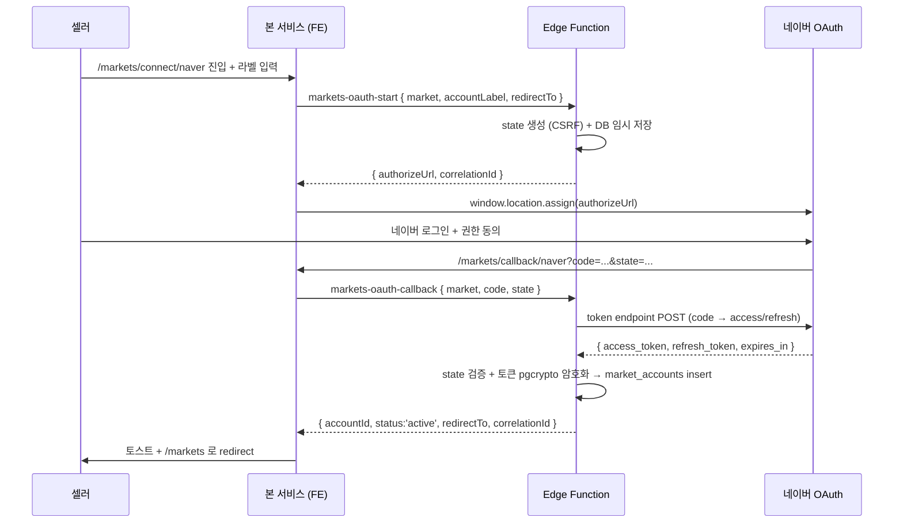
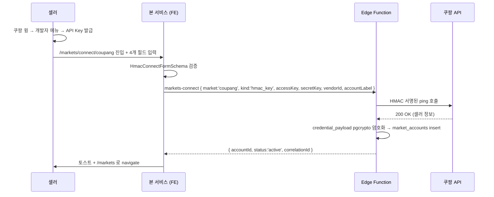
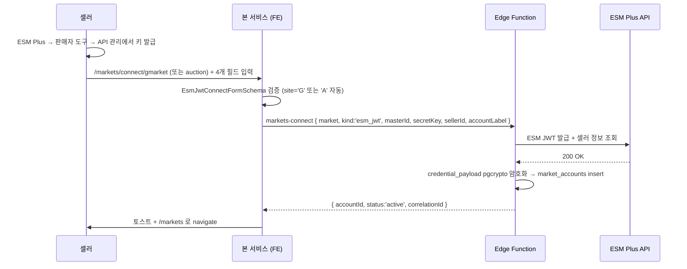
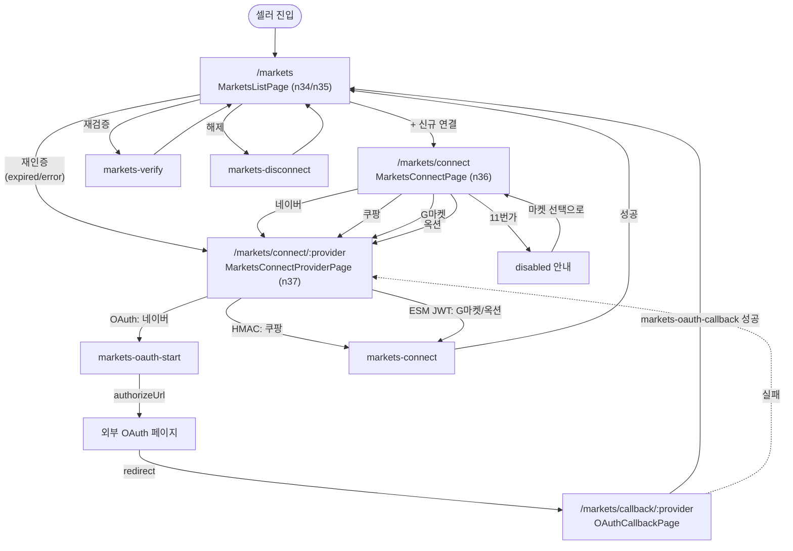

# s5 마켓 계정 도메인 — 화면 정의 / 기능 / 워크플로우

> 디자인 리뉴얼을 위한 화면 명세서. **실제 코드 / Tailwind 토큰은 다루지 않는다.**
> 외부 디자이너가 본 문서만 보고 와이어프레임·시안을 그릴 수 있도록 정리한다.
>
> 마스터 참조:
> - 화면 흐름: `docs/spec/user_flow.md` §s5 (n34~n40)
> - 요구사항: `docs/spec/PRD.md` §2.2 / §2.3 / §2.4
> - 설계: `docs/architecture/v1/features/markets.md`
> - 횡단: `docs/architecture/v1/cross-cutting/credential-vault.md`, `cross-cutting/market-adapter.md`
> - 현 구현: `apps/web/src/features/markets/`

---

## 1. 도메인 개요

### 1.1 목적
판매자가 본 서비스에서 상품을 일괄 등록하려면 먼저 외부 마켓(네이버 스마트스토어, 쿠팡, G마켓, 옥션 등)에 자기 셀러 계정 자격증명을 **안전하게 연결**해야 한다. s5 도메인은 그 **연결 / 상태 모니터링 / 해제 / 재인증** 의 전 라이프사이클을 다룬다.

### 1.2 진입 경로
- 메인 진입: 좌측 사이드바 → "마켓 계정" 메뉴 (`/markets`)
- 보조 진입:
  - s3 상품 등록 단계 3 (마켓 선택) 에서 "활성 마켓 0개" 일 때 빈 상태 CTA → `/markets/connect`
  - s2 대시보드 마켓 위젯에서 "재인증 필요" 뱃지 클릭 → `/markets`
  - 알림(토큰 만료) 클릭 → `/markets` (해당 계정 행에 포커스)

### 1.3 user_flow 매핑

| 노드 | 라벨 | 본 도메인 매핑 |
|---|---|---|
| n34 | 마켓 계정 관리 (main_page) | `/markets` 진입점 |
| n35 | 연결된 계정 목록 (page) | `MarketsListPage` 의 데이터 영역 |
| n36 | 마켓 계정 연결 (page) | `MarketsConnectPage` (마켓 선택) |
| n37 | OAuth 인증 (page) | `MarketsConnectProviderPage` (4-way 분기) + `OAuthCallbackPage` |
| n38 | 계정 연결 (action) | connect mutation 성공 흐름 |
| n39 | 계정 연결 해제 (action) | 목록 행의 "해제" 액션 |
| n40 | 연결 상태 확인 (action) | 목록 행의 "재검증" 액션 + 실시간 갱신 |

> user_flow.md 의 n37 라벨은 "OAuth 인증"이지만, **v1 실제 구현에서는 4-way 분기**(OAuth / HMAC / ESM JWT / disabled) 로 확장된다. 이 문서가 더 정확하다 — user_flow.md 는 라벨 갱신이 후속으로 필요 (백로그).

### 1.4 PRD 매핑

| PRD | 본 도메인에서 다루는 화면 |
|---|---|
| §2.2.1 OAuth 인증 플로우 구현 | `MarketsConnectProviderPage` OAuth 섹션 + `OAuthCallbackPage` |
| §2.2.2 API 연결 상태 실시간 표시 | `MarketsListPage` 의 상태 뱃지 + Supabase Realtime 구독 |
| §2.2.3 연결 계정 토큰 갱신 자동화 | 백그라운드 (자동) + 만료 임박 시 목록의 시각적 신호 |
| §2.3.1 연결 계정 목록 조회 | `MarketsListPage` |
| §2.3.2 마켓 계정 추가/수정/삭제 | `MarketsConnectPage` (추가) + 목록 행 액션 (해제, 재인증) |
| §2.3.3 마켓 계정 연결 상태 실시간 표시 | `MarketsListPage` 의 status 컬럼 |
| §2.3.4 계정 상태 변경 알림 | 본 도메인 외 — 알림 도메인이 트리거, 본 도메인은 클릭 진입점 제공 |
| §2.4.1 정기 보안 감사 | 백엔드 자동 — 본 도메인은 결과를 "오류 코드 + 마지막 검증 시각" 컬럼으로 반영 |
| §2.4.2 인증 정보 백업/복구 | 백엔드 자동 — UI 비노출 |

### 1.5 v1 마켓 라인업 (확정)

| 마켓 | 인증 방식 | 상태 | refreshToken |
|---|---|---|---|
| 네이버 스마트스토어 | OAuth 2.0 | ready | 사용 (자동 갱신) |
| 쿠팡 | HMAC 키 (Access / Secret / Vendor ID) | ready | 미사용 |
| G마켓 | ESM JWT (Master ID / Secret / Seller ID) | ready | 미사용 |
| 옥션 | ESM JWT (Master ID / Secret / Seller ID) | ready | 미사용 |
| 11번가 | API 키 | **coming_soon** (v2 이관) | — |

- 어댑터 `AuthInput` 은 4-way discriminated union: `oauth_code` | `hmac_key` | `esm_jwt` | `api_key`. `refreshToken` 메서드는 OAuth(네이버) 만 사용 — optional.
- credential 저장 = `credential_payload jsonb` 단일 컬럼 + pgcrypto 암호화. 평문은 Edge Function 안에서만 일시적으로 존재.
- 11번가는 Supabase Edge Function 의 outbound IP 동적 문제로 11번가 IP 화이트리스트 정책과 충돌 → Pro 고정 IP / 외부 프록시 / 11번가 해제 신청 중 결정 후 v2 진입.

---

## 2. 화면 목록

| # | 라우트 | 파일 | 화면명 | 진입 조건 |
|---|---|---|---|---|
| 1 | `/markets` | `apps/web/src/features/markets/pages/MarketsListPage.tsx` | 마켓 계정 목록 | 로그인 + 사이드바 클릭 / 알림 / 빈 상태 CTA |
| 2 | `/markets/connect` | `apps/web/src/features/markets/pages/MarketsConnectPage.tsx` | 마켓 선택 (신규 연결) | 목록 화면 "신규 연결" CTA |
| 3 | `/markets/connect/:provider` | `apps/web/src/features/markets/pages/MarketsConnectProviderPage.tsx` | 마켓별 인증 폼 (4-way 분기) | 마켓 선택 카드 클릭 |
| 4 | `/markets/callback/:provider` | `apps/web/src/features/markets/pages/OAuthCallbackPage.tsx` | OAuth 콜백 처리 | 외부 OAuth 인증 화면이 redirect (v1 = naver 만 도달) |

---

## 3. 화면별 상세

### 3.1 MarketsListPage — 마켓 계정 목록

**라우트** `/markets`
**파일** `apps/web/src/features/markets/pages/MarketsListPage.tsx`
**user_flow 노드** n34 / n35
**목적** 셀러가 자기가 연결한 모든 마켓 계정을 한눈에 보고, 상태(활성 / 만료 / 해제 / 오류) 와 마지막 검증 시각을 확인하며, 행 단위로 재검증·해제·재인증을 수행한다.

#### 3.1.1 기능
- 목록 표시: 행 단위로 `[마켓 로고/이름] [라벨] [상태 뱃지] [마지막 확인 시각] [액션]`.
- 상단 요약 (`MarketStackSummary`): 5개 마켓의 연결 상태 아이콘 묶음 (active / expired / not connected 시각 차이).
- 상단 우측 CTA: "+ 신규 연결" → `/markets/connect`.
- 모든 마켓 비활성일 때 경고 배너: "모든 마켓이 재인증 필요 또는 해제 상태입니다. 상품 등록 전에 1개 이상의 마켓을 다시 연결하세요."
- 데스크탑 (md+) = 테이블. 모바일 (~767px) = 카드 그리드.
- 실시간 갱신: `market_accounts` Postgres changes 구독 → 다른 탭/세션에서 상태 변경 시 즉시 반영.

#### 3.1.2 워크플로우
1. 진입 시 `useMarketAccounts` Query 실행 → `marketQueryKeys.accounts(sellerId)`.
2. `useMarketAccountsRealtime(sellerId)` 가 Supabase `channel('market_accounts')` 구독 → 변경 이벤트 → Query cache invalidate.
3. 행 액션:
   - "재검증" 클릭 → `useVerifyMarket` mutation → 성공 시 status / lastVerifiedAt 갱신 (Realtime 또는 즉시 invalidate).
   - "해제" 클릭 → 확인 다이얼로그 → `useDisconnectMarket` mutation → status='revoked'.
   - "재인증" 클릭 (만료/오류 상태) → `/markets/connect/:provider` 로 이동.
4. 빈 상태 → `MarketAccountEmpty` 컴포넌트 (CTA = "+ 신규 연결").

#### 3.1.3 주요 컴포넌트
- `PageHeader` (제목 + 부제 + 액션 슬롯)
- `MarketStackSummary` — 5개 마켓 묶음 상태 시각화
- `MarketAccountRow` — 데스크탑 행
- `MarketAccountCard` — 모바일 카드
- `MarketAccountStatusBadge` — 상태별 색상/문구 (active=초록 / expired=주황 / revoked=회색 / error=빨강)
- `MarketAccountActions` — 행 액션 묶음
- `MarketAccountEmpty` — 빈 상태
- `ErrorMessage`, `Skeleton`, `Card` (shadcn/ui)

#### 3.1.4 데이터 의존
- Query: `marketQueryKeys.accounts(sellerId)` → `listMarketAccounts()` (Supabase `market_accounts` 직접 SELECT, RLS 로 본인 데이터만).
- Realtime: `supabase.channel('market_accounts:<sellerId>')` Postgres changes.
- Mutation: `markets-verify`, `markets-disconnect` Edge Function.

#### 3.1.5 상태 처리 (4상태 + α)
- **loading** — `Skeleton` 행 3~4개.
- **data** — 정상 목록.
- **error** — `Card` 안 `ErrorMessage` + "다시 시도" 버튼. `correlationId` 표기.
- **empty** — `MarketAccountEmpty` (일러스트 자리 + CTA).
- **partial (커스텀)** — 데이터는 있지만 active 0 개 → 경고 배너.
- **per-row mutating** — 행 액션 진행 중 = 액션 버튼만 disabled + spinner. 다른 행은 정상 동작.

#### 3.1.6 PRD 근거
- §2.3.1 목록 조회, §2.3.2 추가/수정/삭제 진입점, §2.3.3 상태 실시간 표시, §2.2.2 연결 상태 실시간, §2.2.3 토큰 갱신 자동화 (UI 는 결과만 반영).

---

### 3.2 MarketsConnectPage — 마켓 선택 (신규 연결)

**라우트** `/markets/connect`
**파일** `apps/web/src/features/markets/pages/MarketsConnectPage.tsx`
**user_flow 노드** n36
**목적** 셀러가 연결할 마켓을 5개 중 1개 선택. 마켓별 인증 방식 힌트를 표시하고, v2 예정인 11번가는 disabled 로 노출.

#### 3.2.1 기능
- 5개 마켓 카드 그리드 (md+ 2열, 모바일 1열).
- 카드 구성: `[마켓명] [인증 방식 한 줄 설명] [CTA 버튼]`.
- 활성 4개 = "연결 시작" primary 버튼.
- 11번가 = "오픈 준비중" disabled + 부제 "v2 예정".

#### 3.2.2 인증 방식 설명 (카드 부제)
- 네이버 → "OAuth 2.0 인증 (마켓 로그인 페이지로 이동)"
- 쿠팡 → "API 키 입력 (Access / Secret / Vendor ID)"
- G마켓 → "ESM 키 입력 (Master ID / Secret / Seller ID)"
- 옥션 → "ESM 키 입력 (Master ID / Secret / Seller ID)"
- 11번가 → "오픈 준비중 (v2 예정)"

#### 3.2.3 워크플로우
1. 진입 시 `MARKET_CATALOG` 정적 데이터로 카드 렌더 (서버 호출 없음).
2. "연결 시작" 클릭 → `/markets/connect/:provider` 로 이동 (`provider` = naver / coupang / gmarket / auction).
3. 11번가 카드는 disabled, 클릭 불가.

#### 3.2.4 주요 컴포넌트
- `PageHeader`
- `Card` + `CardHeader` + `CardTitle` + `CardDescription` + `CardContent` (shadcn/ui)
- `Button` (primary / disabled)

#### 3.2.5 데이터 의존
- 없음. `MARKET_CATALOG` (`apps/web/src/features/markets/types/index.ts`) 정적 import.

#### 3.2.6 상태 처리
- 단일 정적 상태. loading/error/empty 없음.
- 11번가만 항상 disabled + aria-disabled.

#### 3.2.7 PRD 근거
- §2.2.1 OAuth 인증 플로우의 진입 화면, §2.3.2 추가의 첫 단계.

---

### 3.3 MarketsConnectProviderPage — 마켓별 인증 폼

**라우트** `/markets/connect/:provider`
**파일** `apps/web/src/features/markets/pages/MarketsConnectProviderPage.tsx`
**user_flow 노드** n37 + n38 (전반부)
**목적** 선택한 마켓의 인증 방식에 맞는 폼/안내를 보여주고, 자격증명을 수집해 Edge Function 으로 안전하게 전달.

#### 3.3.1 4-way 분기 (provider 파라미터로 결정)

| provider | 화면 모드 | 입력 필드 | 제출 시 동작 |
|---|---|---|---|
| `naver` | OAuth 안내 | `accountLabel` 만 | `useOAuthStart` → 응답의 `authorizeUrl` 로 외부 redirect |
| `coupang` | HMAC 폼 | `accountLabel` / `accessKey` / `secretKey` / `vendorId` | `useConnectMarket` → 성공 시 `/markets` 로 navigate |
| `gmarket` | ESM JWT 폼 | `accountLabel` / `masterId` / `secretKey` / `sellerId` (site=`G` 자동) | `useConnectMarket` → 성공 시 navigate |
| `auction` | ESM JWT 폼 | 동일 (site=`A` 자동) | 동일 |
| `11st` | disabled 안내 | 없음 | "마켓 선택으로" 링크만 |
| 잘못된 값 | 가드 화면 | — | "알 수 없는 마켓" + 마켓 선택으로 |

#### 3.3.2 워크플로우 (마켓별)

**OAuth (네이버):**
1. 폼: `accountLabel` 입력만 (라벨 = 동일 마켓 내 중복 불가, 1~40자).
2. 제출 → `markets-oauth-start` Edge Function 호출 → `{ authorizeUrl, correlationId }` 반환.
3. `window.location.assign(authorizeUrl)` 으로 네이버 OAuth 페이지로 이동.
4. 셀러가 네이버에서 로그인/동의 → `/markets/callback/naver?code=...&state=...` 로 redirect.

**HMAC (쿠팡):**
1. 폼: 4개 필드 (라벨 + Access / Secret / Vendor ID).
2. zod (`HmacConnectFormSchema`) 로 클라이언트 검증.
3. 제출 → `markets-connect` Edge Function 호출.
4. Edge Function 이 자격증명으로 쿠팡 API ping → 성공 시 암호화 저장 + `market_accounts` 행 생성.
5. 성공 토스트 + `/markets` 로 navigate. 실패 시 `ErrorMessage` + `correlationId` 표시.

**ESM JWT (G마켓 / 옥션):**
1. 폼: 4개 필드 (라벨 + Master ID / Secret / Seller ID).
2. `site` 코드는 UI 에 노출만 (G / A) — 자동 결정, 사용자 편집 불가.
3. 제출 흐름은 HMAC 과 동일.

**Disabled (11번가):**
1. "오픈 준비중 (v2 예정)" 안내 + 마켓 선택으로 돌아가는 버튼만.

#### 3.3.3 입력 보안 UX
- `secretKey` / `Secret Key` 는 `type="password"` 로 입력 (입력 중에도 화면에 평문 표기 금지).
- `autoComplete="off"` 강제 (브라우저 자동완성으로 다른 사이트 자격증명 누출 차단).
- 폼 제출 후 입력값은 **메모리에만** 유지, Edge Function 호출 직후 zero out (form reset).
- 클라이언트 측 로깅에 secret 절대 포함 금지 (`logger` 에서 redact).

#### 3.3.4 주요 컴포넌트
- `PageHeader`
- `Card` / `CardHeader` / `CardTitle` / `CardDescription` / `CardContent`
- `Input` / `Label` / `Button` (shadcn/ui)
- `ErrorMessage` (서버 에러 + correlationId)
- 내부 헬퍼: `OAuthSection` / `HmacSection` / `EsmJwtSection` / `DisabledSection` / `FormField`

#### 3.3.5 데이터 의존
- Mutation:
  - `useOAuthStart` → `markets-oauth-start`
  - `useConnectMarket` → `markets-connect` (HMAC / ESM JWT)
- zod 스키마 (`apps/web/src/lib/schemas/markets-feature.ts`):
  - `HmacConnectFormSchema` / `EsmJwtConnectFormSchema` (RHF + insert 3중 재사용)
  - `OAuthStartRequestSchema` / `OAuthStartResponseSchema`

#### 3.3.6 상태 처리
- **idle/data** — 폼 표시.
- **submitting/loading** — 제출 버튼 spinner + disabled, 다른 필드는 readonly 가 아닌 통상 유지 (사용자가 수정 후 재시도 가능).
- **error** — `ErrorMessage` (요청 ID 표시, raw response 는 접힘).
- **empty** — 해당 없음 (정적 폼).
- **success** — OAuth = redirect 직전 "이동 중…" 표기 / Key 입력 = 성공 토스트 + 목록으로 navigate.

#### 3.3.7 에러 코드 매핑 (대표 — `formatMarketError` 참조)

| 코드 | 의미 | UX |
|---|---|---|
| `invalid_code` | OAuth code 누락/위조 | "인증 코드가 유효하지 않습니다. 다시 시도하세요." |
| `invalid_state` | CSRF state 불일치 | 동일 메시지 + 보안 차단 안내 |
| `oauth_denied` | 사용자가 마켓에서 거부 | "마켓 인증을 취소했습니다." |
| `duplicate_label` | 동일 마켓 내 라벨 중복 | 라벨 필드 inline 에러 |
| `invalid_credentials` | 키 검증 실패 | "API 키가 유효하지 않습니다. 발급 화면에서 다시 확인하세요." |
| `market_unreachable` | 마켓 API 도달 실패 | "마켓 서버 응답이 없습니다. 잠시 후 다시 시도하세요." |
| `internal` | Edge Function 내부 오류 | 일반 안내 + correlationId |

#### 3.3.8 PRD 근거
- §2.2.1 OAuth 인증 플로우 구현 (네이버), §2.2.3 토큰 갱신 자동화의 초기 토큰 발급 단계, §2.3.2 추가 기능, §2.4 암호화 및 보안 (입력 → 암호화 저장 진입점).

---

### 3.4 OAuthCallbackPage — OAuth 콜백 처리

**라우트** `/markets/callback/:provider` (v1 = `naver` 만 도달)
**파일** `apps/web/src/features/markets/pages/OAuthCallbackPage.tsx`
**user_flow 노드** n37 (후반부) + n38 (완료)
**목적** 외부 OAuth 페이지에서 redirect 된 셀러를 받아, `code` + `state` 를 Edge Function 에 넘기고, 토큰 저장 결과에 따라 목록으로 보내거나 실패 화면을 표시.

#### 3.4.1 기능
- URL search params 검증:
  - `provider` 가 OAuth 지원 마켓인지 (v1 = `naver` 만).
  - 마켓 측 `error` 파라미터 우선 처리 (`access_denied` → `oauth_denied`).
  - `code` 존재 여부.
  - `state` 길이 ≥ 32자 (CSRF 방지).
- 모든 사전 검증 통과 시 `markets-oauth-callback` 호출.
- 성공 → 성공 토스트 + `data.redirectTo || '/markets'` 로 replace navigate.
- 실패 → 실패 카드 (에러 코드별 메시지 + correlationId + 재시도 / 목록 링크).
- 한 번만 실행 보장 (`startedRef` 가드) — React StrictMode dev 환경에서도 mutation 중복 방지.

#### 3.4.2 워크플로우 (정상 / 실패 다 포함)

```
외부 OAuth → /markets/callback/:provider?code=...&state=...
  ↓
URL 파싱
  ├─ provider 미지원 → failed (market_not_supported)
  ├─ ?error=access_denied → failed (oauth_denied)
  ├─ code 누락 → failed (invalid_code)
  ├─ state 누락/짧음 → failed (invalid_state)
  └─ 통과
     ↓
useOAuthCallback.mutate({ market, code, state })
  ├─ 성공: toast.success + navigate(redirectTo, replace:true)
  └─ 실패: setState({ kind: 'failed', code, message, correlationId })
```

#### 3.4.3 주요 컴포넌트
- `PageHeader`
- `Card` + `CardContent`
- `ErrorMessage` (correlationId 표기)
- `Button` (재시도 / 목록으로)
- spinner 인디케이터 (`aria-live="polite"` 영역)

#### 3.4.4 데이터 의존
- Mutation: `useOAuthCallback` → `markets-oauth-callback` Edge Function.
- 응답 스키마: `OAuthCallbackResponseSchema` (`accountId`, `market`, `accountLabel`, `status='active'`, `connectedAt`, `redirectTo`, `correlationId`).

#### 3.4.5 상태 처리
- **loading** — "연결 처리 중…" 카드 + spinner + 부제. 페이지 진입 직후 ~ mutation 완료까지.
- **data (success)** — 별도 화면 없음. 즉시 redirect.
- **error** — 실패 카드 (에러 카드 그대로) — 사용자가 "처음부터 다시 시도" 또는 "마켓 목록으로" 선택 가능.
- **empty** — 해당 없음.

#### 3.4.6 보안 고려
- `code` / `state` 는 search params 에서만 수령. localStorage / sessionStorage 에 저장 금지.
- mutation 호출 후 페이지는 즉시 redirect 되므로 URL 의 `code` 가 브라우저 히스토리에 남는 시간을 최소화.
- 실패 화면에서도 raw `code` / `state` 값 화면에 노출 금지 (correlationId 만 표기).

#### 3.4.7 PRD 근거
- §2.2.1 OAuth 인증 플로우의 마지막 단계 (token 교환 + 저장).

---

## 4. 마켓별 인증 플로우

### 4.1 네이버 스마트스토어 — OAuth 2.0



- **refreshToken** = 백그라운드 잡이 만료 임박 시 `markets-refresh` 자동 실행. UI 는 결과만 반영 (status / lastVerifiedAt).
- **CSRF 방어** = `state` 32자 이상 검증 + 서버측 storage 매칭.

### 4.2 쿠팡 — HMAC 키 입력



- **refreshToken 미사용** — HMAC 키는 만료 없음 (셀러가 직접 재발급할 때까지 유효).
- 키 검증 실패 시 `invalid_credentials` 에러 → 폼 그대로 + ErrorMessage.

### 4.3 G마켓 / 옥션 — ESM JWT



- ESM Plus 는 G마켓·옥션 공통 셀러 콘솔이므로 동일 키로 두 마켓 모두 동작 가능. 단 본 서비스에서는 **마켓 계정을 별도 행으로 분리** (G마켓용 1행 + 옥션용 1행) — site 코드 차이로 구분.

### 4.4 11번가 — coming_soon UX

- `/markets/connect` 카드에서 disabled 버튼 + "v2 예정" 부제.
- `/markets/connect/11st` 직접 진입 시 = "오픈 준비중" 안내 카드 + "마켓 선택으로" 버튼만.
- v2 진입 시점:
  - Pro 플랜 고정 IP / 외부 프록시 / 11번가 화이트리스트 해제 신청 중 결정 후
  - 어댑터 추가 + `MARKET_CATALOG['11st'].status = 'ready'` + 인증 방식(`api_key`) 폼 신설.

---

## 5. 연결 상태 표시 (실시간)

### 5.1 status 4종 (`MarketAccountStatusSchema`)

| status | 의미 | 색상 (의미만, 토큰은 디자이너) | 셀러 행동 유도 |
|---|---|---|---|
| `active` | 정상 | 초록 계열 | 그대로 사용 |
| `expired` | 토큰/세션 만료, 자동 갱신 실패 | 주황 계열 | 재인증 (재로그인 또는 키 재입력) |
| `revoked` | 셀러가 해제 | 회색 계열 | 필요 시 재연결 |
| `error` | 마켓 API 검증 실패 (자격증명 무효, 마켓 정책 위반 등) | 빨강 계열 | `lastErrorCode` 보고 대응, 재인증 |

### 5.2 실시간 갱신 메커니즘
- `useMarketAccountsRealtime(sellerId)` 가 Supabase Realtime channel 구독.
- INSERT / UPDATE / DELETE 이벤트 발생 시 TanStack Query `marketQueryKeys.accounts(sellerId)` cache invalidate.
- 셀러가 다른 탭에서 해제하거나, 백엔드 잡이 토큰을 만료 처리하면 → 현재 탭의 목록이 즉시 갱신.

### 5.3 상태 변경 알림 (도메인 외)
- §2.3.4 의 토큰 만료 / 인증 실패 알림은 **알림 도메인** (in-app + 이메일) 이 담당.
- 알림 클릭 → `/markets` 로 deep-link → 해당 행에 포커스 (행 id 를 URL hash 로 전달, 본 화면이 hash → scrollIntoView + highlight).

---

## 6. 자격증명 보안 UX

### 6.1 절대 노출 금지
- UI 어떤 곳에도 **평문 access_token / refresh_token / secretKey / accessKey** 표시 금지.
- 목록 / 상세에서 자격증명 자체를 보여주는 화면 자체가 없다. 보여줄 게 없는 게 보안.
- 디버그 로그·콘솔에도 금지 (logger redact 룰).

### 6.2 마스킹이 필요한 표시 케이스
- 셀러가 "이 계정의 키 일부를 확인하고 싶다" 는 요구가 있을 수 있다 → v1 에서는 **제공하지 않음** (별도 기능). 필요 시 v2 에서 `accessKey` 의 앞 4자 + `********` 형태로만 노출 검토.
- `externalAccountId` (예: 네이버 채널 ID, 쿠팡 vendorId) 는 마켓이 공개 정보로 분류한 식별자이므로 그대로 표시 가능.

### 6.3 액션 동선
- **해제 (Disconnect)** — 목록 행의 "해제" → 확인 다이얼로그 ("이 마켓 연결을 해제하면 등록 중인 상품은 영향 없으나, 새 등록·갱신이 차단됩니다. 계속할까요?") → mutation → status='revoked'.
- **재인증 (Re-auth)** — `expired` / `error` 상태에서만 노출. 클릭 시 해당 마켓의 connect 폼으로 이동 (`/markets/connect/:provider`). 기존 계정과 동일 라벨 + accountId 를 query param 으로 넘겨 백엔드가 "갱신" 모드로 처리.
- **재검증 (Verify)** — `active` 상태에서도 노출. 백엔드가 마켓 API ping → status / lastVerifiedAt 갱신만. 토큰 재발급은 별개.

### 6.4 보안 메시지 (UX 카피)
- HMAC / ESM 폼 부제에 **"입력값은 Edge Function 만 접근 가능한 영역에 암호화 저장됩니다."** 명시 (현재 구현된 카피 유지).
- OAuth 폼 부제에 **"마켓 로그인 정보는 본 서비스에 전달되지 않으며, 발급된 토큰은 암호화 저장됩니다."** 명시.

---

## 7. 도메인 워크플로우 다이어그램



---

## 8. 디자인 리뉴얼 시 고려사항

### 8.1 마켓 카드 시각 (MarketsConnectPage / MarketsListPage 요약)
- 5개 마켓을 한눈에 구분 가능한 강한 시각 정체성 필요 (색상 / 로고 / 약어).
- **마켓 색상 표준 (CLAUDE.md 마켓 라인업)**:
  - 네이버 스마트스토어 `#03C75A`
  - 11번가 `#FF0038`
  - G마켓 `#00B147`
  - 옥션 `#E73936`
  - 쿠팡 `#F11F44`
- 색상은 **로고 배지 / 좌측 컬러 바**에만 한정. 본문 텍스트·버튼 primary 컬러로 차용 금지 (디자인 시스템 토큰과 충돌).
- coming_soon (11번가) 은 색상을 desaturate + "준비중" 뱃지로 처리.

### 8.2 OAuth 콜백 로딩 화면
- 현재 spinner + "연결 처리 중…" 단순 형태.
- 디자이너 검토 포인트:
  - 셀러가 외부 OAuth → 본 서비스 redirect 시 **체감 지연** 이 생긴다 (보통 1~3초). progress 단계 시각화 (예: "토큰 수령 → 검증 → 저장" 3단계 dots) 가 UX 향상 여지 있음.
  - 실패 화면이 갑작스럽지 않게 — loading 카드에서 부드럽게 transition.

### 8.3 인증 방식별 폼 차이 (4-way union)
- 4개 마켓 모두 동일 레이아웃 컨테이너에 들어가지만 **필드 수와 종류가 다르다**.
  - 네이버 OAuth = 1개 (라벨만) — 가장 짧음.
  - 쿠팡 HMAC = 4개.
  - G마켓 / 옥션 ESM = 4개 (필드명만 다름).
  - 11번가 = 0개 (안내).
- 디자이너 검토 포인트:
  - 라벨 길이가 4개 (네이버 = "계정 라벨", 쿠팡 = "Access Key" 등) 간 큰 차이 → 정렬 일관성.
  - secret 필드 (`type=password`) 시각적 차이 (자물쇠 아이콘? show/hide 토글? — v1 은 show/hide 미제공이 보안상 더 안전).
  - "키 발급 위치" 가이드 링크 / 부제 가독성 (현재 카피 길다 — 단축 또는 접힘 가능).

### 8.4 모바일 OAuth 동선
- 모바일에서 외부 OAuth → 본 서비스 callback 이동은 브라우저 탭/세션 보존 이슈가 있다.
- 디자이너 검토 포인트:
  - OAuth 시작 직전에 "마켓 로그인 페이지로 이동합니다. 같은 탭에서 진행하세요." 안내 노출 (현재 부제로만).
  - 모바일 폼 입력 시 키보드가 secret 필드를 가리지 않는지 (input 위치 / 스크롤).
  - 터치 타겟 ≥ 44×44px — "연결 시작" / "해제" / "재검증" 버튼 모두 적용.

### 8.5 목록 화면 (MarketsListPage) 데스크탑 vs 모바일
- 데스크탑 = 5컬럼 테이블 (마켓 / 라벨 / 상태 / 마지막 확인 / 액션).
- 모바일 = 카드 그리드 (상태가 카드 좌측 컬러바로, 라벨은 큰 글씨로).
- 디자이너 검토 포인트:
  - 데스크탑 테이블에서 **상태 컬럼이 가장 시선이 가야 함** (체감상 가장 자주 확인).
  - 모바일 카드는 정보 밀도 vs 가독성 트레이드오프 — 한 카드에 모든 정보 vs 펼침.
  - 상단 `MarketStackSummary` 는 5개 마켓 한 줄 시각화 — 디자이너가 이 컴포넌트를 강한 정체성으로 다듬을 여지 큼.

### 8.6 빈 상태 (MarketAccountEmpty)
- 현재 placeholder. 디자이너 검토 포인트:
  - "아직 연결된 마켓이 없습니다" 메시지 + 5개 마켓 로고 미리보기 + "+ 신규 연결" CTA.
  - 일러스트레이션 1개 (도메인 모티프 — 다중 마켓 연결, 자물쇠/체크).

### 8.7 에러 메시지 표시 일관성
- `ErrorMessage` 공통 컴포넌트 사용 — 모든 화면에서 동일한 형태로 표기:
  - 짧은 메시지 + (선택) "요청 ID: ..." 보조 정보.
  - raw API response 는 접힘 기본 (`details` prop).
- 디자이너 검토 포인트:
  - correlationId 가 항상 보이는 게 셀러에게 친절한가 vs 노이즈인가 (현재는 항상 노출).
  - 권장: 평소엔 접힘, "지원팀에 문의" CTA 클릭 시 펼침.

### 8.8 상태 뱃지 시인성
- 4종 status × 모바일/데스크탑 = 디자이너가 각 상태별 색상·아이콘·텍스트 결정.
- WCAG 2.1 AA 대비 4.5:1 강제. 색상만으로 상태 구분 금지 (아이콘/텍스트 병행).

### 8.9 v1 → v2 확장 여백
- 11번가가 v2 에 추가되면 → `MarketsConnectPage` 카드가 5개 그대로지만 disabled 가 빠짐.
- v2 에서 `api_key` 방식 폼이 추가되므로 디자이너는 **5번째 인증 방식 폼 레이아웃** 도 미리 검토 (HMAC / ESM 과 거의 유사한 형태로 통일 권장).

---

## 9. 백로그 (본 도메인 후속)

- user_flow.md 의 n37 라벨 "OAuth 인증" → "마켓 인증 (OAuth / Key)" 로 갱신 검토 (4-way 확장 반영).
- 재인증 동선의 "기존 accountId 갱신 vs 신규 행 생성" 정책 명시 (현재 backend 마스터 `markets.md` 확인 필요).
- 자격증명 일부 마스킹 노출 (앞 4자 + ********) v2 검토.
- 모바일 OAuth 안내 카피 단축.
- `MarketStackSummary` 시각 정체성 강화 (디자이너).
