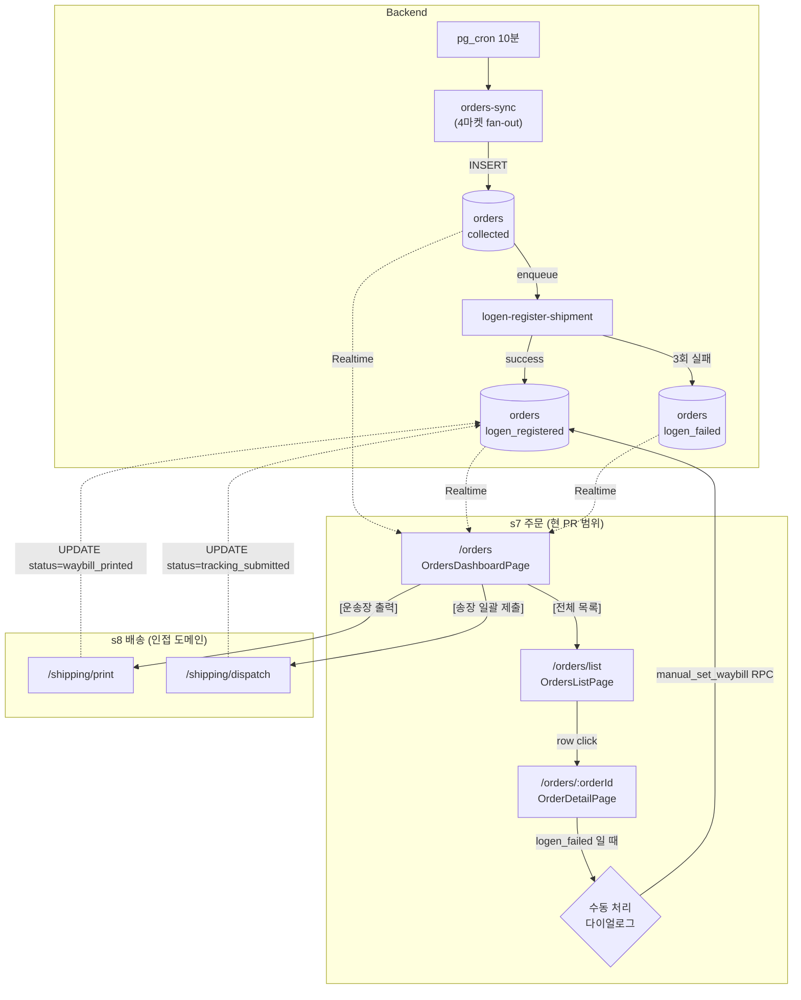

# s7 주문 현황 — 디자인 리뉴얼 화면 정의서

> **목적**: 외부 디자이너에게 s7 (주문 현황) 도메인의 화면·기능·워크플로우를 인계하기 위한 입력 자료. 디자인 시안·토큰 변경은 본 문서 범위 밖.
> **대상 화면**: `OrdersDashboardPage` (n47) / `OrdersListPage` (n48) / `OrderDetailPage` (n49) — `OrderManualResolveDialog` (n50) 는 Detail 내부 다이얼로그로 포함.
> **참조 마스터**: `docs/spec/user_flow.md` s7 / `docs/spec/PRD.md` §6.1·§6.5 / `docs/architecture/v1/features/orders.md` / `docs/architecture/v1/overview-shipping.md`.

---

## 1. 도메인 개요

### 1.1 정체성

s7 은 **마켓에서 수집된 주문의 통합 현황 도메인**이다. 4 마켓(네이버 / 쿠팡 / G마켓 / 옥션) 의 신규 주문이 pg_cron 10분 폴링으로 `orders-sync` Edge Function 을 통해 한 곳에 모이고, 판매자는 s7 화면에서 그 결과를 본다. 송장 발급·발송 트리거는 s7 에서 시작하지만 실제 처리는 s8 배송 도메인이 담당한다.

### 1.2 가치 제안 (PRD §6.5)

판매자의 오전 작업이 "4 마켓 각각 접속 → 신규 주문 확인 → 수기 송장 입력" 에서 "MarketCast 1 곳에서 통합 확인" 으로 줄어든다. 운송장 출력 1 클릭 + 송장 일괄 제출 1 클릭으로 일과 종료.

### 1.3 진입 경로

| 진입점 | 경로 | 비고 |
|---|---|---|
| s2 대시보드 — "전체 보기" 링크 | `/orders` (OrdersDashboardPage) | s2-dashboard.md §3.2.6 / §4.5번 / §5 다이어그램 |
| s2 대시보드 — 마켓별 주문 카드 클릭 | `/orders/list?market=<marketId>` (OrdersListPage 필터 적용) | s2-dashboard.md §3.4 `MarketOrderItemCard` / §4.5번 (n13) / §6.9 경계 |
| 사이드바 | `nav.shipping` 그룹 → `/orders` | overview-shipping.md §4.5 |
| 직접 URL | `/orders` 또는 `/orders/list?market=<id>` | router 등록됨 |
| 알림(이메일·앱) | 주문 알림 클릭 → `/orders/list?market=...` 또는 `/orders/:orderId` | 알림 횡단 도메인 |

### 1.4 user_flow 매핑

| 노드 | Type | 라벨 | 라우트 | 컴포넌트 |
|---|---|---|---|---|
| n47 | main_page | 주문 현황 대시보드 | `/orders` | `OrdersDashboardPage` |
| n48 | page | 주문 목록 | `/orders/list` | `OrdersListPage` |
| n49 | page | 주문 상세 | `/orders/:orderId` | `OrderDetailPage` |
| n50 | action | 수동 처리 다이얼로그 | (Detail 내부) | `OrderManualResolveDialog` |

### 1.5 PRD 매핑

- §6.1 주문 자동 수집 — `orders-sync` 결과를 s7 가 표시.
- §6.2 로젠 집하 예약 자동 등록 — `logen_registered` / `logen_failed` 상태 표시 + 수동 처리(n50) 유도.
- §6.3 운송장 출력 — s7 빠른 액션 → s8 `/shipping/print` 진입.
- §6.4 마켓 송장 일괄 제출 — s7 빠른 액션 → s8 `/shipping/dispatch` 진입.
- §6.5 주문·배송 현황 대시보드 — n47 본문.

### 1.6 s8 배송 도메인과의 경계

| 경계 | s7 (주문) 가 담당 | s8 (배송) 가 담당 |
|---|---|---|
| 데이터 | `orders` 테이블 | `shipping_jobs` / `shipping_job_results` |
| 상태 | `orderShippingStatus` (collected / logen_registered / logen_failed / waybill_printed / tracking_submitted) | `marketDispatchStatus` (pending / submitted / failed) |
| 트리거 | "운송장 출력" / "송장 일괄 제출" CTA 노출 | 실제 출력 팝업 / 일괄 제출 잡 실행 |
| 진행 화면 | 카운터·목록 갱신 (Realtime) | 잡 진행률 / 결과 / 재시도 |
| 이력 | 주문 단위 이력 (= `OrdersListPage` 필터) | 배송잡 단위 이력 (= `/shipping/history`) |

**원칙**: s7 은 "주문 상태 가시화 + s8 진입점". s7 화면 내부에서 송장 발급·제출 잡 자체를 실행시키지 않는다 (n50 수동 운송장 입력은 예외 — 별도 RPC).

---

## 2. 화면 목록

| 라우트 | 파일 | 화면명 | 라우터 등록 |
|---|---|---|---|
| `/orders` | `apps/web/src/features/orders/pages/OrdersDashboardPage.tsx` | 주문 현황 대시보드 (n47) | O (`router.tsx` 내 `path: 'orders'` index) |
| `/orders/list` | `apps/web/src/features/orders/pages/OrdersListPage.tsx` | 주문 목록 (n48) | O (`path: 'list'`) |
| `/orders/:orderId` | `apps/web/src/features/orders/pages/OrderDetailPage.tsx` | 주문 상세 (n49) | O (`path: ':orderId'`) |

세 화면 모두 `router.tsx` `// v2 — 주문 현황 (s7 n47~n50)` 블록에 등록되어 있어 orphan 없음.

---

## 3. 화면별 상세

### 3.1 OrdersDashboardPage (n47)

| 항목 | 내용 |
|---|---|
| **라우트** | `/orders` |
| **파일** | `apps/web/src/features/orders/pages/OrdersDashboardPage.tsx` |
| **목적** | 오늘자 주문·로젠 등록·출력·제출 4 단계 카운터 + 마켓별 신규 주문 + s8 빠른 액션 |
| **user_flow 노드** | n47 |
| **PRD 근거** | §6.5 (대시보드), §6.1 (자동 수집 결과 표시), §6.3·§6.4 (빠른 액션 진입점) |

**진입 경로**: s2 대시보드 **마켓별 주문 현황 위젯의 "전체 보기" 링크** / 사이드바 `nav.shipping` 그룹 / 알림 / 직접 URL. (s2 의 개별 마켓 카드 클릭은 `OrdersListPage` 필터 적용 진입이라 본 화면 거치지 않음 — §3.2 참조.)

**기능**:
- 오늘 요약 카드 4 종
  - 신규 주문 (`collected`)
  - 로젠 등록 완료 (`logen_registered`)
  - 출력 대기 (`logen_registered` 중 출력 미완료)
  - 제출 완료 (`tracking_submitted`)
- 빠른 액션 2 종 — `[운송장 출력]` (s8 `/shipping/print` 이동) / `[송장 일괄 제출]` (s8 `/shipping/dispatch` 이동)
- 마켓별 신규 주문 뱃지 — 4 마켓 각각 신규/대기 카운트
- 헤더 액션 `[전체 목록]` → `/orders/list`

**s2 대시보드 위젯과의 경계** (s2-dashboard.md §6.9 양방향 정합):
- s2 위젯 = 압축 요약 (마켓별 신규 카운트 + sync 상태) — **첫 진입 화면**에서 "처리할 마켓이 있는가" 한눈 표시.
- 본 화면 = 주문 도메인 자체 대시보드 — 4상태 카운터 + 빠른 액션 + 마켓별 뱃지. s2 보다 정보 밀도 높음.
- 두 화면이 동일한 "오늘 신규 주문 카운트" 를 표시할 수 있지만 데이터 소스는 분리: s2 = `rpc_get_market_orders_summary()`, 본 화면 = `useOrdersSummary()` (Edge Function `orders-summary`). **수치 일치 보장은 동일 origin DB 라 자연 일치** — 차이가 보이면 캐시 staleTime 차이 의심.

**워크플로우**:
1. 페이지 진입 → `useOrdersSummary()` 가 Edge Function `orders-summary` 호출 (가정 — `orders-api.ts` 참조)
2. Supabase Realtime `orders:seller=${sellerId}` 채널 구독 — INSERT/UPDATE 시 query invalidate
3. 카드 카운터 / 마켓별 뱃지 즉시 갱신 (사용자 새로고침 불필요)
4. 빠른 액션 클릭 → s8 화면으로 라우팅 (s7 내부 잡 실행 없음)

**주요 컴포넌트**:
- `PageHeader` (`@/components/layout/PageHeader`)
- `OrdersSummaryCard` (4 상태 — loading skeleton / data / error / empty 자체 처리)
- `MarketBadge` (마켓별 색상 토큰 — overview 의 4 마켓 색상 표준)
- `Button` / `Card` / `CardHeader` / `CardContent` / `ErrorMessage` (shadcn)
- 아이콘: `Inbox` (신규) / `Truck` (로젠 등록) / `Printer` (출력) / `Send` (제출)

**데이터 의존**:
- Hook: `useOrdersSummary` → `['orders', 'summary', sellerId]`
- Edge Function: `orders-summary` (계산 view 가정. 본 PR 시점 placeholder)
- Realtime: `orders` 테이블

**상태 처리**:

| 상태 | UI |
|---|---|
| loading | 4 카드 + 마켓별 영역에 skeleton |
| data | 카운터 + 뱃지 정상 표시 |
| error | `ErrorMessage` (raw 응답 접힘 기본) + 재시도 |
| empty | "오늘 신규 주문이 없습니다" + 로젠 미연동 시 `/settings/shipping` 유도 배너 |
| partial | 카드 4 종은 항상 모두 표시 — 마켓별 영역은 일부 마켓 응답 누락 시 fetched 마켓만 표시 (다른 마켓은 회색 placeholder 권장) |

---

### 3.2 OrdersListPage (n48)

| 항목 | 내용 |
|---|---|
| **라우트** | `/orders/list` |
| **파일** | `apps/web/src/features/orders/pages/OrdersListPage.tsx` |
| **목적** | 모든 주문의 검색·필터 + 페이지네이션 (무한 스크롤) |
| **user_flow 노드** | n48 |
| **PRD 근거** | §6.5 (필터·검색), §6.1 (수집된 주문 노출) |

**진입 경로**: n47 헤더 `[전체 목록]` / 사이드바 / 알림 클릭 / 직접 URL / **s2 대시보드 마켓별 주문 카드 클릭 (`?market=<id>` 사전 적용 상태)** — s2-dashboard.md §3.4 `MarketOrderItemCard` 정합.

**기능**:
- 검색 (q): 상품명·주문번호·수취인(마스킹) 매칭 (60자 제한)
- 필터: 마켓 (`market`) / 상태 (`status`) — URL search params 단방향 source. **s2 위젯에서 진입 시 `market=<id>` 가 사전 채워진 상태로 마운트** — 사용자가 즉시 해당 마켓 주문 목록만 확인 가능.
- 필터 리셋 버튼
- 무한 스크롤 (IntersectionObserver, pageSize=50)
- 행 클릭 → `/orders/:orderId`
- 데스크탑 = 테이블 / 모바일 = 카드 (반응형 분기 `md:`)

**워크플로우**:
1. URL search params → zod (`MarketIdSchema` / `OrderShippingStatusSchema`) 검증 → `OrdersFilter` 구성
2. `useOrders(filter)` 가 무한 쿼리 (`['orders', 'list', filter]`) 시작
3. sentinel `
` 가 viewport 진입 시 `fetchNextPage()`
4. 필터·검색 변경 시 URL 갱신 (`replace: true`) → 쿼리 키 자동 변경 → 새 결과

**주요 컴포넌트**:
- `Input` / `Button` / `Skeleton` / `ErrorMessage` (shadcn)
- `FilterChips` (페이지 내부 정의 — `<fieldset>` + `aria-pressed` 토글 버튼)
- `OrderStatusBadge` / `MarketBadge` (`features/orders/components/`)
- native `<table>` (shadcn Table 미보유 — 페르소나 룰 4 의 특수 케이스, 사유 명시됨)

**데이터 의존**:
- Hook: `useOrders(filter)` → `['orders', 'list', filter]` (TanStack `useInfiniteQuery`)
- Schema: `OrderSummarySchema` (`apps/web/src/lib/schemas/orders.ts`)
- ENUM: `ORDER_SHIPPING_STATUSES` 5 종 / `MARKET_IDS` 4 종 — 필터 옵션 단일 소스

**상태 처리**:

| 상태 | UI |
|---|---|
| loading | 3 줄 skeleton (`<Skeleton h-16>`) |
| data | 테이블/카드 + 페이지 카운트 (`subtitle`) + sentinel |
| error | `ErrorMessage` |
| empty | 필터 default = "전체 주문 없음" 메시지 / 필터 적용 중 = "조건에 맞는 주문 없음" 메시지 (두 메시지 키 분리) |
| partial | 무한 스크롤 중 `isFetchingNextPage` 시 sentinel 영역에 32x10 skeleton |

---

### 3.3 OrderDetailPage (n49)

| 항목 | 내용 |
|---|---|
| **라우트** | `/orders/:orderId` |
| **파일** | `apps/web/src/features/orders/pages/OrderDetailPage.tsx` |
| **목적** | 단일 주문의 상세 정보 + 5단계 타임라인 + 마켓 송장 제출 상태 + 수동 처리 진입 |
| **user_flow 노드** | n49 + n50 (다이얼로그) |
| **PRD 근거** | §6.1·§6.2 (수집·로젠 등록 결과 시각화), §6.4 (마켓 송장 상태) |

**진입 경로**: n48 행 클릭 / 알림 URL.

**기능**:
- PageHeader (상품명 + `#외부주문ID`) + 헤더 액션 (`OrderStatusBadge` + `OrderManualResolveDialog` 트리거)
- 주문 정보 카드 — 외부주문ID / 마켓 뱃지 / 상품명 / 옵션 / 수량 / 주문시각
- 배송 정보 카드 — 수취인(마스킹) / 연락처(마스킹) / 주소(마스킹) / 운송장번호
- 타임라인 — collected → logen_registered → waybill_printed → tracking_submitted (`OrderStatusTimeline`)
- 마켓 송장 제출 카드 — `MarketDispatchStatus` 뱃지 (pending / submitted / failed)
- logen_failed 시 안내 문구 + 수동 처리 다이얼로그 활성
- 하단 `[목록으로]` 링크

**워크플로우**:
1. `useParams` 로 `orderId` 추출 → null 가드 → notFound 분기
2. `useOrderDetail(orderId)` 가 `get_order` RPC 호출 → `OrderDetail` zod parse
3. 4상태 분기 (loading / error / notFound / data)
4. logen_failed 인 경우 `OrderManualResolveDialog` 가 활성 — RPC `orders.manual_set_waybill(p_order_id, p_waybill)` 호출 → 성공 시 query invalidate + Realtime 갱신
5. `events` 테이블에 `{ type: 'manual_waybill_set', seller_id, order_id, prev_status }` 감사 로그 (Edge / RPC 측)

**주요 컴포넌트**:
- `PageHeader` (header actions slot)
- `Card` 4종 (주문 정보 / 배송 정보 / 타임라인 / 송장 제출)
- `OrderStatusBadge` / `OrderStatusTimeline` / `MarketBadge` / `Badge` (shadcn)
- `OrderManualResolveDialog` (shadcn `Dialog` + RHF + zod — 운송장번호 12자리 등 로젠 규칙 검증)
- `KeyValue` 내부 컴포넌트 (label/value 2열 그리드)

**데이터 의존**:
- Hook: `useOrderDetail(orderId)` → `['orders', 'detail', orderId]`
- Mutation: `useManualResolveWaybill` (n50 다이얼로그)
- Schema: `OrderDetailSchema` (jsonb 단일 객체)
- RPC: `get_order` (SELECT) / `orders.manual_set_waybill` (security definer)

**상태 처리**:

| 상태 | UI |
|---|---|
| loading | `role="status"` + 2단 skeleton (32 / 48) |
| data | 4 카드 + 타임라인 + 헤더 액션 |
| error | `ErrorMessage` + `[목록으로]` |
| empty (notFound) | "주문을 찾을 수 없습니다" + `[목록으로]` |
| partial | logen_failed 시: 타임라인 logen 단계 = 실패 표시 + 송장 제출 카드 = pending + 다이얼로그 트리거 활성 |

---

## 4. 주문 동기화 흐름

### 4.1 채널별 트리거

| 채널 | 주기 | 트리거 주체 | 처리 함수 | s7 반영 경로 |
|---|---|---|---|---|
| pg_cron 폴링 | 10분 (`*/10 * * * *`) | Supabase cron | `orders-sync` Edge Function | DB INSERT → Realtime `orders` 채널 → query invalidate |
| 마켓 웹훅 (v2) | OQ-SHIP-02 해결 후 | 외부 마켓 | (신규 함수 추가 예정) | 동일 — `orders` 테이블 INSERT |
| 수동 새로고침 | 사용자 | UI `[새로고침]` (옵션) | `useOrdersSummary` / `useOrders` refetch | 동일 query key invalidate |
| 수동 처리 | 사용자 (n50) | `OrderManualResolveDialog` 제출 | RPC `orders.manual_set_waybill` | UPDATE → Realtime UPDATE → invalidate |

### 4.2 멱등성

- `orders` 테이블 unique 제약 `(market_id, external_order_id, seller_id)` 가 중복 차단.
- 동일 윈도우 재폴링 시 0 건 insert — `orders-sync` 재시도 안전.

### 4.3 실패 격리

- `orders-sync` 는 4 마켓 fan-out `Promise.allSettled`. 한 마켓 401 → `market_accounts.status = 'reauth_required'` 마킹 + s5 마켓 페이지 재인증 배너. s7 화면은 영향 받지 않음 (해당 마켓 카운트만 정체).
- 디자인 관점: 마켓별 뱃지 영역에 **"동기화 지연" 마이크로 표시**를 추가하면 사용자가 "특정 마켓만 비어 있다 → 재인증 필요" 를 직관적으로 인지 가능 (v2 후보).

---

## 5. 선택·일괄 처리 패턴 (v1 현재 / v2 후보)

### 5.1 v1 — 화면 단위 진입

s7 자체는 다중 선택 UI 를 가지지 않는다. 일괄 처리는 s8 화면 진입 후 거기서 처리.

| 동선 | s7 진입 | s8 처리 |
|---|---|---|
| 운송장 출력 | n47 `[운송장 출력]` 클릭 | `/shipping/print` 에서 `logen_registered` 주문 전체/선택 → 출력 팝업 |
| 송장 일괄 제출 | n47 `[송장 일괄 제출]` 클릭 | `/shipping/dispatch` 에서 `waybill_printed` 주문 전체 → 4 마켓 fan-out |

### 5.2 v2 후보 — n48 목록에서 직접 선택

- `OrdersListPage` 행 좌측에 체크박스 + 헤더 일괄 선택
- 선택된 주문에 대해서만 [선택 출력] / [선택 제출] CTA 활성 (`blockingReasons` 노출 — 예: "상태가 logen_registered 가 아닌 주문 N건이 포함되어 있습니다")
- s8 `/shipping/print` 또는 `/shipping/dispatch` 에 `?selectedOrderIds=...` 쿼리로 전달

디자인 리뉴얼 시 v1 유지 (셀렉션 UI 미포함) 와 v2 도입 (셀렉션 UI 포함) 두 안의 시각 차이를 미리 정리해두면 다운스트림 비용 절감.

---

## 6. 도메인 워크플로우 다이어그램

---

## 7. 디자인 리뉴얼 시 고려사항

### 7.1 주문 카드 / 테이블 패턴

- **데스크탑 = 테이블 / 모바일 = 카드** 반응형 분기는 이미 코드상 확정 (`hidden md:block` / `md:hidden`). 디자인 시안도 두 모드 동시 제공 필요.
- 데스크탑 테이블 컬럼 폭: 상품(34%) / 마켓(12%) / 수취인(14%) / 상태(14%) / 운송장(14%) / 주문시각(12%) — 토큰화 여부 결정 (현재는 inline `w-[34%]`). 디자인 시안에서 컬럼 폭이 바뀌면 모든 컬럼이 한 화면에 맞춰 재계산되어야 함.
- shadcn 에 Table primitive 없음 → 디자인 시안에서 테이블 스타일을 정의하면 native `<table>` 위에 Tailwind 클래스로 구현.

### 7.2 마켓별 색상 뱃지

- 표준: 네이버 `#03C75A` / 쿠팡 `#F11F44` / G마켓 `#00B147` / 옥션 `#E73936` (CLAUDE.md "마켓 라인업 색상 표준").
- 11번가 (`#FF0038`) 는 v1 미포함이나 색상은 예약. v1 디자인 시안에서 11번가 자리 비워두기.
- raw HEX 금지 룰 — `tailwind.config.ts` 또는 `globals.css` 의 토큰화 필요. 디자인 토큰 갱신은 `docs/architecture/v1/ui-system.md` 선행 갱신 후 동기화.
- 대비 4.5:1 확보 — 마켓 색상 위에 흰색 텍스트가 모두 통과하는지 디자인 시안에서 사전 검증.

### 7.3 상태 뱃지 / 타임라인

- `OrderShippingStatus` 5 종 + `MarketDispatchStatus` 3 종. 디자인 시안에서 각 상태별 색상 + 아이콘 + 라벨을 일관되게 정의해야 두 뱃지가 한 화면(`/orders/:orderId`) 에 공존할 때 혼동 없음.
- 타임라인 5단계 시각화: collected → logen_registered → waybill_printed → tracking_submitted + 분기 (`logen_failed` 는 logen 단계 실패 표시). 시안에서 "진행 / 완료 / 실패 / 예정" 4 톤 필요.

### 7.4 다중 선택 UX (v2 도입 대비)

- v1 시점에는 셀렉션 UI 없음. 디자인 시안에서 미리 셀렉션 행 + 일괄 액션 바 (sticky bottom 또는 header) 디자인 안을 만들어두면 v2 진입 시 재작업 최소.

### 7.5 검색·필터 영역

- 현재: 상단 grid `md:grid-cols-[1fr_auto_auto_auto]` — 검색 입력 / 마켓 칩 / 상태 칩 / 리셋.
- 마켓 4 종 × 상태 5 종 칩 = 한 줄에 안 들어갈 수 있음 (모바일). 칩 wrap 정책 / 펼치기·접기 정책 시안에서 정의.
- 검색은 즉시 결과 갱신 (페이지 이동 없음) — 페르소나 룰 5 의 "검색/필터류" variant 적용. 검색 버튼은 `variant="outline"`, 리셋은 `variant="ghost"`, 빠른 액션 (`/shipping/*` 이동) 은 `variant="primary"` 로 시각 차이.

### 7.6 빈 상태 (empty)

| 화면 | empty 시나리오 | 메시지 후보 |
|---|---|---|
| n47 | 오늘 신규 주문 0 | "오늘 신규 주문이 없습니다" + (로젠 미연동) 배너 |
| n48 (필터 default) | 전체 주문 0 | "수집된 주문이 없습니다" |
| n48 (필터 적용) | 조건에 맞는 주문 0 | "조건에 맞는 주문이 없습니다" + [필터 초기화] |
| n49 | 잘못된 orderId | "주문을 찾을 수 없습니다" + [목록으로] |

각 empty 일러스트 / 톤 일관성 — 등록 도메인(s3) empty 와 통일.

### 7.7 동기화 상태 표시 (옵션)

- 현재 화면 어디에도 "마지막 동기화 시각" 표시 없음. Realtime 으로 자동 갱신되지만 사용자가 "정말 최신인가" 의심할 가능성.
- 디자인 리뉴얼 시 헤더 보조 영역에 `최근 동기화: HH:mm:ss` + 수동 새로고침 버튼을 둘지 결정 (v2 후보).
- 마켓별 동기화 상태(특정 마켓 401 등)를 색상 점으로 표시하는 안도 후보.

### 7.8 접근성 (WCAG 2.1 AA)

- 색상 대비 4.5:1 — 마켓 뱃지 / 상태 뱃지 모두 검증.
- 키보드 흐름 — 필터 칩은 `Button aria-pressed` 사용 중 (탭 순서 유지).
- 무한 스크롤 sentinel 은 `aria-hidden` — 키보드 사용자에게는 별도 "더 보기" 버튼 옵션을 검토 (현재는 미제공).
- 모바일 터치 타겟 ≥ 44×44px — 카드 클릭 영역, 칩 버튼 크기 시안 검증.

### 7.9 동기화 정책 변경 가능성 (OQ-SHIP-02)

웹훅 도입 시 폴링 간격·"최근 동기화" 표시 의미가 달라짐. 디자인 시안에서 "동기화 시각" 요소를 모듈로 분리해두면 정책 변경 시 텍스트만 갱신해도 됨.

---

## 8. 작업 후 동기화 체크리스트 (디자이너 → 개발 핸드오프 시)

- [ ] 디자인 시안의 마켓 색상이 `tailwind.config.ts` / `globals.css` 토큰과 1:1 매칭되는지
- [ ] `OrderShippingStatus` / `MarketDispatchStatus` 8 종 뱃지가 모두 시안에 있는지
- [ ] 모바일 (`~767px`) / 태블릿 (`768~1199px`) / 데스크탑 (`1200px+`) 3 브레이크포인트 시안 제공
- [ ] empty / loading / error 일러스트·메시지 톤 일관성
- [ ] 다중 선택 UX (v2) 의 시각 안 포함 여부 결정
- [ ] `docs/spec/user_flow.md` s7 노드 (n47~n50) 라벨과 시안 화면명 일치
- [ ] `apps/web/src/locales/ko.ts` 의 `orders.*` 키와 시안 텍스트 일치 — 시안 텍스트 변경 시 i18n 사전 갱신 PR 동반

---

## 9. 미해결 사안 (s7 관련)

| # | 질문 | s7 디자인 영향 |
|---|---|---|
| OQ-SHIP-02 | 마켓 주문 웹훅 지원 여부 | "최근 동기화 시각" 표기 의미, 폴링 간격 표시 |
| OQ-SHIP-03 | 네이버 주문 API 가 상품등록 앱과 동일 여부 | n47 마켓별 뱃지에 "재인증 필요" 분기 시각 추가 가능성 |
| (신규) | 다중 선택 UX v1 도입 여부 | n48 행 디자인 (체크박스 컬럼 유무) |

해결 결과는 본 문서 §3 (해당 화면) 또는 §5·§7 갱신.
