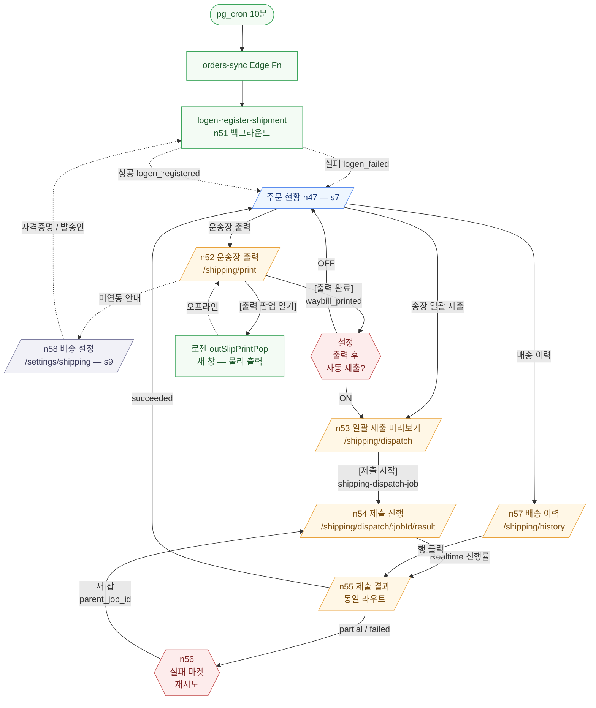

# s8 배송 처리 — 디자인 리뉴얼 인계 문서

> 외부 디자이너에게 넘기기 위한 **화면 정의 / 기능 / 워크플로우** 정리.
> 본 문서는 디자인 리뉴얼 산출물이 아니다 — 리뉴얼 결정 전 "지금 무엇이 있는가"를 캡처한 입력 자료.
>
> **소관 도메인**: s8 배송 처리 (운송장 출력 / 송장 일괄 제출 / 배송 이력)
> **마스터 참조**:
> - PRD: `docs/spec/PRD.md` §6 (주문 자동 수집 + 배송 자동화), §7 (로젠택배 API 명세), §8 (데이터 모델)
> - 유저 플로우: `docs/spec/user_flow.md` §s8 (n51 ~ n57)
> - 아키텍처: `docs/architecture/v1/features/shipping.md` (단일 진입점), `docs/architecture/v1/overview-shipping.md`, `docs/architecture/v1/cross-cutting/logen-adapter.md`, `docs/architecture/v1/cross-cutting/market-adapter-shipping.md`
> - 구현: `apps/web/src/features/shipping/`

---

## 1. 도메인 개요

### 1.1 목적

판매자가 여러 마켓에 접속하여 주문을 수동 확인하고 운송장을 입력하는 반복 작업을 제거한다. **MarketCast 1곳에서 4마켓 주문을 통합 수집** → **로젠택배 집하 예약·운송장번호 채번 자동** → **마켓 송장 일괄 제출까지 클릭 최소화 (최대 2 클릭)** 로 끝낸다.

### 1.2 진입 경로

- 사이드바 네비 "배송" → `/shipping/print` (기본 진입점) → `/shipping/dispatch` → `/shipping/history`
- s7 주문 화면 (n47 "주문 현황") 의 빠른 액션 버튼 "운송장 출력" / "송장 일괄 제출" 에서 직접 진입
- s2 대시보드의 "출력 대기 N건" / "제출 대기 N건" 카운터에서 직접 진입

### 1.3 user_flow / PRD 매핑

| user_flow 노드 | 화면 / 트리거 | PRD |
|---|---|---|
| n51 (action) 로젠 자동 처리 | Edge Fn `logen-register-shipment` — 백그라운드 (사용자 진입 없음) | §6.2 |
| n52 (page) 운송장 출력 | `/shipping/print` → `ShippingPrintPage` | §6.3 |
| n53 (page) 송장 일괄 제출 시작 | `/shipping/dispatch` (미리보기 sub-view) → `ShippingDispatchPage` | §6.4 |
| n54 (page) 송장 제출 진행 (실시간) | `/shipping/dispatch/:jobId/result` (진행률 sub-view) → `ShippingDispatchResultPage` | §6.4 |
| n55 (page) 송장 제출 결과 | `/shipping/dispatch/:jobId/result` (결과 sub-view) → `ShippingDispatchResultPage` | §6.4 |
| n56 (action) 부분 실패 재시도 | 결과 페이지 내부 액션 → 새 `shipping_job` 생성 (`parent_job_id` 연결) | §6.4 |
| n57 (page) 배송 이력 | `/shipping/history` → `ShippingHistoryPage` | §6.4 |

### 1.4 인접 도메인 경계

| 도메인 | 경계 |
|---|---|
| **s7 주문** (`/orders`) | 주문 수집·상태 (`collected` / `logen_registered` / `waybill_printed` / `tracking_submitted` / `dispatch_failed`) 표시는 s7 책임. s8 은 **출력 대상**(`logen_registered`) 과 **제출 대상**(`waybill_printed`) 만 다룸. 주문 단건 상세는 s7 으로 라우팅. |
| **s9 설정 — 배송** (`/settings/shipping`) | 로젠 자격증명 / 발송인 정보 / 출력 후 자동 제출 토글 default 는 s9 영역. s8 화면에서는 "미연동 안내 배너" 만 표시하고 설정 페이지로 라우팅. |
| **알림 (횡단)** | 부분 실패 시 알림 발송 책임은 횡단 알림 도메인. s8 결과 페이지에서는 in-page 토스트 + 카드 강조까지만. |
| **로젠 API** | `getSlipNo` / `registerOrderData` / `outSlipPrintPop` 등 로젠 4 메서드 명세는 `cross-cutting/logen-adapter.md` 단일 출처. s8 은 추상화된 어댑터만 사용. |
| **마켓 송장 전달** | 4마켓별 송장 API 매트릭스 (네이버 / 쿠팡 / G마켓 / 옥션) 는 `cross-cutting/market-adapter-shipping.md` 단일 출처. |

---

## 2. 화면 목록

| 라우트 | 파일 | 화면명 | 진입 조건 |
|---|---|---|---|
| `/shipping/print` | `apps/web/src/features/shipping/pages/ShippingPrintPage.tsx` | 운송장 출력 (n52) | 인증된 셀러. 로젠 미연동이어도 진입 가능하나 데이터 0건 + 안내 배너 |
| `/shipping/dispatch` | `apps/web/src/features/shipping/pages/ShippingDispatchPage.tsx` | 송장 일괄 제출 미리보기 (n53) | 인증된 셀러. `status='waybill_printed'` 주문 존재 시 의미 있음 |
| `/shipping/dispatch/:jobId/result` | `apps/web/src/features/shipping/pages/ShippingDispatchResultPage.tsx` | 송장 제출 진행 / 결과 (n54 + n55 + n56) | `:jobId` 로 식별되는 본인 소유 `shipping_jobs` 행 존재 (RLS) |
| `/shipping/history` | `apps/web/src/features/shipping/pages/ShippingHistoryPage.tsx` | 배송 이력 (n57) | 인증된 셀러 |

> n51 (`logen-register-shipment`) 은 백그라운드 Edge Function. 화면 없음 — orders-sync 직후 자동 트리거되며 결과는 s7 주문 목록의 `status` 컬럼으로 반영.

---

## 3. 화면별 상세

### 3.1 `/shipping/print` — 운송장 출력 (n52)

- **파일**: `apps/web/src/features/shipping/pages/ShippingPrintPage.tsx`
- **목적**: 로젠에 자동 등록되어 운송장번호가 채번된 주문(`status='logen_registered'`) 의 라벨을 로젠 인쇄 팝업으로 출력하고, 출력 완료 처리(`waybill_printed`) 까지 한 화면에서 수행.
- **진입 경로**:
  - 사이드바 "배송 → 운송장 출력"
  - s7 주문 현황(n47) "운송장 출력" 빠른 액션
  - s2 대시보드의 출력 대기 카운터
- **기능**:
  1. 출력 대상 주문 테이블 (체크박스 전체/개별 선택, 마켓 배지 / 주문번호 / 상품명 / 구매자 / 운송장번호 컬럼).
  2. **[출력 팝업 열기]** — 선택된 운송장 (또는 미선택 시 전체) 의 운송장번호 배열을 인자로 `buildOutSlipPrintPopUrl({ waybillNumbers })` 호출 → `window.open(url, 'logen-print-pop', 'width=900,height=700')` 로 로젠 인쇄 팝업 띄움. 팝업 차단 시 토스트.
  3. **[출력 완료]** — 선택된(또는 전체) 주문 ids 를 `useMarkWaybillPrinted` mutation 으로 `status='waybill_printed'` 일괄 전환. 완료 토스트 + 선택 해제.
  4. 로젠 미연동 안내 배너 — 현재는 정적 stub (PR10 연동 후 `useShippingSettings()` 로 조건부 렌더).
  5. 헤더 우측 "로젠 연동 설정" 링크 → `/settings/shipping`.
- **워크플로우**:
  ```
  진입 → 출력 대상 목록 로드
    └ 0건이면 empty 메시지 + 미연동 안내 배너만
    └ ≥1건이면 테이블 표시
  사용자: 전체 또는 개별 선택
  사용자: [출력 팝업 열기] → 로젠 팝업 새 창 → 프린터 출력 → 택배 부착 (오프라인)
  사용자: [출력 완료] 클릭 → 서버 update
    └ 성공: status='waybill_printed', waybill_printed_at=now()
    └ 자동 제출 ON (PR10 후): /shipping/dispatch 자동 이동
  ```
- **주요 컴포넌트**:
  - shadcn: `Button`, `Card`, `Badge`, `Tooltip`, `Skeleton`, `ErrorMessage`
  - 자체: `PageHeader`
  - raw `<input type=checkbox>` 2곳 (테이블 내 행 선택 / 전체 선택) — shadcn Checkbox 로 교체 검토 필요(현재 일관성 흠집)
- **데이터 의존**:
  - Hook: `useShippingPrintList()` — `queryKey: ['shipping', 'print-list']`
  - Hook: `useMarkWaybillPrinted()` — invalidate `print-list` + `dispatch-preview`
  - Edge Function (의도): `shipping-print-list` (read), `shipping-mark-waybill-printed` (write)
  - 보조: `buildOutSlipPrintPopUrl` (로젠 팝업 URL 생성 — 현재 stub, 운영에서는 서버 서명 URL)
- **상태 처리**: `loading` (Skeleton) / `data` (테이블) / `error` (ErrorMessage + 재시도 버튼) / `empty` ("출력 대기 중인 운송장이 없습니다")
- **PRD 근거**: §6.3 (운송장 출력 — 자동화 범위 내 유일한 수동 단계)
- **user_flow 노드**: n52

### 3.2 `/shipping/dispatch` — 송장 일괄 제출 미리보기 (n53)

- **파일**: `apps/web/src/features/shipping/pages/ShippingDispatchPage.tsx`
- **목적**: `status='waybill_printed'` 주문을 마켓별로 그룹핑한 미리보기를 보여주고, [제출 시작] 1 클릭으로 `shipping-dispatch-job` Edge Function 을 트리거한 뒤 결과 페이지로 이동.
- **진입 경로**:
  - 사이드바 "배송 → 송장 일괄 제출"
  - s7 주문 현황(n47) "송장 일괄 제출" 빠른 액션
  - 출력 페이지 [출력 완료] 직후 (설정 "출력 후 자동 제출" ON 시 자동 진입)
- **기능**:
  1. 미리보기 카드: 총 N 건 · 마켓 N 개. 마켓별 `{ 마켓 배지, 건수 }` 칩 그리드 (모바일 1열 / sm 2열 / lg 3열).
  2. **경고 배너**: 출력 미완료(`logen_registered`) 주문이 N건 있으면 노란 카드로 안내 + 출력 페이지 링크. 강제 차단 아님.
  3. **[제출 시작]** 실행류 primary 버튼 — `useShippingDispatchStart` mutation 호출 → 성공 시 `/shipping/dispatch/:jobId/result` 로 navigate.
  4. **[출력 페이지로]** ghost 버튼 — 뒤로 가기 동선.
  5. 헤더 우측 `AutoSubmitToggle` — "출력 후 자동 제출" 토글 (현재 로컬 state, PR10 settings persistence 연결 예정).
  6. **blockingReasons 툴팁**: 로드 중 / 제출 가능 주문 0건 / mutation pending 시 disabled + 사유 리스트.
- **워크플로우**:
  ```
  진입 → preview 로드
    └ printedOrders === 0: empty 메시지 + 제출 시작 disabled
    └ unprintedOrders > 0: 노란 경고 배너 + 정상 진행 가능
    └ printedOrders > 0: 미리보기 + 제출 시작 활성
  사용자: [제출 시작]
    └ useShippingDispatchStart mutation
       └ 성공: jobId 반환 → navigate(`/shipping/dispatch/${jobId}/result`)
       └ 실패: 에러 토스트
  ```
- **주요 컴포넌트**: shadcn `Button` / `Card` / `Badge` / `Tooltip` / `Skeleton` / `ErrorMessage` + 자체 `AutoSubmitToggle`, `PageHeader`
- **데이터 의존**:
  - Hook: `useShippingDispatchPreview()` — `queryKey: ['shipping', 'dispatch-preview']`
  - Hook: `useShippingDispatchStart()` (mutation)
  - Edge Function: `shipping-dispatch-preview` (read), `shipping-dispatch-job` (start, fan-out)
- **상태 처리**: `loading` / `data` (미리보기 + 경고) / `error` (ErrorMessage + 다시 시도) / `empty` (제출 가능 0건 메시지)
- **PRD 근거**: §6.4 (마켓 송장 일괄 제출)
- **user_flow 노드**: n53

### 3.3 `/shipping/dispatch/:jobId/result` — 송장 제출 진행 / 결과 (n54 + n55 + n56)

- **파일**: `apps/web/src/features/shipping/pages/ShippingDispatchResultPage.tsx`
- **목적**: `shipping_jobs` 한 건의 실시간 진행률 + 마켓별 결과 + 부분 실패 재시도. n54 (진행) 와 n55 (결과) 는 동일 페이지 transition; n56 (재시도) 은 결과 페이지 내 액션.
- **진입 경로**:
  - `ShippingDispatchPage` 의 [제출 시작] 직후 자동 navigate
  - `ShippingHistoryPage` 리스트의 행 클릭
  - Realtime 알림의 딥링크 (예정)
- **기능**:
  1. **진행률 바** — `ShippingProgressBar` 가 `job.order_count` 대비 `success + failed` 비율 표시.
  2. **마켓별 결과 리스트** — `MarketDispatchRow` 가 마켓 배지 / 상태 칩 (진행중·성공·실패) / 오류 메시지 (긴 응답은 `ErrorMessage` 로 fold) / 단건 [재시도] 버튼.
  3. **partial 알림** — `job.status === 'partial'` 일 때 노란 카드 + **[실패한 마켓 모두 재시도]** primary 버튼 — 실패 result id 배열로 `useShippingJobRetry` mutation 호출 → 새 잡 생성 + 자동 navigate.
  4. **하단 네비** — [배송 이력으로] / [대시보드로].
  5. 잡 ID 유효성 — 라우트 파라미터 누락 시 안내 카드 + 이력 페이지 링크.
- **워크플로우**:
  ```
  진입 → useShippingJob(jobId) 로드 + Realtime 구독
    └ Realtime: shipping_jobs + shipping_job_results 채널
    └ 5초 polling fallback
  job.status 전이 표시:
    pending → running (스피너 + 진행률)
    running → succeeded: 전체 성공 카드
    running → partial:  부분 실패 카드 + 재시도 가능
    running → failed:   전체 실패 카드 + 재시도 가능
  사용자: [실패 마켓 재시도] 또는 행 단위 [재시도]
    └ useShippingJobRetry → 새 jobId
    └ 결과 페이지 / Realtime 진입
  ```
- **주요 컴포넌트**:
  - shadcn `Button` / `Card` / `Skeleton` / `ErrorMessage`
  - 자체 `ShippingProgressBar`, `MarketDispatchRow`, `ShippingJobStatusBadge` (현재 페이지에서는 history 가 주로 씀)
- **데이터 의존**:
  - Hook: `useShippingJob(jobId)` — `queryKey: ['shipping', 'job', jobId]` + Realtime 채널
  - Hook: `useShippingJobRetry()` — invalidate `job(:jobId)` + `jobs()`
  - Edge Function: `shipping-dispatch-job` (재시도 시 `parentJobId` 전달)
- **상태 처리** (RegistrationJob 동등 — partial 1급 시민):
  - `loading` — Skeleton
  - `data` — 진행률 + 마켓별 결과
  - `error` — ErrorMessage (긴 마켓 응답 fold)
  - `empty` — "마켓별 결과가 아직 없습니다." (잡 직후 fan-out 전)
  - **`partial`** — 노란 카드 + 부분 재시도 액션 강조
- **PRD 근거**: §6.4
- **user_flow 노드**: n54 / n55 / n56

### 3.4 `/shipping/history` — 배송 이력 (n57)

- **파일**: `apps/web/src/features/shipping/pages/ShippingHistoryPage.tsx`
- **목적**: 최근 `shipping_jobs` 목록을 시간 역순으로 조회하고, 행 클릭으로 결과 페이지 재진입.
- **진입 경로**:
  - 사이드바 "배송 → 배송 이력"
  - 결과 페이지 하단 [배송 이력으로]
- **기능**:
  1. 최근 100건의 잡 카드 리스트 — `{ status 배지, 상대 시간, 총 N건 · 성공 N · 실패 N, 관련 마켓 배지들 }`.
  2. 행 클릭 → `/shipping/dispatch/:jobId/result`.
  3. (v1 범위 외) 날짜 / 상태 필터 — 디자인 리뉴얼 시 추가 검토 항목.
- **워크플로우**:
  ```
  진입 → useShippingJobs() 로드
    └ empty: "아직 배송 이력이 없습니다."
    └ data: 카드 리스트
  사용자: 카드 클릭 → 결과 페이지 재진입
  ```
- **주요 컴포넌트**: shadcn `Button` / `Card` / `Badge` / `Skeleton` / `ErrorMessage` + 자체 `ShippingJobStatusBadge`, `formatRelativeTime`
- **데이터 의존**:
  - Hook: `useShippingJobs()` — `queryKey: ['shipping', 'jobs']`
  - Edge Function: `shipping-jobs-list`
- **상태 처리**: `loading` / `data` / `error` (다시 시도) / `empty`
- **PRD 근거**: §6.4
- **user_flow 노드**: n57

---

## 4. 발송(Dispatch) 잡 흐름 — 상태 전이

`shipping_jobs` 는 RegistrationJob 패턴과 동일하게 **partial 을 1급 시민** 으로 취급한다. 한 마켓 실패가 다른 마켓 진행을 차단하지 않는다.

### 4.1 enum

```sql
shipping_job_status: pending | running | partial | succeeded | failed
shipping_job_result_status: success | failed
```

### 4.2 전이 규칙

```
[사용자 진입]                       [Edge Function: shipping-dispatch-job]
ShippingDispatchPage
    [제출 시작] ─────────────────▶ INSERT shipping_jobs(status='pending', order_count=N)
                                            │
                                            ▼
                                   status='running' (fan-out 시작)
                                            │
                                            ▼ Promise.allSettled (마켓별)
                                   각 마켓 어댑터.submitTracking()
                                            │
                                            ▼
                                   INSERT shipping_job_results (1행/주문×마켓)
                                            │
                                            ▼ 집계
                            ┌───────────────┼───────────────┐
                            ▼               ▼               ▼
                       모두 success      혼합          모두 failed
                       'succeeded'      'partial'       'failed'
                            │               │               │
                            └───────────────┼───────────────┘
                                            ▼
                            orders.status 동기 업데이트
                              success → tracking_submitted
                              failed  → dispatch_failed
                                            │
                                            ▼
                                   completed_at = now()
                                            │
                                            ▼ Realtime push
                            [클라이언트: ShippingDispatchResultPage 갱신]

[partial / failed 시]
ShippingDispatchResultPage
    [실패 마켓 재시도] ─────────▶ INSERT shipping_jobs(
                                       parent_job_id=<원본>,
                                       order_count=<실패 건수>
                                   )
                                   excludeMarkets / 실패 result_id 패턴으로 fan-out
                                            │
                                            ▼ (새 잡 흐름 반복)
```

### 4.3 클라이언트 상태 매핑

| 잡 상태 | 화면 표시 | 사용자 액션 |
|---|---|---|
| `pending` | 진행률 0%, "시작 중…" | 대기 |
| `running` | 진행률 바 애니메이션, 마켓별 칩 "진행중" | 대기 (or 페이지 이동 후 복귀 가능) |
| `succeeded` | 진행률 100%, 초록 완료 카드 | [대시보드로] |
| `partial` | 노란 partial 카드, 실패 마켓 강조 | **[실패 마켓 모두 재시도]** / 행 단위 [재시도] |
| `failed` | 빨간 실패 카드 | **[전체 재시도]** (선택지: excludeMarkets 도입 검토) |

---

## 5. 출력(Print) 흐름

### 5.1 운송장번호의 생애주기 (참고)

```
[s7 자동]
orders-sync (pg_cron 10분)
    └ orders INSERT (status='collected')

[n51 자동 — 백그라운드]
logen-register-shipment
    └ getSlipNo(N) → slipNo[] 채번
    └ registerOrderData (주문×N) → fixTakeNo 저장
    └ orders.status = 'logen_registered'
       orders.waybill_number = slipNo
       orders.logen_order_id = fixTakeNo

[n52 — s8 ShippingPrintPage]
사용자: 출력 대상 선택 (또는 전체)
    └ [출력 팝업 열기] → 로젠 outSlipPrintPop URL → window.open
       (서버에서 단발 서명 URL 생성 — 자격증명 클라이언트 노출 0)
    └ 프린터 출력 → 물리 라벨 부착 (오프라인)
    └ [출력 완료] → orders.status = 'waybill_printed'
                   orders.waybill_printed_at = now()

[설정 ON 시 자동 또는 사용자 1클릭]
ShippingDispatchPage → shipping-dispatch-job → §6.4
```

### 5.2 출력 포맷

- 로젠 인쇄 팝업이 자체 라벨 포맷을 책임진다. MarketCast 는 **운송장번호 배열만 전달**.
- 일괄 출력 = 운송장번호 N개를 한 번에 팝업으로 넘김. 페이지네이션·정렬·다중 페이지 출력은 로젠 팝업 측 책임.
- (디자인 리뉴얼 검토 항목) **출력 미리보기**: 현재 없음. 사용자는 로젠 팝업을 직접 보고 확인. 자체 미리보기 도입 여부는 디자인 리뉴얼 단계에서 결정.

### 5.3 모바일에서의 출력

- 운송장 출력은 **데스크탑 워크플로우** 가정 (프린터 연결). 모바일에서는 출력 팝업이 의미가 약함.
- 현 구현: 모바일에서도 동일 UI 노출. 디자인 리뉴얼 시 모바일에서는 [출력 팝업 열기] 비활성 + "데스크탑에서 출력해주세요" 안내 패턴 검토 필요.

---

## 6. 이력(History)

### 6.1 현재 (v1) 동작

- `useShippingJobs()` 가 최근 N건 (현재 100건 가정) 조회.
- 필터 없이 시간 역순 리스트.
- 각 카드는 `status` 배지 + 상대 시간 + 카운터 + 마켓 배지들.

### 6.2 재출력 / 재진입

- 현재 화면은 "재출력" 별도 액션 없음 — 카드 클릭 시 결과 페이지로 가서 마켓별 재시도(n56) 만 수행.
- (디자인 리뉴얼 검토 항목) 이력에서 "라벨 재출력" 단축 동선 필요 여부 — 현재는 `/shipping/print` 에서 status 와 무관한 재출력은 미지원.

### 6.3 검색·필터 (v1 미구현)

- PRD §6.4 의 일반 요구이나, 현 화면에는 검색·기간 필터·마켓 필터 UI 없음.
- 디자인 리뉴얼 시 s6 등록 이력의 검색 패턴과 일관성 있게 도입할 것 (참조: `docs/architecture/v1/features/history.md`).

---

## 7. 도메인 워크플로우 다이어그램



---

## 8. 디자인 리뉴얼 시 고려사항

> 본 섹션은 외부 디자이너에게 **풀고 싶은 문제** 와 **현재 약점** 을 전달하는 영역.

### 8.1 진행 중 잡 시각화 (n54)

- 현재: `ShippingProgressBar` + 마켓별 상태 칩 (진행중·성공·실패) 의 단순 리스트.
- 약점: 마켓 4개 모두 동시 fan-out 인데 "어느 마켓이 얼마나 진행됐는지" 가 시각적으로 약하다. 마켓별 progress 가 일자(linear) 인지 단계(step) 인지 불분명.
- 검토 요청: **마켓별 가로 4트랙 progress** vs **단일 총괄 progress + 마켓 칩** 중 더 명료한 패턴. 모바일에서는 세로 stack.

### 8.2 부분 실패 결과 카드 (n55 + n56)

- 현재: partial 시 노란 알림 카드 1개 + 마켓별 결과 리스트. 실패 강조가 약하다.
- 약점: 4마켓 중 1마켓 실패가 화면 절반 아래로 묻힐 수 있다. 사용자 눈에 "재시도해야 할 것" 이 즉시 들어오지 않음.
- 검토 요청: **실패 마켓 sticky 헤더** / **실패 마켓 카드 색 강조 + 정렬 우선** / **단일 [재시도] CTA 의 시각 무게** 패턴.

### 8.3 출력 미리보기 (n52)

- 현재: 없음. 사용자는 로젠 팝업을 직접 본다.
- 검토 요청: 자체 라벨 미리보기 (운송장번호 / 구매자명 / 주소 마스킹된 형태) 카드를 보여줄 가치가 있는지. 비용은 디자인 + 라벨 데이터 페치 추가.

### 8.4 모바일에서 출력 동선 제한

- 운송장 출력은 프린터 의존 워크플로우. 모바일 사용자에게 [출력 팝업 열기] 를 그대로 노출하면 인지 부담.
- 검토 요청: 모바일에서는 **출력 페이지 진입 차단 + "데스크탑에서 출력해주세요" 안내** vs **목록만 read-only 표시 + 출력 액션 disabled + 사유 툴팁** 중 추천 패턴. (참고: PRD §5.2 모바일 터치 ≥44×44px, 16px 폰트.)

### 8.5 일관성 흠집 (raw 요소)

- `ShippingPrintPage` 의 테이블 내 `<input type="checkbox">` 2곳 — shadcn Checkbox 로 교체 검토 필요. 디자인 리뉴얼 시 함께 정리.
- `border-warning/40 bg-warning/5` 등 경고 카드 패턴이 페이지마다 inline 으로 분산되어 있다 — 공통 `<NoticeBanner variant="warning">` 토큰화 검토.

### 8.6 이력 검색·필터 부재 (n57)

- 현재: 단순 최근 100건 리스트.
- 검토 요청: s6 등록 이력의 검색 패턴 (날짜 / 마켓 / 상태) 과 일관성 있는 필터 도입.

### 8.7 자동 제출 토글 위치 (n53)

- 현재: `AutoSubmitToggle` 이 `ShippingDispatchPage` 헤더 액션에 위치, 로컬 state.
- 실제 의미는 **출력 직후 자동 진입 여부** 이므로 출력 페이지(n52) 헤더가 더 자연스러울 수 있음. PR10 (settings persistence) 와 같이 디자인 리뉴얼 시 위치 재검토.

---

## 9. 부록 — Query Key 매핑

```ts
shippingQueryKeys = {
  all:             ['shipping']                       // 도메인 루트
  printList:       ['shipping', 'print-list']         // n52
  dispatchPreview: ['shipping', 'dispatch-preview']   // n53 진입 미리보기
  jobs:            ['shipping', 'jobs']               // n57 이력
  job(id):         ['shipping', 'job', <jobId>]       // n54/n55
}
```

- mutation invalidate 매트릭스:
  - `useMarkWaybillPrinted` → `printList` + `dispatchPreview`
  - `useShippingDispatchStart` → `dispatchPreview` + `jobs`
  - `useShippingJobRetry` → `job(:jobId)` + `jobs`

## 10. 부록 — Edge Function 매핑

| Edge Function | 역할 | 호출 위치 |
|---|---|---|
| `logen-register-shipment` (n51) | 신규 주문 → 로젠 운송장 채번 + 집하 예약 자동 | orders-sync 직후 자동 / cron sweep |
| `shipping-print-list` | `status='logen_registered'` 주문 조회 | `useShippingPrintList` |
| `shipping-mark-waybill-printed` | `status='waybill_printed'` 일괄 전환 | `useMarkWaybillPrinted` |
| `shipping-dispatch-preview` | `status='waybill_printed'` 마켓별 집계 | `useShippingDispatchPreview` |
| `shipping-dispatch-job` (n54) | 4마켓 fan-out 송장 제출 잡 | `useShippingDispatchStart` / `useShippingJobRetry` |
| `shipping-jobs-list` | 최근 잡 이력 | `useShippingJobs` |
| `shipping-job-detail` | 잡 + 마켓별 결과 | `useShippingJob` |

(정확한 함수명·시그니처는 구현 단계에서 확정. 본 문서는 디자인 인계용 개요.)
