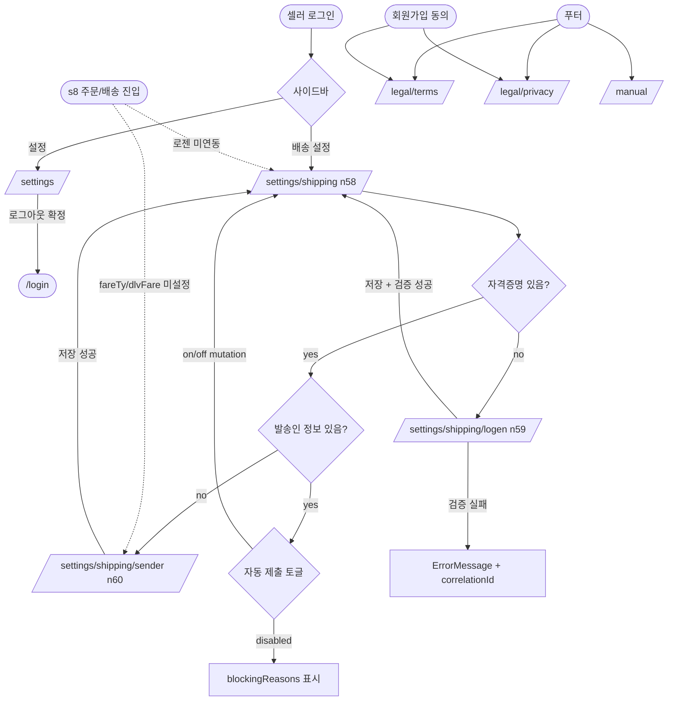

# s9 — 설정 도메인 + 부록(법적/도움말) 화면 정의

> **목적**: 외부 디자이너에게 넘길 화면·기능·워크플로우 정리. 디자인 리뉴얼 작업은 본 문서 범위 외.
>
> **마스터 참조**:
> - `docs/spec/user_flow.md` §s9 (n58~n60)
> - `docs/spec/PRD.md` §6.4 / §8 / §9 (설정-배송)
> - `docs/architecture/v1/features/settings-shipping.md` (백엔드/데이터 계약)
> - `docs/architecture/v1/features/legal.md` (법적/도움말)
> - `docs/architecture/v1/cross-cutting/logen-adapter.md`
> - `apps/web/src/features/settings/`, `apps/web/src/features/legal/`

---

## 1. 도메인 개요

### 1.1 도메인의 위치

s9 **설정**은 셀러가 운영 환경의 **상시 정보**를 관리하는 영역이다. 일회성 등록·주문 처리와 달리, 한 번 설정하면 이후 모든 잡(주문 동기화·운송장 등록·송장 제출)이 이 값을 **암시적으로 사용**한다.

- **포함 (v1)**: 계정(이메일·로그아웃), 배송 설정(로젠 자격증명·발송인 정보·자동 제출 토글·기본 택배사 표시).
- **부록 (v1, 본 도메인에 포함)**: 법적 정적 페이지 3종 — 이용약관(`/legal/terms`), 개인정보처리방침(`/legal/privacy`), 사용자 매뉴얼(`/manual`). 라우팅상 별개 셸(비인증 접근 가능)이지만, **사용자 멘탈 모델에서는 "설정 메뉴 내부"** 로 묶이는 동선이 자연스러워 함께 정의한다.
- **제외 (v2 이후)**: 알림 채널(이메일/푸시) 영구설정, 테마(라이트/다크) 영구설정, 비밀번호 변경, 2FA, 다중 발송지, 로젠 외 택배사 추가, 비밀번호 재설정 진입(s1 인증 도메인 소관).

### 1.2 진입 경로

| 경로 | 진입점 | 인증 필요 |
|---|---|---|
| `/settings` | 사이드바 "설정" 메뉴 (모든 인증 화면 공통) | yes |
| `/settings/shipping` | `/settings` 카드 → "배송 설정" / 사이드바 "배송 설정" 직접 진입 / 주문 처리(s8) 화면의 "로젠 미연동" 유도 배너 | yes |
| `/settings/shipping/logen` | `/settings/shipping` → 로젠 API 연동 카드의 [관리] | yes |
| `/settings/shipping/sender` | `/settings/shipping` → 발송인 정보 카드의 [편집] | yes |
| `/legal/terms` | 푸터 / 회원가입 동의 / 사용자 매뉴얼 링크 | **no** (예비 셀러도 열람) |
| `/legal/privacy` | 푸터 / 회원가입 동의 | **no** |
| `/manual` | 푸터 / 헤더 도움말 | **no** |

### 1.3 user_flow ↔ PRD 매핑

| user_flow 노드 | PRD 섹션 | 비고 |
|---|---|---|
| n58 (배송 설정) | §6.4 (자동 제출 토글) / §8 (로젠 연동 상위) | s9 허브 |
| n59 (로젠 API 연동) | §8 (자격증명 저장·검증) | pgcrypto 암호화 |
| n60 (발송인 정보 설정) | §8 (sender·fareTy·dlvFare) | s8 송장 제출의 전제 |
| — (계정) | §2.1.4 (세션 관리·자동 로그아웃) | 로그아웃 UI 만 |
| — (법적 3종) | §9.1 (이용약관) / §9.2 (개인정보처리방침) / §9.3 (사용자 매뉴얼) | 정적 콘텐츠 |

---

## 2. 화면 목록

| 라우트 | 파일 | 화면명 | 카테고리 |
|---|---|---|---|
| `/settings` | `apps/web/src/features/settings/pages/SettingsPage.tsx` | 설정 (계정 허브) | 설정 |
| `/settings/shipping` | `apps/web/src/features/settings/shipping/pages/SettingsShippingPage.tsx` | 배송 설정 (n58) | 설정 |
| `/settings/shipping/logen` | `apps/web/src/features/settings/shipping/pages/SettingsShippingLogenPage.tsx` | 로젠 API 연동 (n59) | 설정 |
| `/settings/shipping/sender` | `apps/web/src/features/settings/shipping/pages/SettingsShippingSenderPage.tsx` | 발송인 정보 설정 (n60) | 설정 |
| `/settings/policies` | `apps/web/src/features/settings/policies/pages/SettingsPoliciesPage.tsx` | 배송 정책 관리 (v0.6 신규) | 설정 |
| `/legal/terms` | `apps/web/src/features/legal/pages/TermsPage.tsx` | 이용약관 | 법적 (부록) |
| `/legal/privacy` | `apps/web/src/features/legal/pages/PrivacyPage.tsx` | 개인정보처리방침 | 법적 (부록) |
| `/manual` | `apps/web/src/features/legal/pages/ManualPage.tsx` | 사용자 매뉴얼 | 도움말 (부록) |

---

## 3. 설정 메뉴 트리

`/settings` 는 **얕은 허브**다. 단일 카드(계정) 만 보이고, 배송 설정은 사이드바에서 직접 진입한다 — v1 의 단순성을 위해 의도적으로 분리된 구조.

```
설정 (사이드바 "설정")
├─ /settings              # SettingsPage — 계정 카드
│   └─ 계정 카드 (이메일 표시 + [로그아웃] 버튼 + 확인 다이얼로그)
│
└─ /settings/shipping     # SettingsShippingPage — 배송 설정 허브 (n58)
    ├─ 카드 1: 로젠택배 API 연동 상태
    │   ├─ Badge: 연결됨 / 미연결
    │   ├─ 메타: lastVerifiedAt / lastErrorAt + lastErrorCode
    │   └─ [관리] → /settings/shipping/logen (n59)
    │
    ├─ 카드 2: 발송인 정보
    │   ├─ Badge: 설정 완료 / 미설정
    │   └─ [편집] → /settings/shipping/sender (n60)
    │
    ├─ 카드 3: 출력 후 자동 제출 (자동 분주 토글)
    │   ├─ Switch (on/off) → useAutoDispatchToggle mutation
    │   └─ disabled 조건: !hasCredentials || !hasSenderInfo
    │       → blockingReasons 리스트 노출
    │
    └─ 카드 4: 기본 택배사
        └─ Badge: 로젠 (v1 고정, 변경 불가)

/settings/policies          # SettingsPoliciesPage — 배송 정책 관리 (v0.6 신규)
├─ 정책 목록 (카드들, 기본값 ★ 표시)
├─ [신규 정책] → Dialog (ShippingPolicyFormSchema)
└─ 정책 카드별: [편집] / [기본값으로] / [삭제] → Dialog

부록 (사이드바 외 푸터/헤더 진입)
├─ /legal/terms           # 이용약관
├─ /legal/privacy         # 개인정보처리방침
└─ /manual                # 사용자 매뉴얼
```

**디자인 의사 결정**:
- `/settings` 와 `/settings/shipping` 을 **얕은 형제**로 둔 이유 — v1 에서 설정 카테고리가 2개(계정 / 배송) 뿐이라 깊은 트리 IA 가 과한 부하. 향후 알림·테마·청구 카테고리가 추가되면 `/settings` 를 진짜 허브(카드 그리드)로 승격할 여지를 남김.
- 부록 3종은 `PublicLegalShell` 라는 **별개 레이아웃** 사용 (사이드바·헤더 없음). 비인증 사용자가 회원가입 동의 단계에서 열람할 수 있어야 하기 때문.

---

## 4. 화면별 상세

### 4.1 SettingsPage — `/settings` (계정 허브)

- **파일**: `apps/web/src/features/settings/pages/SettingsPage.tsx`
- **목적**: 셀러 계정의 **기본 메타** 확인 + **세션 종료(로그아웃)** 진입점.
- **진입 경로**: 사이드바 "설정"
- **user_flow 노드**: 매핑 없음 (v1 단순 추가, s1 인증 도메인의 보조 화면).
- **PRD 근거**: §2.1.4 (세션 관리·로그아웃).
- **기능**:
  - 이메일 표시 (`user.email`)
  - [로그아웃] 버튼 (`variant="outline"`) → 확인 Dialog → `useAuth.signOut()` → `/login` 리다이렉트
  - 로그아웃 실패 시 toast 에러
- **워크플로우**:
  1. 사용자가 `/settings` 진입 → `useAuth()` 가 반환한 `user.email` 표시
  2. [로그아웃] 클릭 → Dialog 오픈 (`confirmOpen = true`)
  3. Dialog 의 [로그아웃] 확정 → `setSubmitting(true)` → `signOut()` 호출 → 성공 시 toast + `/login` 으로 replace navigate
  4. 실패 시 Dialog 닫고 토스트 에러 노출
- **주요 컴포넌트**: `PageHeader`, `Card`, `CardHeader/Title/Description/Content`, `Button`, `Dialog`
- **데이터 의존**: `useAuth()` (인증 컨텍스트)
- **상태 처리**:
  - `data`: 이메일 표시 (`user.email`)
  - `loading`: `submitting === true` 시 다이얼로그 버튼 disabled + 텍스트 변경
  - `error`: 로그아웃 실패 toast (Dialog 는 닫음)
  - `empty`: `user === null` 일 때 `'—'` 표시 (정상 흐름에선 발생 안 함)

### 4.2 SettingsShippingPage — `/settings/shipping` (n58)

- **파일**: `apps/web/src/features/settings/shipping/pages/SettingsShippingPage.tsx`
- **목적**: 배송 자동화의 **상시 설정** 단일 진입점. 자격증명·발송인 정보·동작 토글·택배사 4개 카드.
- **진입 경로**: 사이드바 "배송 설정" / s8 화면의 "로젠 미연동" 유도 배너
- **user_flow 노드**: n58
- **PRD 근거**: §6.4 (자동 제출 토글) / §8 (자격증명·발송인)
- **기능**:
  - 카드 1: 로젠 API 연동 상태 (`useLogenCredentialsStatus`) — `connected`/`disconnected` Badge, `lastVerifiedAt`/`lastErrorAt` 메타, [관리] 버튼 → `/settings/shipping/logen`
  - 카드 2: 발송인 정보 (`hasSenderInfo`) — `configured`/`notConfigured` Badge, [편집] → `/settings/shipping/sender`
  - 카드 3: 출력 후 자동 제출 (`useAutoDispatchSetting` + `useAutoDispatchToggle`) — Switch + `blockingReasons` 리스트
  - 카드 4: 기본 택배사 (로젠 고정, v1 disabled)
- **워크플로우**:
  1. 진입 시 `useLogenCredentialsStatus` query → 스켈레톤 4장 → 데이터 도착 후 카드 4종 렌더
  2. 자동 제출 토글 변경 → `toggleMut.mutate(next)` → 실패 시 toast 에러
  3. 자격증명 또는 발송인 정보 미완료 → 자동 제출 Switch disabled + `blockingReasons` 리스트 노출
- **주요 컴포넌트**: `PageHeader`, `Card`, `Badge`, `Button`, `Switch`, `ErrorMessage`, `Skeleton`
- **데이터 의존**:
  - `useLogenCredentialsStatus()` → `{ hasCredentials, hasSenderInfo, lastVerifiedAt, lastErrorAt, lastErrorCode, senderInfo }`
  - `useAutoDispatchSetting()` → `{ autoDispatchAfterPrint }`
  - `useAutoDispatchToggle()` → mutation
- **상태 처리**:
  - `loading` (`status.isPending`): `<ShippingPageSkeleton />` (Skeleton ×4)
  - `error` (`status.isError`): `<ErrorMessage>` 상단 단독
  - `data` (`status.isSuccess`): 카드 4종 동시 렌더
  - `empty` (`!hasCredentials`): 동일 카드 트리이되 카드 1·2의 Badge·CTA 가 "미연결"/"미설정" variant
  - `partial`: (자격증명은 있는데 발송인 정보 없음 등) — 카드별 독립 표시. 자동 제출 토글의 `blockingReasons` 가 "어디가 비었는지" 사용자에게 명시

### 4.3 SettingsShippingLogenPage — `/settings/shipping/logen` (n59)

- **파일**: `apps/web/src/features/settings/shipping/pages/SettingsShippingLogenPage.tsx`
- **목적**: 로젠택배 API 자격증명(`userId`/`custCd`) 입력 + 저장 + 즉시 연결 테스트.
- **진입 경로**: `/settings/shipping` 의 카드 1 [관리]
- **user_flow 노드**: n59
- **PRD 근거**: §8 (자격증명 pgcrypto 암호화 + verify Edge Function)
- **기능**:
  - RHF + `LogenCredentialsInputSchema` (zod) 검증: `userId`, `custCd`
  - [저장 후 연결 테스트] (primary) — `useLogenCredentialsUpsert` → 성공 시 `useLogenVerifyCredential` 자동 호출
  - [연결 테스트] (outline, 기존 자격증명 있을 때만) — 저장된 자격증명으로 verify 만 재실행
  - [돌아가기] (ghost) → `/settings/shipping`
  - 성공 시 인라인 성공 배너 + toast + 800ms 후 `/settings/shipping` 으로 자동 이동
  - 실패 시 `ErrorMessage` + `correlationId` 표시. 에러 코드별 분기:
    - `LGN_INVALID_CREDENTIAL` → "코드를 다시 확인해주세요"
    - `LGN_CONTRACT_NOT_FOUND` → "B2B 계약 진행이 필요합니다"
    - 기타 → 내부 일반 메시지 + 상세 접힘
- **워크플로우**:
  1. 진입 → 빈 폼 또는 (기존 자격증명 있으면) [연결 테스트] 버튼 추가 노출
  2. 사용자가 `userId`·`custCd` 입력 → [저장 후 연결 테스트] 클릭
  3. `upsert.mutate` → pgcrypto 암호화 저장 (RPC)
  4. 저장 성공 → 즉시 `verify.mutate({ source: 'inline' })` → `logen-verify-credential` Edge Function 호출
  5. 검증 성공 → 인라인 성공 배너 + toast + 800ms 후 n58 으로 자동 이동
  6. 검증 실패 → ErrorMessage (코드 매핑된 메시지) + `correlationId` 노출
- **주요 컴포넌트**: `PageHeader`, `Card`, `Input`, `Label`, `Button`, `ErrorMessage`
- **데이터 의존**:
  - `useLogenCredentialsStatus()` (기존 자격증명 여부 판단)
  - `useLogenCredentialsUpsert()` (저장 mutation)
  - `useLogenVerifyCredential()` (검증 mutation)
- **상태 처리**:
  - `loading`: `upsert.isPending` / `verify.isPending` 동안 버튼 비활성 + 라벨 변경 ("저장 중", "검증 중")
  - `error`: `LogenApiInvocationError` 코드 매핑 → `ErrorMessage`, 그 외 일반 메시지
  - `data`: 검증 성공 시 인라인 success 배너 (CheckCircle2 + 메시지)
  - `empty`: `!hasCredentials` → 동일 폼이지만 [연결 테스트] 버튼 숨김

### 4.4 SettingsShippingSenderPage — `/settings/shipping/sender` (n60)

- **파일**: `apps/web/src/features/settings/shipping/pages/SettingsShippingSenderPage.tsx`
- **목적**: 발송인명·발송지 주소·연락처 + `fareTy`·`dlvFare` 운영값 입력.
- **진입 경로**: `/settings/shipping` 의 카드 2 [편집]
- **user_flow 노드**: n60
- **PRD 근거**: §8 (발송인 정보 + 운영값)
- **기능**:
  - RHF + `LogenSenderInfoSchema` 검증
  - 필드: `name`, `address`, `phone`, `fareTy` (select: C/S/R), `dlvFare` (number)
  - `useLogenCredentialsStatus` 데이터로 폼 prefill (`useEffect` + `form.reset`)
  - [저장] → `useLogenSenderInfoUpdate` mutation → 성공 시 toast + `/settings/shipping` 리다이렉트
- **워크플로우**:
  1. 진입 → status hook 으로 기존 senderInfo 조회
  2. 데이터 도착 → `form.reset(status.data.senderInfo)` 로 폼 prefill
  3. 사용자 편집 → [저장] → mutation → 성공 시 toast + n58 으로 navigate
  4. 실패 시 `LogenApiInvocationError` 코드 매핑된 ErrorMessage
- **주요 컴포넌트**: `PageHeader`, `Card`, `Input`, `Label`, raw `<select>` (shadcn Select 미사용 — fareTy 가 enum 3개로 단순, 향후 마이그레이션 후보), `Button`, `ErrorMessage`, `Skeleton`
- **데이터 의존**:
  - `useLogenCredentialsStatus()` (prefill)
  - `useLogenSenderInfoUpdate()` (mutation)
- **상태 처리**:
  - `loading` (`status.isPending`): Skeleton 480px 단일
  - `error` (`status.isError`): ErrorMessage 단독
  - `data` (`status.isSuccess` + senderInfo 있음): prefill 폼
  - `empty` (`status.isSuccess` + senderInfo 없음): 빈 폼 (defaultValues `fareTy='C'`, `dlvFare=0`)

### 4.6 SettingsPoliciesPage — `/settings/policies` (v0.6 신규)

- **목적**: 셀러가 자주 사용하는 **배송 정책** (이름·요금·배송 방식·예상 일수·기본값) 을 미리 만들어두고, 상품 등록 (s3 Step 1) 에서 `shippingPolicyId` 로 select.
- **PRD 근거**: §1.1.4 (기본 배송 정보 입력) 의 진화 — 단일 입력 → 정책 풀.
- **컴포넌트 구조**:
  - 목록 (active 정책 카드들, 기본값 ★ 표시)
  - 신규 / 수정 / 삭제 / 기본값 토글 → Dialog
  - 4상태 (loading / data / error / empty)
- **데이터**:
  - `shipping_policies` 테이블 (`apps/api/supabase/migrations/...`)
  - `useShippingPolicies` / `useUpdateShippingPolicy` / `useDeleteShippingPolicy` hook
  - zod: `ShippingPolicyFormSchema` (`apps/web/src/lib/schemas/shipping-policy.ts`)
- **권한**: 셀러 본인 정책만 (RLS — `seller_id = auth.uid()`).

### 4.5 부록 — 정적 콘텐츠 3종

세 화면 모두 동일한 `LegalLayout` (`apps/web/src/features/legal/components/LegalLayout.tsx`) 을 공유. 차이는 `sections` 배열의 내용 뿐.

#### TermsPage — `/legal/terms`
- **목적**: SaaS 표준 12조 이용약관 (목적·정의·효력·서비스·가입·의무·변경·정보·면책·분쟁·준거법·부칙).
- **PRD 근거**: §9.1
- **콘텐츠 출처**: `ko.legal.terms.sections.*` (12 섹션 zod 사전)
- **메타 배너**: `lastUpdated` + `effectiveFrom` + `draftNotice` (운영 전 법률 검토 필요 표시)

#### PrivacyPage — `/legal/privacy`
- **목적**: 개인정보 보호법 표준 10조 (수집항목·방법·목적·보유기간·제3자제공·위탁·파기·열람권·안전성·보호책임자).
- **PRD 근거**: §9.2
- **콘텐츠 출처**: `ko.legal.privacy.sections.*`
- **특수성**: Supabase / Sentry / GitHub Pages 위탁 사항, OAuth 토큰 pgcrypto + RLS + Sentry 마스킹 정책 명시.
- **메타 배너**: 동일 (draftNotice 포함)

#### ManualPage — `/manual`
- **목적**: 5섹션 가이드 (회원가입 → 마켓 연결 → 5단계 위저드 → 결과 → 이력 → FAQ) + 주문·배송 5섹션 (소개·로젠연동·출력·제출·트러블슈팅).
- **PRD 근거**: §9.3
- **콘텐츠 출처**: `ko.legal.manual.sections.*` (10 섹션)
- **메타 배너**: `lastUpdated` (draftNotice 없음 — 운영 시점에도 갱신 지속)
- **v2 백로그 (문서 내부 명시)**: 동영상 매뉴얼, 마켓별 가이드 분리, 본문 검색.

**공통 처리 방식**:
- 콘텐츠 = TypeScript dictionary (`ko.ts`) 내 `sections` 배열 (id + title + body). 마크다운 파서 미도입 — body 는 plain text + 줄바꿈.
- 외부 링크 없음 (v1).
- 인쇄 기능 별도 없음 — 브라우저 인쇄(Ctrl/Cmd+P) 자연 동작 (v1).
- 비인증 접근 가능 (`PublicLegalShell` 레이아웃, 사이드바·헤더 없이 본문 + Footer 만).

---

## 5. 로젠택배 자격증명 입력 / 검증 (보안 UX)

### 5.1 입력 단계 (n59)

- **마스킹 전략**:
  - 입력 중에는 `<Input type="text">` (사용자가 오타 확인 가능) — 자격증명이 비밀번호급은 아니나 회복 어려움.
  - 폼 unmount 시 React 가 자동으로 메모리에서 폐기. 별도 `sessionStorage` 저장 안 함.
  - `autoComplete="off"` 명시 → 브라우저 자동완성 차단.
- **로그 / Sentry 마스킹**:
  - `userId|user_id|custCd|cust_cd` 키는 Sentry `beforeSend` / `beforeBreadcrumb` 가 강제 마스킹 (security.md §6.2 화이트리스트).
  - 화면에서는 절대 raw 값을 toast / console / URL 에 노출하지 않음.

### 5.2 저장 단계

- **암호화 경로**: 클라이언트 → `set_logen_credentials` RPC → Edge Function 내부에서 `pgp_sym_encrypt` 적용 → `user_id_enc` / `cust_cd_enc` (bytea) 컬럼 저장.
- **평문 컬럼 0**: 평문 `userId` / `custCd` 가 저장되는 컬럼은 존재하지 않음. 복호화 RPC 는 `service_role` 만 호출 가능.
- **UI 피드백**: 저장 mutation 시 [저장 중...] 라벨 + 버튼 disabled. 저장 성공 시 즉시 검증 단계로 진행 (사용자가 별도 클릭할 필요 없음).

### 5.3 연결 테스트 단계

- **로직**: `logen-verify-credential` Edge Function → 내부에서 `logen.getSlipNo(slipQty=1)` 호출 → 응답 `resultCd === '0'` 이면 성공 → `logen_credentials.verified_at = now()` 갱신.
- **slipNo 폐기**: 검증으로 발급된 운송장 번호는 사용하지 않음 (채번 누수 우려 시 운영 정책 확인 — settings-shipping.md §8 미해결 사안).
- **UX 피드백**:
  - 성공 → 인라인 성공 배너 (CheckCircle2 아이콘 + 메시지) + toast + 800ms 후 n58 자동 이동 (사용자가 결과를 볼 시간 확보).
  - 실패 → `ErrorMessage` + 코드 매핑 메시지 + `correlationId` 노출 (운영 지원 시 추적용).

### 5.4 자격증명 삭제 (v2 백로그)

- v1 에는 **삭제 UI 없음**. 자격증명 변경은 동일 화면에서 [저장 후 연결 테스트] 로 덮어쓰기.
- v2 에서 삭제 동선 추가 시 — 위험 액션이므로 확인 다이얼로그 + "타이핑 확인" (예: 'DELETE' 입력) 패턴 권장.

---

## 6. 발송인 정보 관리 (n60)

### 6.1 v1 모델 = 단일 발송지

- **다중 발송지 미지원** — `logen_credentials` 테이블은 `seller_id` unique 제약. 1셀러 = 1발송지.
- 이유: v1 타겟 = 1인 셀러. 다중 창고·다중 발송지는 v2 백로그.
- 향후 다중 발송지 도입 시 — 별도 `sender_locations` 테이블 + `is_default` flag + 등록·주문 처리 화면에서 발송지 선택 UI 필요.

### 6.2 필드별 의미

| 필드 | 타입 | 의미 |
|---|---|---|
| `name` | text | 발송인명 (로젠 송장에 인쇄) |
| `address` | text | 발송지 주소 — **v0.6 부터 Daum Postcode API 연동** (`AddressSearchInput` 컴포넌트 + `apps/web/src/lib/daum-postcode.ts` SDK 동적 로드). 수기 입력 제거 |
| `phone` | text | 발송인 연락처 (010-XXXX-XXXX) |
| `fareTy` | enum (C/S/R) | 운임 부담 구분 — C=선불(계약), S=착불, R=신용. v1 default = C |
| `dlvFare` | int | 배송비 (원). 운영값은 로젠 계약 시 확정 (OQ-V2-04) |

### 6.3 s8 배송 처리에서의 사용

- `fareTy` / `dlvFare` 가 미설정인 채로 s8 (주문 처리 / 송장 제출) 진입 → 시스템이 **자동 분주 실행 불가** → n60 유도 배너 노출 (s8 화면 측 책임).
- 발송인 정보는 매 송장 등록(`logen.registerOrderData`) 시 페이로드의 `sender` 섹션으로 주입.

---

## 7. 부록: 법적 / 도움말 화면 처리 방식

### 7.1 콘텐츠 저장

- **위치**: `apps/web/src/locales/ko.ts` 의 `ko.legal.{terms|privacy|manual}.sections.*`
- **구조**: `{ id: string, title: string, body: string }[]` 형태로 dictionary 에 정의 → 페이지 컴포넌트가 배열로 변환 후 `LegalLayout` 에 전달.
- **마크다운 미사용** — body 는 plain text. 줄바꿈은 CSS `whitespace-pre-line` 또는 `\n` 처리 (`LegalLayout` 내부 책임).
- **이유**: v1 콘텐츠 규모가 작고, MD 파서 도입 시 XSS 검사·sanitizer 도입 비용이 과함. 검색·인덱싱·동적 콘텐츠 필요 시점에 MDX 또는 별도 콘텐츠 저장소로 마이그레이션.

### 7.2 외부 링크

- v1: 없음.
- v2 백로그: 로젠 영업 담당 연락처, 마켓별 가이드 PDF, FAQ 외부 위키.

### 7.3 인쇄

- v1: 브라우저 기본 인쇄(`Ctrl/Cmd+P`) 만 — 별도 인쇄 버튼·인쇄 CSS 미제공.
- 디자인 리뉴얼 시 — 약관·개인정보처리방침은 회원가입 동의 단계에서 출력 요구가 발생할 수 있음. **인쇄용 CSS (`@media print`)** 추가는 v1.5 검토 (사이드바·푸터 숨김, 본문 max-width 해제).

### 7.4 비인증 접근 보장

- 라우터 트리에서 `PublicLegalShell` 이 `AuthLayout` / 인증 보호 그룹과 **별개 형제**로 배치됨.
- 즉, 비로그인 상태에서도 `/legal/*`, `/manual` 접근 가능. 회원가입 페이지에서 이용약관·개인정보 동의 체크박스의 링크가 이를 가리킴.

### 7.5 초안 표시 (draftNotice)

- `terms` / `privacy` 페이지 상단 메타 배너에 **운영 전 법률 검토 필요** 명시 (`ko.legal.common.draftNotice`).
- 디자인 리뉴얼 시 — 운영 배포 직전 본 배너 제거 절차를 디자인 사양에 명시 (실수로 운영에 "초안" 표기 남는 사고 방지).

---

## 8. 도메인 워크플로우 다이어그램



**핵심 동선 요약**:
1. **첫 진입 시나리오**: `/settings/shipping` → "미연결" 배지 확인 → [관리] → n59 자격증명 저장 + 검증 → n58 복귀 → "미설정" 발송인 배지 → [편집] → n60 저장 → n58 복귀 → 자동 제출 토글 활성화 가능.
2. **s8 유도 시나리오**: 셀러가 주문 처리 화면 진입했는데 로젠 미연동 → 배너 → `/settings/shipping` → 위 첫 진입 시나리오.
3. **검증 재실행 시나리오**: n58 카드 1에 `lastErrorAt` 표시 → [관리] → n59 → 기존 자격증명으로 [연결 테스트] (storage 모드) → 결과 확인.

---

## 9. 디자인 리뉴얼 시 고려사항

### 9.1 설정 메뉴 IA

- **현재**: `/settings` 와 `/settings/shipping` 이 얕은 형제. 사이드바에 둘 다 노출.
- **확장 대비**: 향후 알림/테마/청구가 추가되면 — 옵션 A (추천): `/settings` 를 카드 그리드 허브로 승격 + 각 카테고리는 `/settings/<category>` 하위. 옵션 B: 사이드바 내 "설정" 펼침 메뉴.
- **디자이너 결정 요청 항목**: v1 출시 시점의 IA 가 v2 확장에 맞게 자연스럽게 진화 가능한가? 카드 vs 사이드 서브내비 트레이드오프.

### 9.2 폼 그룹핑 (n60)

- 현재 한 카드에 5개 필드 (이름·주소·전화·fareTy·dlvFare) 평행 배치.
- 검토: **"발송인" (name/address/phone) vs "운임 정책" (fareTy/dlvFare)** 두 그룹으로 시각 분리하면 인지 부하 감소. 카드 분할 또는 fieldset + legend 패턴.

### 9.3 저장·반영 피드백

- **현재**: mutation 성공 시 toast + `replace navigate` 가 800ms 이내에 발생 → 사용자가 결과 확인 시간 부족할 수 있음.
- **개선 후보**: (a) n59 처럼 인라인 성공 배너 800ms 노출 후 이동 / (b) 토스트만 + 현재 페이지 유지 + 사용자 명시 이동 / (c) 인라인 success + [돌아가기] 버튼.
- 디자이너 결정 요청.

### 9.4 위험 액션 (자격증명 삭제) — v2

- v2 에 자격증명 삭제 동선 추가 시:
  - 확인 다이얼로그 (이중 확인 — "DELETE" 타이핑 또는 체크박스)
  - 삭제 후 영향 명시 ("연결된 주문 자동 처리가 중단됩니다")
  - 위험 액션 variant — `Button variant="destructive"`

### 9.5 로젠 연동 상태 카드 (n58 카드 1)

- **현재**: Badge (success/default) + lastVerifiedAt + lastErrorAt + lastErrorCode.
- **검토**:
  - 연결 실패 상태(lastErrorCode 있음)일 때 시각적 강도 — danger soft 배경 카드로 격상하여 즉시 인지 가능하게.
  - "지금 다시 테스트" 버튼을 카드 자체에서 제공 (n59 진입 없이) — 단, 인터랙션 복잡도 vs 사용 빈도 트레이드오프.

### 9.6 정적 페이지 가독성 (부록 3종)

- **현재**: 단일 컬럼, 섹션 제목 + body. TOC(목차) 없음.
- **개선 후보**:
  - 데스크탑(1200px+) 에서 좌측 sticky TOC (anchor 링크) → 12조 약관·10조 개인정보 탐색 편의.
  - 모바일에서는 섹션 collapse (Accordion) 또는 상단 점프 navigation.
  - 본문 max-width = 65~75ch (현재 LegalLayout 확인 필요) — 가독성 황금비.
- 인쇄용 CSS (v1.5 검토).

### 9.7 부록 진입 동선 일관성

- 푸터 vs 사이드바 vs 회원가입 동의 체크박스 — **3개 경로 모두 동일 url 로 수렴**해야 함. v1 라우터는 이미 단일 URL.
- 디자인 리뉴얼 시 — 푸터에 약관·개인정보·매뉴얼 링크가 모든 인증/비인증 페이지에 존재하는지 확인. 인증 후 화면(`AppLayout`)에서 푸터 노출 여부 결정 필요 (현재 `PublicLegalShell` 만 Footer 사용).

### 9.8 모바일 반응형 (PRD §5 일관성)

- 모든 카드 / 폼 — 768px 미만에서 컬럼 정렬 검증.
- 터치 타겟 ≥ 44×44px (자동 제출 Switch, 셀렉트, 카드 진입 버튼).
- 폼 입력 — 모바일 기본 폰트 ≥ 16px (iOS 자동 줌 방지).
- 부록 정적 페이지 — 본문 padding · 줄간격 모바일 별도 조정.

### 9.9 다크 모드

- 라이트/다크 동시 지원 (CLAUDE.md 인프라 결정). 토큰만 사용 (`text-text-secondary`, `bg-warning-soft`, `border-warning/40` 등).
- **검증 포인트**: 로젠 미연결 / lastErrorCode 표시의 danger 토큰이 다크 모드에서 충분한 대비를 갖는지, draftNotice 배너의 warning-soft 가 다크에서 가독성 유지하는지.

### 9.10 i18n 한국어 일관성

- 모든 텍스트는 `ko.ts` 의 `ko.settings.*` / `ko.legal.*` 사전 참조. 디자인 리뉴얼 시 카피 변경이 발생하면 사전을 업데이트 → 자동으로 모든 화면에 반영.
- 디자이너에게 — 카피 톤 가이드 (존댓말 / 명사형 종결 / "~합니다" vs "~해요") 를 v1 출시 전 확정하여 사전에 반영 필요.

---

## 부록 A. 관련 백엔드·횡단 문서

- `docs/architecture/v1/features/settings-shipping.md` — 데이터 모델 / RPC / Edge Function / 보안 / 테스트 매트릭스 / 미해결 사안.
- `docs/architecture/v1/features/legal.md` — 법적/도움말 콘텐츠 관리 정책.
- `docs/architecture/v1/cross-cutting/logen-adapter.md` — 로젠 API 4 메서드 명세.
- `docs/architecture/v1/cross-cutting/credential-vault.md` — pgcrypto 패턴.
- `apps/web/src/features/settings/shipping/hooks/` — `useLogenCredentialsStatus`, `useLogenSenderInfo`, `useLogenVerifyCredential`, `useAutoDispatchToggle`.
- `apps/web/src/lib/schemas/logen.ts` — `LogenCredentialsInputSchema`, `LogenSenderInfoSchema`, `LogenCredentialsStatus`.
