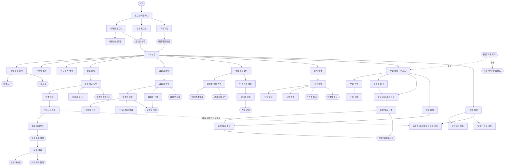

# 다중 마켓 상품 자동 등록 서비스 — User Flow

- **Source**: manyfast.io share link (`bofMD4-zDAAjGPnv2TLGbxdk0apn9CdyuWnk0XtOdlpQ7EyTDqx4jhCXLliuKk6F`)
- **Document ID**: `080e78bc-b54b-4761-94eb-812aba517be7`
- **Version**: 1 ("새 플로우 1", COMPLETED)
- **AI Model**: claude-opus-4-5
- **Created**: 2026-05-18
- **Pages**: 30 / Nodes: 61 / Edges: ~71 / Sections: 9
- **Note**: s7~s9 (주문·배송 자동화) 는 manyfast 다이어그램에 없는 자체 확장 섹션 — PRD §6~§9 와 매핑.

---

## 섹션 구성

| 섹션 ID | 이름 | 노드 수 |
|---|---|---|
| s1 | 인증 | 8 |
| s2 | 대시보드 | 6 |
| s3 | 상품 등록 | 11 |
| s4 | 템플릿 관리 | 8 |
| s5 | 마켓 계정 | 7 |
| s6 | 등록 이력 | 6 |
| s7 | 주문 현황 | 4 |
| s8 | 배송 처리 | 7 |
| s9 | 설정 (배송) | 4 |

---

## s1. 인증

| ID | Type | Label |
|---|---|---|
| n1 | start | 시작 |
| n2 | main_page | 로그인/회원가입 |
| n3 | page | 이메일 로그인 |
| n4 | page | 소셜 로그인 |
| n5 | page | 회원가입 |
| n6 | page | 비밀번호 찾기 |
| n7 | action | 로그인 실행 |
| n8 | action | 회원가입 완료 |

**Flow**
- 시작 → 로그인/회원가입
- 로그인/회원가입 → 이메일 로그인 / 소셜 로그인 / 회원가입
- 이메일 로그인 → 비밀번호 찾기 / 로그인 실행
- 소셜 로그인 → 로그인 실행
- 회원가입 → 회원가입 완료
- 로그인 실행 / 회원가입 완료 → 대시보드 (s2)

---

## s2. 대시보드

| ID | Type | Label |
|---|---|---|
| n9 | main_page | 대시보드 |
| n10 | page | 등록 현황 요약 |
| n11 | page | 마켓별 통계 |
| n12 | page | 최근 등록 내역 |
| n13 | action | 상세 보기 |
| n14 | action | 새로고침 |

**Flow**
- 대시보드 → 등록 현황 요약 / 마켓별 통계 / 최근 등록 내역
- 등록 현황 요약 → 상세 보기 / 새로고침
- 대시보드 → 상품 등록(s3) / 템플릿 관리(s4) / 마켓 계정 관리(s5) / 등록 이력(s6)

---

## s3. 상품 등록

| ID | Type | Label |
|---|---|---|
| n15 | main_page | 상품 등록 |
| n16 | page | 상품 정보 입력 |
| n17 | page | 마켓 선택 |
| n18 | page | 이미지 업로드 |
| n19 | page | 카테고리 매핑 + 마켓별 등록옵션 |
| n20 | page | 등록 미리보기 |
| n21 | page | 등록 결과 |
| n22 | action | 템플릿 불러오기 |
| n23 | action | 일괄 등록 실행 |
| n24 | action | 오류 재시도 |
| n25 | action | 마켓 제외 등록 |

**Flow**
- 상품 등록 → 상품 정보 입력
- 상품 정보 입력 → 마켓 선택 / 이미지 업로드 / 템플릿 불러오기
- 마켓 선택 → 카테고리 매핑
- 카테고리 매핑 → 등록 미리보기
- 카테고리 매핑(n19) → (deep link) G마켓·옥션 배송 프로필 관리(n61) — ESM(gmarket/auction) 카드에 배송 프로필 select 가 동적 렌더되며, 프로필이 없으면 "배송 프로필 만들러 가기"로 `/settings/shipping/esm-profiles` 진입 (PR-3.5). ESM 외 마켓은 카테고리만(하위호환).
- 카테고리 매핑(n19) 내 ESM(gmarket/auction) 카드는 **상품정보고시 입력**도 동적 렌더한다(PR-5) — 상품군 select(41개 법정 표준) → 선택 군의 필수 고시 항목 동적 폼. 입력값은 `marketOptions.officialNotice`({officialNoticeNo, details[{code,value}]})로 수집되어 오케스트레이터가 `mapping.extra.officialNotice` 로 적재(PR-4 transformProduct 가 페이로드에 매핑). 군 미선택/항목 value 누락 시 blockingReason → 다음(미리보기) 버튼 비활성. ESM 외 마켓은 고시 입력 없음(하위호환). (노드 추가 아님 — n19 카드 내부 구조.)
- 등록 미리보기 → 일괄 등록 실행
- 일괄 등록 실행 → 등록 결과
- 등록 결과 → 오류 재시도 / 마켓 제외 등록

---

## s4. 템플릿 관리

| ID | Type | Label |
|---|---|---|
| n26 | main_page | 템플릿 관리 |
| n27 | page | 템플릿 목록 |
| n28 | page | 템플릿 생성 |
| n29 | page | 템플릿 수정 |
| n30 | page | 이미지 관리 |
| n31 | page | HTML 설명 편집 |
| n32 | action | 템플릿 저장 |
| n33 | action | 템플릿 삭제 |

**Flow**
- 템플릿 관리 → 템플릿 목록
- 템플릿 목록 → 템플릿 생성 / 템플릿 수정 / 템플릿 삭제
- 템플릿 생성 → 이미지 관리 / HTML 설명 편집 / 템플릿 저장
- 템플릿 수정 → 템플릿 저장

---

## s5. 마켓 계정 관리

| ID | Type | Label |
|---|---|---|
| n34 | main_page | 마켓 계정 관리 |
| n35 | page | 연결된 계정 목록 |
| n36 | page | 마켓 계정 연결 |
| n37 | page | OAuth 인증 |
| n38 | action | 계정 연결 |
| n39 | action | 계정 연결 해제 |
| n40 | action | 연결 상태 확인 |

**Flow**
- 마켓 계정 관리 → 연결된 계정 목록 / 마켓 계정 연결
- 마켓 계정 연결 → OAuth 인증 → 계정 연결
- 연결된 계정 목록 → 계정 연결 해제 / 연결 상태 확인

---

## s6. 등록 이력

| ID | Type | Label |
|---|---|---|
| n41 | main_page | 등록 이력 |
| n42 | page | 이력 목록 |
| n43 | page | 이력 상세 |
| n44 | page | 오류 분석 |
| n45 | action | 기간별 필터 |
| n46 | action | 마켓별 필터 |

**Flow**
- 등록 이력 → 이력 목록
- 이력 목록 → 이력 상세 / 오류 분석 / 기간별 필터 / 마켓별 필터

---

## s7. 주문 현황

| ID | Type | Label |
|---|---|---|
| n47 | main_page | 주문 현황 대시보드 |
| n48 | page | 주문 목록 |
| n49 | page | 주문 상세 |
| n50 | action | 수동 처리 다이얼로그 |

**Flow**
- 대시보드(s2) → 주문 현황 대시보드
- 주문 현황 대시보드 → 주문 목록 / "운송장 출력"(s8 n52) / "송장 일괄 제출"(s8 n53)
- 주문 목록 → 주문 상세
- 로젠 자동 처리(n51) 실패(`logen_failed`) → 수동 처리 다이얼로그

---

## s8. 배송 처리

| ID | Type | Label |
|---|---|---|
| n51 | action | 로젠 자동 처리 (백그라운드) |
| n52 | page | 운송장 출력 |
| n53 | page | 송장 일괄 제출 시작 |
| n54 | page | 송장 제출 진행 (실시간) |
| n55 | page | 송장 제출 결과 |
| n56 | action | 부분 실패 재시도 |
| n57 | page | 배송 이력 |

**Flow**
- 로젠 자동 처리: orders-sync 직후 자동 (사용자 진입 없음). 성공 → n47 카운터 갱신, 실패 → n50 유도.
- n47 "운송장 출력" → n52 → outSlipPrintPop 팝업 → 출력 완료 시 `status='waybill_printed'`
- 설정 "출력 후 자동 제출" ON → n52 완료 직후 n53 자동 진입
- n47 "송장 일괄 제출" 또는 n52 자동 진입 → n53 → n54 → n55
- n55 부분 실패 → n56 (실패 마켓만 재시도) → n54 (새 ShippingJob)
- n47 → n57 (이력) → n55 (이력 상세)

---

## s9. 설정 (배송)

| ID | Type | Label |
|---|---|---|
| n58 | main_page | 배송 설정 |
| n59 | page | 로젠 API 연동 |
| n60 | page | 발송인 정보 설정 |
| n61 | page | G마켓·옥션 배송 프로필 관리 (ESM) |

**Flow**
- 배송 설정 → 로젠 API 연동 (userId / custCd 입력 → pgcrypto 암호화 저장 → 연결 테스트)
- 배송 설정 → 발송인 정보 설정 (이름·주소·연락처·fareTy·dlvFare)
- 배송 설정 → G마켓·옥션 배송 프로필 관리 (`/settings/shipping/esm-profiles`) — ESM 상품 등록 선행값(출하지·발송정책) 사전 생성·재사용. 생성 시 Edge `esm-shipping-profile` 가 ESM 4단계(주소록→출하지→묶음배송→발송정책) 호출 → 번호 저장. 상품 등록 3단계(s3)는 이 프로필을 select 만 (esm.md §1.3/§5, PR-3).
  - ESM(G마켓/옥션) 계정 미연결 시 생성 불가 → 마켓 연결 유도 (n34 `/markets/connect`).
- 로젠 미연동 상태에서 n47 진입 시 → 배송 설정 유도 배너

---

## 전체 일과 플로우 (Happy Path)

```
[오전 — 자동]
pg_cron 10분 폴링
  └─ orders-sync: 4마켓 신규 주문 수집 → DB 저장
  └─ logen-register-shipment: 자동 실행
      └─ getSlipNo → slipNo 채번
      └─ registerOrderData → fixTakeNo 저장
      └─ orders.status = 'logen_registered'

[오전 — 판매자 액션 1번]
판매자: n47 접속
  └─ "운송장 출력" 클릭 (n52)
  └─ [출력 팝업 열기] → 프린터 출력 → 택배 부착
  └─ [출력 완료] 클릭 → status = 'waybill_printed'

[이후 — 자동 or 1클릭]
설정 "출력 후 자동 제출" ON
  └─ shipping-dispatch-job 자동 실행
  └─ 4마켓 동시 제출 → status = 'tracking_submitted'
  └─ 완료 (판매자 개입 없음)

또는 퇴근 전 1클릭
  └─ "송장 일괄 제출" 클릭 (n53) → n54 → n55
  └─ 30초 내 완료 → 퇴근
```

---

## 엣지 케이스 (주문·배송)

| 케이스 | 처리 |
|---|---|
| 로젠 `getSlipNo` 실패 | 재시도 3회 → `logen_failed` → n50 수동 운송장번호 입력 |
| 로젠 `registerOrderData` 실패 (부분) | 성공 건만 저장, 실패 건 재시도 → 최종 실패 시 n50 |
| 마켓 송장 API 실패 | 해당 마켓만 실패 표시 → n56 재시도 |
| 출력 완료 미확인 상태에서 제출 시도 | 경고 배너 표시 후 진행 가능 (강제 차단 아님) |
| 중복 제출 방지 | `status='tracking_submitted'` 주문 필터 제외 |
| 로젠 미연동 상태 | n58 유도 배너 (운송장번호 없으면 제출 불가) |
| `fareTy` / `dlvFare` 미설정 | n60 유도 → 발송인 정보 완성 필요 |

---

## 전체 다이어그램 (Mermaid)


