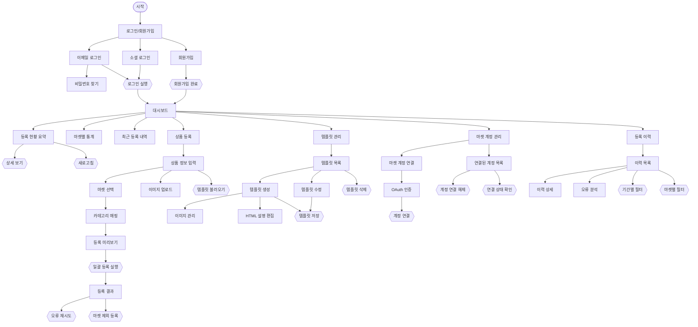

# 다중 마켓 상품 자동 등록 서비스 — User Flow

- **Source**: manyfast.io share link (`bofMD4-zDAAjGPnv2TLGbxdk0apn9CdyuWnk0XtOdlpQ7EyTDqx4jhCXLliuKk6F`)
- **Document ID**: `080e78bc-b54b-4761-94eb-812aba517be7`
- **Version**: 1 ("새 플로우 1", COMPLETED)
- **AI Model**: claude-opus-4-5
- **Created**: 2026-05-18
- **Pages**: 30 / Nodes: 46 / Edges: 48 / Sections: 6

---

## 섹션 구성

| 섹션 ID | 이름 | 노드 수 |
|---|---|---|
| s1 | 인증 | 8 |
| s2 | 대시보드 | 6 |
| s3 | 상품 등록 | 11 |
| s4 | 템플릿 관리 | 8 |
| s5 | 마켓 계정 | 7 |
| s6 | 등록 이력 | 6 |

---

## s1. 인증

| ID | Type | Label |
|---|---|---|
| n1 | start | 시작 |
| n2 | main_page | 로그인/회원가입 |
| n3 | page | 이메일 로그인 |
| n4 | page | 소셜 로그인 |
| n5 | page | 회원가입 |
| n6 | page | 비밀번호 찾기 |
| n7 | action | 로그인 실행 |
| n8 | action | 회원가입 완료 |

**Flow**
- 시작 → 로그인/회원가입
- 로그인/회원가입 → 이메일 로그인 / 소셜 로그인 / 회원가입
- 이메일 로그인 → 비밀번호 찾기 / 로그인 실행
- 소셜 로그인 → 로그인 실행
- 회원가입 → 회원가입 완료
- 로그인 실행 / 회원가입 완료 → 대시보드 (s2)

---

## s2. 대시보드

| ID | Type | Label |
|---|---|---|
| n9 | main_page | 대시보드 |
| n10 | page | 등록 현황 요약 |
| n11 | page | 마켓별 통계 |
| n12 | page | 최근 등록 내역 |
| n13 | action | 상세 보기 |
| n14 | action | 새로고침 |

**Flow**
- 대시보드 → 등록 현황 요약 / 마켓별 통계 / 최근 등록 내역
- 등록 현황 요약 → 상세 보기 / 새로고침
- 대시보드 → 상품 등록(s3) / 템플릿 관리(s4) / 마켓 계정 관리(s5) / 등록 이력(s6)

---

## s3. 상품 등록

| ID | Type | Label |
|---|---|---|
| n15 | main_page | 상품 등록 |
| n16 | page | 상품 정보 입력 |
| n17 | page | 마켓 선택 |
| n18 | page | 이미지 업로드 |
| n19 | page | 카테고리 매핑 |
| n20 | page | 등록 미리보기 |
| n21 | page | 등록 결과 |
| n22 | action | 템플릿 불러오기 |
| n23 | action | 일괄 등록 실행 |
| n24 | action | 오류 재시도 |
| n25 | action | 마켓 제외 등록 |

**Flow**
- 상품 등록 → 상품 정보 입력
- 상품 정보 입력 → 마켓 선택 / 이미지 업로드 / 템플릿 불러오기
- 마켓 선택 → 카테고리 매핑
- 카테고리 매핑 → 등록 미리보기
- 등록 미리보기 → 일괄 등록 실행
- 일괄 등록 실행 → 등록 결과
- 등록 결과 → 오류 재시도 / 마켓 제외 등록

---

## s4. 템플릿 관리

| ID | Type | Label |
|---|---|---|
| n26 | main_page | 템플릿 관리 |
| n27 | page | 템플릿 목록 |
| n28 | page | 템플릿 생성 |
| n29 | page | 템플릿 수정 |
| n30 | page | 이미지 관리 |
| n31 | page | HTML 설명 편집 |
| n32 | action | 템플릿 저장 |
| n33 | action | 템플릿 삭제 |

**Flow**
- 템플릿 관리 → 템플릿 목록
- 템플릿 목록 → 템플릿 생성 / 템플릿 수정 / 템플릿 삭제
- 템플릿 생성 → 이미지 관리 / HTML 설명 편집 / 템플릿 저장
- 템플릿 수정 → 템플릿 저장

---

## s5. 마켓 계정 관리

| ID | Type | Label |
|---|---|---|
| n34 | main_page | 마켓 계정 관리 |
| n35 | page | 연결된 계정 목록 |
| n36 | page | 마켓 계정 연결 |
| n37 | page | OAuth 인증 |
| n38 | action | 계정 연결 |
| n39 | action | 계정 연결 해제 |
| n40 | action | 연결 상태 확인 |

**Flow**
- 마켓 계정 관리 → 연결된 계정 목록 / 마켓 계정 연결
- 마켓 계정 연결 → OAuth 인증 → 계정 연결
- 연결된 계정 목록 → 계정 연결 해제 / 연결 상태 확인

---

## s6. 등록 이력

| ID | Type | Label |
|---|---|---|
| n41 | main_page | 등록 이력 |
| n42 | page | 이력 목록 |
| n43 | page | 이력 상세 |
| n44 | page | 오류 분석 |
| n45 | action | 기간별 필터 |
| n46 | action | 마켓별 필터 |

**Flow**
- 등록 이력 → 이력 목록
- 이력 목록 → 이력 상세 / 오류 분석 / 기간별 필터 / 마켓별 필터

---

## 전체 다이어그램 (Mermaid)

